# Design Document

## Overview

This design document outlines the architecture and implementation approach for migrating the admin panel from frontend v1 to frontend-v2. The migration focuses on creating a unified, modern administrative interface using shadcn/ui components while maintaining all existing functionality and improving user experience.

The design follows the established patterns in frontend-v2, leveraging Next.js 15 App Router, TypeScript, TanStack Query for state management, and shadcn/ui for consistent design components.

## Architecture

### High-Level Architecture

```mermaid
graph TB
    subgraph "Frontend-v2 Admin Panel"
        A[Admin Layout] --> B[Admin Dashboard]
        A --> C[Inspector Management]
        A --> D[Attendance Management]
        A --> E[Template Management]
        A --> F[Payroll Management]
        A --> G[Bulk Operations]
        
        B --> H[Statistics Cards]
        B --> I[Quick Actions]
        B --> J[Attendance Grid]
        
        C --> K[Inspector List]
        C --> L[Inspector Forms]
        C --> M[Specialty Management]
        
        D --> N[Attendance Calendar]
        D --> O[Work Cycle Manager]
        
        E --> P[Template Builder]
        E --> Q[Template List]
        
        F --> R[Payroll Reports]
        F --> S[Salary Management]
        
        G --> T[Excel Import/Export]
        G --> U[Batch Operations]
    end
    
    subgraph "Shared Infrastructure"
        V[Auth Context] --> A
        W[Query Provider] --> A
        X[Theme Provider] --> A
        Y[Error Boundary] --> A
    end
    
    subgraph "Backend APIs"
        Z[Inspector API]
        AA[Attendance API]
        BB[Template API]
        CC[Payroll API]
        DD[Bulk Operations API]
    end
    
    A --> Z
    A --> AA
    A --> BB
    A --> CC
    A --> DD
```



### Directory Structure

```
frontend-v2/src/
├── app/
│   └── admin/
│       ├── layout.tsx                 # Admin layout with navigation
│       ├── page.tsx                   # Admin dashboard
│       ├── inspectors/
│       │   ├── page.tsx              # Inspector list
│       │   ├── [id]/
│       │   │   ├── page.tsx          # Inspector details
│       │   │   └── edit/
│       │   │       └── page.tsx      # Edit inspector
│       │   └── create/
│       │       └── page.tsx          # Create inspector
│       ├── attendance/
│       │   ├── page.tsx              # Attendance management
│       │   └── [inspectorId]/
│       │       └── page.tsx          # Individual attendance
│       ├── templates/
│       │   ├── page.tsx              # Template list
│       │   ├── [id]/
│       │   │   ├── page.tsx          # Template details
│       │   │   └── edit/
│       │   │       └── page.tsx      # Edit template
│       │   └── create/
│       │       └── page.tsx          # Create template
│       ├── payroll/
│       │   ├── page.tsx              # Payroll dashboard
│       │   └── [inspectorId]/
│       │       └── page.tsx          # Inspector payroll
│       └── bulk-operations/
│           └── page.tsx              # Bulk operations
├── components/
│   └── admin/
│       ├── dashboard/
│       │   ├── admin-dashboard.tsx
│       │   ├── stats-cards.tsx
│       │   ├── quick-actions.tsx
│       │   └── attendance-overview.tsx
│       ├── inspectors/
│       │   ├── inspector-list.tsx
│       │   ├── inspector-form.tsx
│       │   ├── inspector-card.tsx
│       │   ├── specialty-editor.tsx
│       │   └── inspector-filters.tsx
│       ├── attendance/
│       │   ├── attendance-calendar.tsx
│       │   ├── work-cycle-manager.tsx
│       │   ├── attendance-grid.tsx
│       │   └── cycle-date-picker.tsx
│       ├── templates/
│       │   ├── template-list.tsx
│       │   ├── template-builder.tsx
│       │   ├── template-card.tsx
│       │   └── template-editor.tsx
│       ├── payroll/
│       │   ├── payroll-dashboard.tsx
│       │   ├── payroll-report.tsx
│       │   ├── salary-calculator.tsx
│       │   └── payroll-export.tsx
│       ├── bulk-operations/
│       │   ├── excel-import.tsx
│       │   ├── excel-export.tsx
│       │   ├── batch-operations.tsx
│       │   └── operation-progress.tsx
│       └── shared/
│           ├── admin-layout.tsx
│           ├── admin-navigation.tsx
│           ├── permission-guard.tsx
│           └── admin-breadcrumbs.tsx
├── lib/
│   └── api/
│       ├── admin/
│       │   ├── inspectors.ts
│       │   ├── attendance.ts
│       │   ├── templates.ts
│       │   ├── payroll.ts
│       │   └── bulk-operations.ts
│       └── types/
│           └── admin.ts
├── hooks/
│   └── admin/
│       ├── use-inspectors.ts
│       ├── use-attendance.ts
│       ├── use-templates.ts
│       ├── use-payroll.ts
│       └── use-bulk-operations.ts
└── types/
    └── admin.ts
```

## Components and Interfaces

### Core Admin Types

```typescript
// Admin-specific types
export interface AdminDashboardStats {
  totalInspectors: number
  activeInspectors: number
  specialtyCounts: {
    psv: number
    crane: number
    corrosion: number
  }
  upcomingBirthdays: number
  attendanceOverview: {
    presentToday: number
    totalScheduled: number
    attendanceRate: number
  }
}

export interface Inspector {
  id: number
  name: string
  employeeId: string
  email: string
  phone?: string
  dateOfBirth?: string
  inspectorType: InspectorType
  specialties: SpecialtyCode[]
  active: boolean
  canLogin: boolean
  attendanceTrackingEnabled: boolean
  baseHourlyRate?: number
  overtimeMultiplier?: number
  workCycle?: WorkCycle
  createdAt: string
  updatedAt: string
}

export interface AttendanceRecord {
  id: number
  inspectorId: number
  date: string
  status: AttendanceStatus
  workHours: number
  overtimeHours: number
  notes?: string
  isOverride: boolean
  overrideReason?: string
}

export interface ReportTemplate {
  id: string
  name: string
  description: string
  reportType: ReportType
  isActive: boolean
  sections: TemplateSection[]
  fieldsCount: number
  createdBy: string
  createdAt: string
  updatedAt: string
}

export interface PayrollRecord {
  id: number
  inspectorId: number
  month: number
  year: number
  workingDays: number
  overtimeDays: number
  totalHours: number
  overtimeHours: number
  baseSalary: number
  overtimePay: number
  totalPay: number
  deductions: number
  netPay: number
}
```

### Component Architecture

#### 1. Admin Layout Component

```typescript
// components/admin/shared/admin-layout.tsx
interface AdminLayoutProps {
  children: React.ReactNode
  title?: string
  breadcrumbs?: BreadcrumbItem[]
}

export function AdminLayout({ children, title, breadcrumbs }: AdminLayoutProps) {
  return (
    <div className="min-h-screen bg-background">
      <AdminNavigation />
      <main className="container mx-auto px-4 py-8">
        {breadcrumbs && <AdminBreadcrumbs items={breadcrumbs} />}
        {title && (
          <div className="mb-8">
            <h1 className="text-3xl font-bold text-foreground">{title}</h1>
          </div>
        )}
        {children}
      </main>
    </div>
  )
}
```

#### 2. Dashboard Statistics Cards

```typescript
// components/admin/dashboard/stats-cards.tsx
interface StatsCardsProps {
  stats: AdminDashboardStats
  loading?: boolean
}

export function StatsCards({ stats, loading }: StatsCardsProps) {
  if (loading) {
    return <StatsGridSkeleton />
  }

  return (
    <div className="grid grid-cols-1 md:grid-cols-2 lg:grid-cols-5 gap-6">
      <StatCard
        title="Total Inspectors"
        value={stats.totalInspectors}
        subtitle={`${stats.activeInspectors} Active`}
        icon={Users}
        variant="default"
      />
      <StatCard
        title="PSV Inspectors"
        value={stats.specialtyCounts.psv}
        icon={Shield}
        variant="blue"
      />
      {/* Additional stat cards */}
    </div>
  )
}
```

#### 3. Inspector Management Components

```typescript
// components/admin/inspectors/inspector-list.tsx
interface InspectorListProps {
  inspectors: Inspector[]
  loading?: boolean
  onEdit: (inspector: Inspector) => void
  onDelete: (inspector: Inspector) => void
  onSpecialtyEdit: (inspector: Inspector) => void
}

export function InspectorList({ 
  inspectors, 
  loading, 
  onEdit, 
  onDelete, 
  onSpecialtyEdit 
}: InspectorListProps) {
  const [searchTerm, setSearchTerm] = useState('')
  const [filters, setFilters] = useState<InspectorFilters>({})

  const filteredInspectors = useMemo(() => {
    return inspectors.filter(inspector => 
      inspector.name.toLowerCase().includes(searchTerm.toLowerCase()) ||
      inspector.employeeId.toLowerCase().includes(searchTerm.toLowerCase())
    )
  }, [inspectors, searchTerm])

  return (
    <Card>
      <CardHeader>
        <div className="flex items-center justify-between">
          <CardTitle>Inspector Management</CardTitle>
          <Button asChild>
            <Link href="/admin/inspectors/create">
              <Plus className="w-4 h-4 mr-2" />
              Create Inspector
            </Link>
          </Button>
        </div>
      </CardHeader>
      <CardContent>
        <InspectorFilters 
          searchTerm={searchTerm}
          onSearchChange={setSearchTerm}
          filters={filters}
          onFiltersChange={setFilters}
        />
        <InspectorTable
          inspectors={filteredInspectors}
          loading={loading}
          onEdit={onEdit}
          onDelete={onDelete}
          onSpecialtyEdit={onSpecialtyEdit}
        />
      </CardContent>
    </Card>
  )
}
```

#### 4. Attendance Management Components

```typescript
// components/admin/attendance/attendance-calendar.tsx
interface AttendanceCalendarProps {
  inspector: Inspector
  month: number
  year: number
  attendanceData: AttendanceRecord[]
  onDateClick: (date: Date) => void
  onStatusChange: (date: Date, status: AttendanceStatus) => void
}

export function AttendanceCalendar({
  inspector,
  month,
  year,
  attendanceData,
  onDateClick,
  onStatusChange
}: AttendanceCalendarProps) {
  const daysInMonth = getDaysInMonth(month, year)
  const attendanceMap = useMemo(() => {
    return attendanceData.reduce((map, record) => {
      map[record.date] = record
      return map
    }, {} as Record<string, AttendanceRecord>)
  }, [attendanceData])

  return (
    <Card>
      <CardHeader>
        <CardTitle className="flex items-center justify-between">
          <span>Attendance Calendar - {inspector.name}</span>
          <div className="flex items-center gap-2">
            <Button variant="outline" size="sm" onClick={() => navigateMonth(-1)}>
              <ChevronLeft className="w-4 h-4" />
            </Button>
            <span className="text-sm font-medium">
              {getMonthName(month)} {year}
            </span>
            <Button variant="outline" size="sm" onClick={() => navigateMonth(1)}>
              <ChevronRight className="w-4 h-4" />
            </Button>
          </div>
        </CardTitle>
      </CardHeader>
      <CardContent>
        <div className="grid grid-cols-7 gap-1">
          {/* Calendar implementation */}
        </div>
      </CardContent>
    </Card>
  )
}
```

## Data Models

### Inspector Management

```typescript
export interface InspectorFormData {
  name: string
  employeeId: string
  email: string
  phone?: string
  dateOfBirth?: string
  inspectorType: InspectorType
  specialties: SpecialtyCode[]
  active: boolean
  canLogin: boolean
  attendanceTrackingEnabled: boolean
  baseHourlyRate?: number
  overtimeMultiplier?: number
  workCycle?: WorkCycleData
}

export interface SpecialtyPermissions {
  PSV: boolean
  CRANE: boolean
  CORROSION: boolean
}

export interface WorkCycleData {
  type: 'CONTINUOUS' | 'SHIFT_BASED' | 'CUSTOM'
  startDate: string
  workDays: number
  restDays: number
  customPattern?: string[]
}
```

### Attendance System

```typescript
export interface AttendanceDay {
  date: string
  status: AttendanceStatus
  workHours: number
  overtimeHours: number
  isOverride: boolean
  overrideReason?: string
}

export enum AttendanceStatus {
  WORKING = 'WORKING',
  RESTING = 'RESTING',
  OVERTIME = 'OVERTIME',
  ABSENT = 'ABSENT',
  SICK_LEAVE = 'SICK_LEAVE',
  VACATION = 'VACATION'
}

export interface WorkCycle {
  id: number
  inspectorId: number
  type: WorkCycleType
  startDate: string
  workDays: number
  restDays: number
  isActive: boolean
  createdAt: string
}
```

### Template System

```typescript
export interface TemplateSection {
  id: string
  title: string
  order: number
  fields: TemplateField[]
}

export interface TemplateField {
  id: string
  name: string
  type: FieldType
  label: string
  required: boolean
  options?: string[]
  validation?: FieldValidation
  defaultValue?: any
}

export enum FieldType {
  TEXT = 'text',
  NUMBER = 'number',
  DATE = 'date',
  SELECT = 'select',
  MULTISELECT = 'multiselect',
  TEXTAREA = 'textarea',
  CHECKBOX = 'checkbox',
  FILE = 'file',
  IMAGE = 'image'
}
```

## Error Handling

### Error Boundary Implementation

```typescript
// components/admin/shared/admin-error-boundary.tsx
export function AdminErrorBoundary({ children }: { children: React.ReactNode }) {
  return (
    <ErrorBoundary
      fallback={({ error, resetError }) => (
        <div className="min-h-[400px] flex items-center justify-center">
          <Card className="w-full max-w-md">
            <CardHeader>
              <CardTitle className="text-destructive">
                Admin Panel Error
              </CardTitle>
            </CardHeader>
            <CardContent>
              <p className="text-sm text-muted-foreground mb-4">
                An error occurred in the admin panel. Please try again.
              </p>
              <div className="flex gap-2">
                <Button onClick={resetError} variant="outline">
                  Try Again
                </Button>
                <Button asChild>
                  <Link href="/admin">Return to Dashboard</Link>
                </Button>
              </div>
            </CardContent>
          </Card>
        </div>
      )}
    >
      {children}
    </ErrorBoundary>
  )
}
```

### API Error Handling

```typescript
// lib/api/admin/base.ts
export class AdminAPIError extends Error {
  constructor(
    message: string,
    public status: number,
    public code?: string
  ) {
    super(message)
    this.name = 'AdminAPIError'
  }
}

export async function handleAdminAPIResponse<T>(response: Response): Promise<T> {
  if (!response.ok) {
    const errorData = await response.json().catch(() => ({}))
    throw new AdminAPIError(
      errorData.detail || `HTTP ${response.status}: ${response.statusText}`,
      response.status,
      errorData.code
    )
  }
  return response.json()
}
```

## Testing Strategy

### Component Testing

```typescript
// components/admin/inspectors/__tests__/inspector-list.test.tsx
describe('InspectorList', () => {
  it('should display inspector data correctly', () => {
    const mockInspectors = [
      {
        id: 1,
        name: 'John Doe',
        employeeId: 'EMP001',
        email: 'john@example.com',
        specialties: ['PSV', 'CRANE'],
        active: true
      }
    ]

    render(
      <InspectorList
        inspectors={mockInspectors}
        onEdit={jest.fn()}
        onDelete={jest.fn()}
        onSpecialtyEdit={jest.fn()}
      />
    )

    expect(screen.getByText('John Doe')).toBeInTheDocument()
    expect(screen.getByText('EMP001')).toBeInTheDocument()
    expect(screen.getByText('PSV')).toBeInTheDocument()
  })

  it('should handle search functionality', () => {
    // Test search implementation
  })

  it('should handle specialty editing', () => {
    // Test specialty editor dialog
  })
})
```

### Integration Testing

```typescript
// __tests__/admin/inspector-management.integration.test.tsx
describe('Inspector Management Integration', () => {
  it('should create, edit, and delete inspectors', async () => {
    // Test full CRUD operations
  })

  it('should manage inspector specialties', async () => {
    // Test specialty management workflow
  })

  it('should handle bulk operations', async () => {
    // Test bulk import/export
  })
})
```

## Performance Considerations

### Data Loading Strategies

1. **Lazy Loading**: Load admin data only when needed
2. **Pagination**: Implement server-side pagination for large datasets
3. **Caching**: Use TanStack Query for intelligent caching
4. **Virtualization**: Use virtual scrolling for large lists

### Code Splitting

```typescript
// Lazy load admin components
const AdminDashboard = lazy(() => import('@/components/admin/dashboard/admin-dashboard'))
const InspectorManagement = lazy(() => import('@/components/admin/inspectors/inspector-management'))
const AttendanceManagement = lazy(() => import('@/components/admin/attendance/attendance-management'))
```

### Memory Management

1. **Cleanup**: Proper cleanup of subscriptions and timers
2. **Memoization**: Use React.memo and useMemo for expensive calculations
3. **Debouncing**: Debounce search and filter operations

## Security Considerations

### Permission System

```typescript
// hooks/admin/use-admin-permissions.ts
export function useAdminPermissions() {
  const { user } = useAuth()
  
  return {
    canManageInspectors: user?.role === 'admin',
    canManageAttendance: user?.role === 'admin',
    canManageTemplates: user?.role === 'admin',
    canViewPayroll: user?.role === 'admin',
    canPerformBulkOperations: user?.role === 'admin'
  }
}
```

### Data Validation

```typescript
// lib/validation/admin.ts
export const inspectorSchema = z.object({
  name: z.string().min(1, 'Name is required'),
  employeeId: z.string().min(1, 'Employee ID is required'),
  email: z.string().email('Invalid email format'),
  specialties: z.array(z.enum(['PSV', 'CRANE', 'CORROSION'])),
  active: z.boolean(),
  canLogin: z.boolean()
})
```

## Accessibility Features

1. **Keyboard Navigation**: Full keyboard support for all interactions
2. **Screen Reader Support**: Proper ARIA labels and descriptions
3. **Focus Management**: Logical focus order and visible focus indicators
4. **Color Contrast**: Meet WCAG 2.1 AA standards
5. **Alternative Text**: Descriptive alt text for images and icons

## Migration Strategy

### Phase 1: Core Infrastructure
- Set up admin layout and navigation
- Implement permission system
- Create base components and types

### Phase 2: Inspector Management
- Migrate inspector list and forms
- Implement specialty management
- Add search and filtering

### Phase 3: Attendance System
- Migrate attendance calendar
- Implement work cycle management
- Add attendance reporting

### Phase 4: Template Management
- Migrate template list and editor
- Implement template builder
- Add template validation

### Phase 5: Payroll and Bulk Operations
- Migrate payroll features
- Implement bulk operations
- Add export/import functionality

### Phase 6: Testing and Optimization
- Comprehensive testing
- Performance optimization
- Accessibility improvements