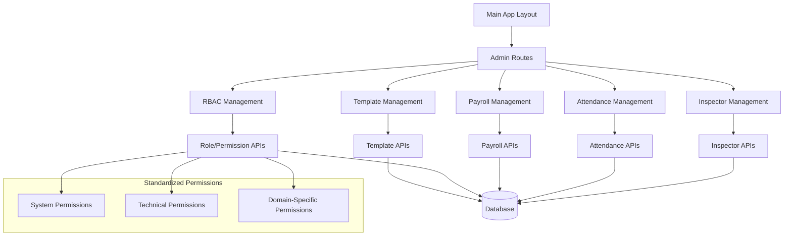

# Design Document

## Overview

This document outlines the design for standardizing the RBAC system and completing the admin panel integration. The design focuses on implementing 23 standardized permissions, integrating admin layout with the main application, and completing admin domain functionality including inspector management, attendance tracking, payroll management, role/permission management, and report template management.

The approach maintains the existing RBAC infrastructure while standardizing permissions and enhancing the admin interface for better user experience and consistency.

## Architecture

### High-Level Architecture



### Core Components

1. **Standardized Permission System**: 23 predefined permissions aligned with business needs
2. **Integrated Admin Layout**: Admin pages using main application layout structure
3. **Inspector Management Module**: Complete CRUD operations for inspector profiles
4. **Attendance Management Module**: Time tracking and attendance reporting
5. **Payroll Management Module**: Salary calculation and payroll generation
6. **RBAC Management Module**: Role and permission administration
7. **Template Management Module**: Report template customization

## Components and Interfaces

### 1. Standardized Permission System

#### Permission Categories and Definitions

```typescript
// System-level permissions
const SYSTEM_PERMISSIONS = {
  SYSTEM_SUPERADMIN: 'system_superadmin',     // Full system access
  SYSTEM_HR_MANAGE: 'system_hr_manage',      // HR management access
} as const;

// Technical domain permissions
const TECHNICAL_PERMISSIONS = {
  // Mechanical
  MECHANICAL_VIEW: 'mechanical_view',
  MECHANICAL_EDIT: 'mechanical_edit',
  MECHANICAL_APPROVE: 'mechanical_approve',
  
  // Corrosion
  CORROSION_VIEW: 'corrosion_view',
  CORROSION_EDIT: 'corrosion_edit',
  CORROSION_APPROVE: 'corrosion_approve',
  
  // NDT
  NDT_VIEW: 'ndt_view',
  NDT_EDIT: 'ndt_edit',
  NDT_APPROVE: 'ndt_approve',
  
  // Electrical
  ELECTRICAL_VIEW: 'electrical_view',
  ELECTRICAL_EDIT: 'electrical_edit',
  ELECTRICAL_APPROVE: 'electrical_approve',
  
  // Instrumentation
  INSTRUMENT_VIEW: 'instrument_view',
  INSTRUMENT_EDIT: 'instrument_edit',
  INSTRUMENT_APPROVE: 'instrument_approve',
  
  // Quality Control
  QUALITY_VIEW: 'quality_view',
  QUALITY_EDIT: 'quality_edit',
  QUALITY_APPROVE: 'quality_approve',
  
  // Maintenance
  MAINTENANCE_VIEW: 'maintenance_view',
  MAINTENANCE_EDIT: 'maintenance_edit',
  MAINTENANCE_APPROVE: 'maintenance_approve',
} as const;

// Combined permission list
export const STANDARDIZED_PERMISSIONS = {
  ...SYSTEM_PERMISSIONS,
  ...TECHNICAL_PERMISSIONS,
} as const;
```

#### Permission Migration Strategy

```typescript
// Migration mapping from current to standardized permissions
const PERMISSION_MIGRATION_MAP = {
  'admin:manage': 'system_superadmin',
  'admin:manage_users': 'system_hr_manage',
  'mechanical:view': 'mechanical_view',
  'mechanical:edit_own': 'mechanical_edit',
  'mechanical:edit_all': 'mechanical_edit',
  'mechanical:approve': 'mechanical_approve',
  // ... continue for all domains
};
```

### 2. Admin Layout Integration

#### Layout Structure

```typescript
// Remove separate AdminLayoutContent, use main layout
export default function AdminRootLayout({
  children,
}: {
  children: React.ReactNode;
}) {
  return (
    <AdminPermissionGuard>
      {/* Use main layout structure instead of separate sidebar */}
      <div className="admin-content">
        {children}
      </div>
    </AdminPermissionGuard>
  );
}
```

#### Navigation Integration

```typescript
// Integrate admin navigation with main navigation
const adminNavigationItems: NavigationItem[] = [
  {
    title: 'مدیریت بازرسین',
    href: '/admin/inspectors',
    icon: 'Users',
    permission: { resource: 'system', action: 'hr_manage' }
  },
  {
    title: 'حضور و غیاب',
    href: '/admin/attendance',
    icon: 'Clock',
    permission: { resource: 'system', action: 'hr_manage' }
  },
  {
    title: 'فیش حقوقی',
    href: '/admin/payroll',
    icon: 'DollarSign',
    permission: { resource: 'system', action: 'hr_manage' }
  },
  {
    title: 'نقش‌ها و دسترسی‌ها',
    href: '/admin/rbac',
    icon: 'Shield',
    permission: { resource: 'system', action: 'superadmin' }
  },
  {
    title: 'قالب گزارش‌ها',
    href: '/admin/templates',
    icon: 'FileText',
    permission: { resource: 'system', action: 'superadmin' }
  }
];
```

### 3. Inspector Management Module

#### Inspector Management Interface

```typescript
interface InspectorManagementProps {
  // List view with pagination, search, filtering
  inspectors: Inspector[];
  totalCount: number;
  currentPage: number;
  searchQuery: string;
  filters: InspectorFilters;
  
  // CRUD operations
  onCreateInspector: (data: InspectorCreateData) => Promise<void>;
  onUpdateInspector: (id: number, data: InspectorUpdateData) => Promise<void>;
  onDeleteInspector: (id: number) => Promise<void>;
  
  // Role management
  onAssignRoles: (inspectorId: number, roleIds: number[]) => Promise<void>;
  onRemoveRole: (inspectorId: number, roleId: number) => Promise<void>;
}

interface InspectorCreateData {
  // Basic Information
  first_name: string;
  last_name: string;
  employee_id: string;
  national_id: string;
  email: string;
  phone?: string;
  
  // Educational Information
  education_degree?: string;
  education_field?: string;
  education_institute?: string;
  graduation_year?: number;
  
  // Experience
  years_experience: number;
  previous_companies: string[];
  
  // Authentication
  username?: string;
  password?: string;
  can_login: boolean;
  
  // Profile
  date_of_birth?: string;
  birth_place?: string;
  marital_status?: string;
  
  // Payroll
  base_hourly_rate?: number;
  overtime_multiplier?: number;
  night_shift_multiplier?: number;
  on_call_multiplier?: number;
}
```

#### Inspector API Endpoints

```python
# Enhanced Inspector Management APIs
@router.get("/admin/inspectors", response_model=InspectorListResponse)
async def list_inspectors(
    page: int = Query(1, ge=1),
    page_size: int = Query(20, ge=1, le=100),
    search: Optional[str] = Query(None),
    department: Optional[str] = Query(None),
    active_only: bool = Query(True),
    can_login_only: Optional[bool] = Query(None),
    db: Session = Depends(get_db),
    current_inspector: Inspector = Depends(require_permission("system", "hr_manage"))
)

@router.post("/admin/inspectors", response_model=InspectorResponse)
async def create_inspector(
    inspector_data: InspectorCreateRequest,
    db: Session = Depends(get_db),
    current_inspector: Inspector = Depends(require_permission("system", "hr_manage"))
)

@router.put("/admin/inspectors/{inspector_id}", response_model=InspectorResponse)
async def update_inspector(
    inspector_id: int,
    inspector_data: InspectorUpdateRequest,
    db: Session = Depends(get_db),
    current_inspector: Inspector = Depends(require_permission("system", "hr_manage"))
)

@router.delete("/admin/inspectors/{inspector_id}")
async def delete_inspector(
    inspector_id: int,
    db: Session = Depends(get_db),
    current_inspector: Inspector = Depends(require_permission("system", "hr_manage"))
)

@router.get("/admin/inspectors/{inspector_id}/roles", response_model=InspectorRolesResponse)
async def get_inspector_roles(
    inspector_id: int,
    db: Session = Depends(get_db),
    current_inspector: Inspector = Depends(require_permission("system", "hr_manage"))
)

@router.put("/admin/inspectors/{inspector_id}/roles", response_model=SuccessResponse)
async def assign_inspector_roles(
    inspector_id: int,
    role_assignment: InspectorRoleAssignmentRequest,
    db: Session = Depends(get_db),
    current_inspector: Inspector = Depends(require_permission("system", "hr_manage"))
)
```

### 4. Attendance Management Module

#### Attendance Interface Components

```typescript
interface AttendanceManagementProps {
  // Calendar views
  selectedDate: Date;
  viewMode: 'daily' | 'weekly' | 'monthly';
  
  // Attendance data
  attendanceRecords: AttendanceRecord[];
  attendanceSummary: AttendanceSummary;
  
  // Operations
  onRecordAttendance: (data: AttendanceRecordData) => Promise<void>;
  onBulkImport: (file: File) => Promise<void>;
  onGenerateReport: (params: ReportParams) => Promise<void>;
  onUpdateAttendance: (recordId: number, data: AttendanceUpdateData) => Promise<void>;
}

interface AttendanceRecord {
  id: number;
  inspector_id: number;
  inspector_name: string;
  date: string;
  check_in_time?: string;
  check_out_time?: string;
  total_hours: number;
  overtime_hours: number;
  status: 'present' | 'absent' | 'late' | 'half_day';
  notes?: string;
}
```

#### Attendance API Endpoints

```python
@router.get("/admin/attendance", response_model=AttendanceListResponse)
async def list_attendance(
    start_date: date = Query(...),
    end_date: date = Query(...),
    inspector_id: Optional[int] = Query(None),
    status: Optional[str] = Query(None),
    db: Session = Depends(get_db),
    current_inspector: Inspector = Depends(require_permission("system", "hr_manage"))
)

@router.post("/admin/attendance/bulk-import", response_model=BulkImportResponse)
async def bulk_import_attendance(
    file: UploadFile = File(...),
    db: Session = Depends(get_db),
    current_inspector: Inspector = Depends(require_permission("system", "hr_manage"))
)

@router.get("/admin/attendance/reports", response_model=AttendanceReportResponse)
async def generate_attendance_report(
    report_type: str = Query(...),
    start_date: date = Query(...),
    end_date: date = Query(...),
    inspector_ids: Optional[List[int]] = Query(None),
    db: Session = Depends(get_db),
    current_inspector: Inspector = Depends(require_permission("system", "hr_manage"))
)
```

### 5. Payroll Management Module

#### Payroll Interface Components

```typescript
interface PayrollManagementProps {
  // Payroll periods
  selectedPeriod: PayrollPeriod;
  payrollRecords: PayrollRecord[];
  
  // Calculations
  onCalculatePayroll: (period: PayrollPeriod) => Promise<void>;
  onGeneratePayslips: (inspectorIds: number[]) => Promise<void>;
  onExportPayroll: (format: 'excel' | 'pdf', period: PayrollPeriod) => Promise<void>;
  
  // Settings
  payrollSettings: PayrollSettings;
  onUpdateSettings: (settings: PayrollSettings) => Promise<void>;
}

interface PayrollRecord {
  id: number;
  inspector_id: number;
  inspector_name: string;
  period_start: string;
  period_end: string;
  base_salary: number;
  overtime_pay: number;
  night_shift_pay: number;
  on_call_pay: number;
  total_earnings: number;
  deductions: number;
  net_pay: number;
  status: 'draft' | 'calculated' | 'approved' | 'paid';
}
```

#### Payroll API Endpoints

```python
@router.post("/admin/payroll/calculate", response_model=PayrollCalculationResponse)
async def calculate_payroll(
    calculation_request: PayrollCalculationRequest,
    db: Session = Depends(get_db),
    current_inspector: Inspector = Depends(require_permission("system", "hr_manage"))
)

@router.get("/admin/payroll/records", response_model=PayrollRecordListResponse)
async def list_payroll_records(
    period_start: date = Query(...),
    period_end: date = Query(...),
    inspector_id: Optional[int] = Query(None),
    db: Session = Depends(get_db),
    current_inspector: Inspector = Depends(require_permission("system", "hr_manage"))
)

@router.post("/admin/payroll/export", response_model=ExportResponse)
async def export_payroll(
    export_request: PayrollExportRequest,
    db: Session = Depends(get_db),
    current_inspector: Inspector = Depends(require_permission("system", "hr_manage"))
)
```

### 6. RBAC Management Module

#### Enhanced Role and Permission Management

```typescript
interface RBACManagementProps {
  // Roles
  roles: Role[];
  onCreateRole: (data: RoleCreateData) => Promise<void>;
  onUpdateRole: (id: number, data: RoleUpdateData) => Promise<void>;
  onDeleteRole: (id: number) => Promise<void>;
  
  // Permissions (standardized)
  standardizedPermissions: StandardizedPermission[];
  onAssignPermissionsToRole: (roleId: number, permissionIds: number[]) => Promise<void>;
  
  // Role assignments
  onAssignRolesToInspector: (inspectorId: number, roleIds: number[]) => Promise<void>;
  onBulkRoleAssignment: (data: BulkRoleAssignmentData) => Promise<void>;
  
  // Impact analysis
  onAnalyzeRoleImpact: (roleId: number) => Promise<RoleImpactAnalysis>;
  onAnalyzePermissionImpact: (permissionId: number) => Promise<PermissionImpactAnalysis>;
}

interface StandardizedPermission {
  id: number;
  name: string;
  display_name: string;
  category: 'system' | 'technical';
  domain?: string;
  description: string;
  is_active: boolean;
}
```

### 7. Template Management Module

#### Report Template Management

```typescript
interface TemplateManagementProps {
  // Templates
  templates: ReportTemplate[];
  templateCategories: TemplateCategory[];
  
  // CRUD operations
  onCreateTemplate: (data: TemplateCreateData) => Promise<void>;
  onUpdateTemplate: (id: number, data: TemplateUpdateData) => Promise<void>;
  onDeleteTemplate: (id: number) => Promise<void>;
  onCloneTemplate: (id: number, newName: string) => Promise<void>;
  
  // Template builder
  onOpenTemplateBuilder: (templateId?: number) => void;
  onValidateTemplate: (templateData: TemplateData) => Promise<ValidationResult>;
  
  // Usage analytics
  onGetTemplateUsage: (templateId: number) => Promise<TemplateUsageStats>;
}

interface ReportTemplate {
  id: number;
  name: string;
  description: string;
  category: string;
  inspection_type: string;
  template_data: TemplateData;
  is_active: boolean;
  usage_count: number;
  created_at: string;
  updated_at: string;
}
```

## Error Handling and User Experience

### Enhanced Permission-Based UI Control

```typescript
// Enhanced error messages for restricted actions
interface PermissionErrorProps {
  action: string;
  requiredPermission: string;
  currentUserRoles: string[];
  suggestedAction?: string;
}

const PermissionError: React.FC<PermissionErrorProps> = ({
  action,
  requiredPermission,
  currentUserRoles,
  suggestedAction
}) => (
  <Alert variant="destructive">
    <AlertCircle className="h-4 w-4" />
    <AlertTitle>دسترسی محدود</AlertTitle>
    <AlertDescription>
      برای انجام عملیات "{action}" نیاز به دسترسی "{requiredPermission}" دارید.
      {suggestedAction && (
        <p className="mt-2">
          پیشنهاد: {suggestedAction}
        </p>
      )}
    </AlertDescription>
  </Alert>
);

// Enhanced button component with permission checking
interface ProtectedButtonProps extends ButtonProps {
  requiredPermission: string;
  fallbackMessage?: string;
  showTooltip?: boolean;
}

const ProtectedButton: React.FC<ProtectedButtonProps> = ({
  requiredPermission,
  fallbackMessage,
  showTooltip = true,
  children,
  onClick,
  ...props
}) => {
  const { hasPermission } = usePermissions();
  const [resource, action] = requiredPermission.split('_');
  
  const hasAccess = hasPermission(resource, action);
  
  if (!hasAccess && showTooltip) {
    return (
      <Tooltip>
        <TooltipTrigger asChild>
          <Button {...props} disabled onClick={undefined}>
            {children}
          </Button>
        </TooltipTrigger>
        <TooltipContent>
          {fallbackMessage || `نیاز به دسترسی ${requiredPermission}`}
        </TooltipContent>
      </Tooltip>
    );
  }
  
  if (!hasAccess) {
    return (
      <Button 
        {...props} 
        disabled 
        onClick={() => {
          toast.error(`برای این عملیات نیاز به دسترسی ${requiredPermission} دارید`);
        }}
      >
        {children}
      </Button>
    );
  }
  
  return (
    <Button {...props} onClick={onClick}>
      {children}
    </Button>
  );
};
```

## Performance Considerations

### Optimized Data Loading

```typescript
// Implement pagination and virtual scrolling for large datasets
interface OptimizedListProps<T> {
  items: T[];
  totalCount: number;
  pageSize: number;
  currentPage: number;
  onPageChange: (page: number) => void;
  renderItem: (item: T, index: number) => React.ReactNode;
  virtualScrolling?: boolean;
}

// Implement debounced search
const useDebounceSearch = (searchTerm: string, delay: number = 300) => {
  const [debouncedTerm, setDebouncedTerm] = useState(searchTerm);
  
  useEffect(() => {
    const handler = setTimeout(() => {
      setDebouncedTerm(searchTerm);
    }, delay);
    
    return () => {
      clearTimeout(handler);
    };
  }, [searchTerm, delay]);
  
  return debouncedTerm;
};
```

### Caching Strategy

```typescript
// Implement React Query for efficient data caching
const useInspectors = (filters: InspectorFilters) => {
  return useQuery({
    queryKey: ['inspectors', filters],
    queryFn: () => fetchInspectors(filters),
    staleTime: 5 * 60 * 1000, // 5 minutes
    cacheTime: 10 * 60 * 1000, // 10 minutes
  });
};

const useRoles = () => {
  return useQuery({
    queryKey: ['roles'],
    queryFn: fetchRoles,
    staleTime: 10 * 60 * 1000, // 10 minutes
  });
};
```

## Security Considerations

### API Security Enhancements

```python
# Enhanced permission checking with detailed logging
def require_standardized_permission(permission: str):
    """Enhanced permission dependency with standardized permissions"""
    async def permission_checker(
        db: AsyncSession = Depends(get_db),
        current_inspector: Inspector = Depends(get_current_active_inspector)
    ):
        # Validate permission format
        if permission not in STANDARDIZED_PERMISSIONS.values():
            logger.error(f"Invalid permission requested: {permission}")
            raise HTTPException(
                status_code=400,
                detail=f"Invalid permission: {permission}"
            )
        
        # Check permission
        has_access = await check_inspector_permission(db, current_inspector.id, permission)
        
        # Log access attempt
        logger.info(
            f"Permission check: inspector={current_inspector.id}, "
            f"permission={permission}, granted={has_access}"
        )
        
        if not has_access:
            logger.warning(
                f"Access denied: inspector={current_inspector.id}, "
                f"permission={permission}"
            )
            raise HTTPException(
                status_code=403,
                detail=f"Insufficient permissions. Required: {permission}"
            )
        
        return current_inspector
    
    return permission_checker
```

## Migration Strategy

### Permission Migration Process

```python
# Migration script for standardizing permissions
async def migrate_permissions_to_standardized():
    """Migrate existing permissions to standardized format"""
    
    # Step 1: Create standardized permissions
    for perm_name, perm_details in STANDARDIZED_PERMISSIONS_CONFIG.items():
        await create_standardized_permission(perm_name, perm_details)
    
    # Step 2: Map existing role permissions
    existing_roles = await get_all_roles_with_permissions()
    
    for role in existing_roles:
        new_permissions = []
        for old_permission in role.permissions:
            mapped_permission = PERMISSION_MIGRATION_MAP.get(old_permission.name)
            if mapped_permission:
                new_permissions.append(mapped_permission)
        
        # Update role with new permissions
        await update_role_permissions(role.id, new_permissions)
    
    # Step 3: Clean up old permissions
    await remove_deprecated_permissions()
    
    # Step 4: Validate migration
    await validate_permission_migration()
```

This design provides a comprehensive approach to standardizing the RBAC system and completing the admin panel integration while maintaining consistency with the existing application architecture.