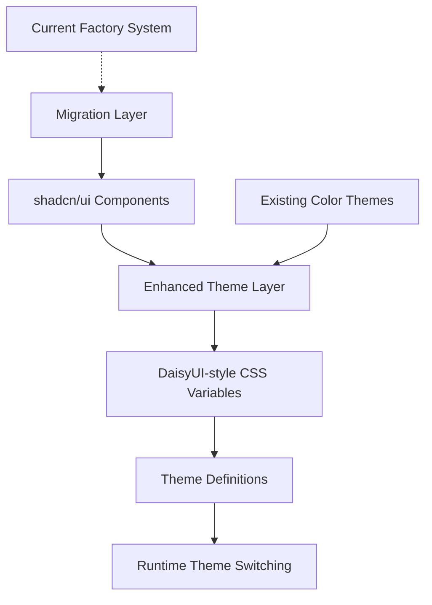
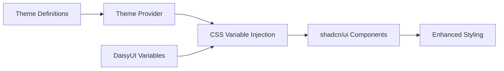

# Design Document

## Overview

This design outlines the migration from the current factory-based component system to standard shadcn/ui components enhanced with DaisyUI-style theming capabilities. The solution provides comprehensive theme control over component properties like border radius, sizing, spacing, shadows, and colors while maintaining shadcn/ui as the reliable foundation.

## Architecture

### High-Level Architecture



### Component Architecture



## Components and Interfaces

### 1. Enhanced Theme System

#### Theme Definition Interface

```typescript
interface EnhancedTheme {
  id: string
  name: string
  description: string
  
  // Color scheme
  colorScheme: 'light' | 'dark'
  
  // Base colors (DaisyUI-style)
  colors: {
    // Base surface colors
    'base-100': string      // Main background
    'base-200': string      // Secondary background  
    'base-300': string      // Tertiary background
    'base-content': string  // Text on base colors
    
    // Semantic colors
    primary: string
    'primary-content': string
    secondary: string
    'secondary-content': string
    accent: string
    'accent-content': string
    neutral: string
    'neutral-content': string
    
    // Status colors
    info: string
    'info-content': string
    success: string
    'success-content': string
    warning: string
    'warning-content': string
    error: string
    'error-content': string
  }
  
  // Component-specific properties
  radius: {
    'radius-box': string      // Cards, modals, alerts
    'radius-field': string    // Buttons, inputs, selects
    'radius-selector': string // Checkboxes, toggles, badges
  }
  
  sizing: {
    'size-field': string      // Button/input height base
    'size-selector': string   // Small controls size
  }
  
  // Visual effects
  effects: {
    border: string           // Border style/width
    depth: string           // Shadow intensity
    noise?: string          // Optional texture/pattern
  }
}
```

#### CSS Variable Mapping

```typescript
interface ThemeCSSVariables {
  // Color variables
  '--color-base-100': string
  '--color-base-200': string
  '--color-base-300': string
  '--color-base-content': string
  '--color-primary': string
  '--color-primary-content': string
  '--color-secondary': string
  '--color-secondary-content': string
  '--color-accent': string
  '--color-accent-content': string
  '--color-neutral': string
  '--color-neutral-content': string
  '--color-info': string
  '--color-info-content': string
  '--color-success': string
  '--color-success-content': string
  '--color-warning': string
  '--color-warning-content': string
  '--color-error': string
  '--color-error-content': string
  
  // Component radius variables
  '--radius-box': string
  '--radius-field': string
  '--radius-selector': string
  
  // Sizing variables
  '--size-field': string
  '--size-selector': string
  
  // Effect variables
  '--border': string
  '--depth': string
  '--noise'?: string
}
```

### 2. Component Migration Strategy

#### Migration Mapping

| Current Factory Component | shadcn/ui Equivalent | Migration Notes |
|--------------------------|---------------------|-----------------|
| `createInteractiveComponent('Button')` | `@/components/ui/button` | Replace with standard Button |
| `createLayoutComponent('Card')` | `@/components/ui/card` | Use Card.Root, Card.Header, etc. |
| `createFormComponent('Input')` | `@/components/ui/input` | Standard Input with enhanced theming |
| `createLayoutComponent('Alert')` | `@/components/ui/alert` | Use Alert with proper semantic variants |
| `createInteractiveComponent('Badge')` | `@/components/ui/badge` | Standard Badge with theme variables |

#### Enhanced shadcn/ui Components

Each shadcn/ui component will be enhanced to use DaisyUI-style variables:

```typescript
// Enhanced Button (example)
const buttonVariants = cva(
  "inline-flex items-center justify-center whitespace-nowrap text-sm font-medium ring-offset-background transition-colors focus-visible:outline-none focus-visible:ring-2 focus-visible:ring-ring focus-visible:ring-offset-2 disabled:pointer-events-none disabled:opacity-50",
  {
    variants: {
      variant: {
        default: "bg-[var(--color-primary)] text-[var(--color-primary-content)] hover:bg-[var(--color-primary)]/90",
        secondary: "bg-[var(--color-secondary)] text-[var(--color-secondary-content)] hover:bg-[var(--color-secondary)]/80",
        // ... other variants
      },
      size: {
        default: "h-[var(--size-field)] px-4 py-2",
        sm: "h-[calc(var(--size-field)*0.8)] px-3",
        lg: "h-[calc(var(--size-field)*1.2)] px-8",
        // ... other sizes
      },
    },
    defaultVariants: {
      variant: "default",
      size: "default",
    },
  }
)

// Apply radius based on component type
const buttonClasses = cn(
  buttonVariants({ variant, size, className }),
  "rounded-[var(--radius-field)]" // Use field radius for buttons
)
```

### 3. Theme Provider System

#### Enhanced Theme Provider

```typescript
interface ThemeProviderProps {
  children: React.ReactNode
  defaultTheme?: string
  storageKey?: string
  enableSystem?: boolean
  disableTransitionOnChange?: boolean
}

export function EnhancedThemeProvider({
  children,
  defaultTheme = "base",
  storageKey = "enhanced-theme",
  enableSystem = true,
  disableTransitionOnChange = false,
  ...props
}: ThemeProviderProps) {
  // Theme management logic
  // CSS variable injection
  // System preference detection
  // Storage management
}
```

#### Theme Context

```typescript
interface ThemeContextType {
  theme: string
  themes: EnhancedTheme[]
  setTheme: (theme: string) => void
  systemTheme: 'light' | 'dark'
  resolvedTheme: string
  
  // Enhanced methods
  getThemeVariable: (variable: keyof ThemeCSSVariables) => string
  applyThemeVariant: (variant: ThemeVariant) => void
  resetToDefault: () => void
}
```

## Data Models

### 1. Theme Variants

Pre-defined theme variants that modify base themes:

```typescript
interface ThemeVariant {
  id: string
  name: string
  description: string
  modifiers: Partial<EnhancedTheme>
}

// Example variants
const themeVariants: ThemeVariant[] = [
  {
    id: 'rounded',
    name: 'Rounded',
    description: 'Large border radius for friendly appearance',
    modifiers: {
      radius: {
        'radius-box': '1rem',
        'radius-field': '0.75rem',
        'radius-selector': '9999px'
      }
    }
  },
  {
    id: 'sharp',
    name: 'Sharp',
    description: 'Minimal border radius for professional look',
    modifiers: {
      radius: {
        'radius-box': '0.25rem',
        'radius-field': '0.125rem',
        'radius-selector': '0.125rem'
      }
    }
  },
  {
    id: 'compact',
    name: 'Compact',
    description: 'Smaller sizing for dense layouts',
    modifiers: {
      sizing: {
        'size-field': '2rem',
        'size-selector': '1rem'
      }
    }
  },
  {
    id: 'spacious',
    name: 'Spacious',
    description: 'Larger sizing for comfortable layouts',
    modifiers: {
      sizing: {
        'size-field': '3rem',
        'size-selector': '1.5rem'
      }
    }
  }
]
```

### 2. Default Theme Mapping

Migration from current themes to enhanced themes:

```typescript
const defaultThemeMapping: Record<string, EnhancedTheme> = {
  'base': {
    id: 'base',
    name: 'Base',
    description: 'Default shadcn/ui appearance',
    colorScheme: 'light',
    colors: {
      'base-100': '#ffffff',
      'base-200': '#f8fafc',
      'base-300': '#f1f5f9',
      'base-content': '#0f172a',
      primary: '#2563eb',
      'primary-content': '#ffffff',
      // ... map existing color variables
    },
    radius: {
      'radius-box': '0.75rem',    // Current --radius-2xl
      'radius-field': '0.375rem', // Current --radius-lg  
      'radius-selector': '0.25rem' // Current --radius-md
    },
    sizing: {
      'size-field': '2.5rem',     // Standard button/input height
      'size-selector': '1.25rem'  // Standard checkbox/toggle size
    },
    effects: {
      border: '1px solid var(--color-base-300)',
      depth: '0 4px 6px -1px rgba(0, 0, 0, 0.1)'
    }
  }
  // ... other theme mappings
}
```

## Error Handling

### 1. Theme Validation

```typescript
interface ThemeValidationResult {
  isValid: boolean
  errors: string[]
  warnings: string[]
}

function validateTheme(theme: EnhancedTheme): ThemeValidationResult {
  const errors: string[] = []
  const warnings: string[] = []
  
  // Required field validation
  if (!theme.id) errors.push('Theme ID is required')
  if (!theme.name) errors.push('Theme name is required')
  
  // Color validation
  Object.entries(theme.colors).forEach(([key, value]) => {
    if (!isValidColor(value)) {
      errors.push(`Invalid color value for ${key}: ${value}`)
    }
  })
  
  // CSS unit validation
  Object.entries(theme.radius).forEach(([key, value]) => {
    if (!isValidCSSUnit(value)) {
      errors.push(`Invalid CSS unit for ${key}: ${value}`)
    }
  })
  
  // Contrast ratio warnings
  const contrastRatio = getContrastRatio(
    theme.colors.primary, 
    theme.colors['primary-content']
  )
  if (contrastRatio < 4.5) {
    warnings.push('Primary color contrast ratio may not meet WCAG AA standards')
  }
  
  return {
    isValid: errors.length === 0,
    errors,
    warnings
  }
}
```

### 2. Fallback Mechanisms

```typescript
function getThemeVariable(
  variable: keyof ThemeCSSVariables, 
  fallback?: string
): string {
  const value = getComputedStyle(document.documentElement)
    .getPropertyValue(variable)
    .trim()
  
  if (!value) {
    console.warn(`Theme variable ${variable} not found, using fallback`)
    return fallback || getDefaultValue(variable)
  }
  
  return value
}

function getDefaultValue(variable: keyof ThemeCSSVariables): string {
  const defaults: Record<string, string> = {
    '--color-primary': '#2563eb',
    '--radius-field': '0.375rem',
    '--size-field': '2.5rem',
    // ... other defaults
  }
  
  return defaults[variable] || ''
}
```

## Testing Strategy

### 1. Component Migration Testing

```typescript
describe('Component Migration', () => {
  test('Button component uses theme variables', () => {
    render(<Button variant="primary">Test</Button>)
    
    const button = screen.getByRole('button')
    const styles = getComputedStyle(button)
    
    expect(styles.backgroundColor).toBe('var(--color-primary)')
    expect(styles.borderRadius).toBe('var(--radius-field)')
    expect(styles.height).toBe('var(--size-field)')
  })
  
  test('Card component uses box radius', () => {
    render(<Card>Test Card</Card>)
    
    const card = screen.getByText('Test Card').closest('[class*="card"]')
    const styles = getComputedStyle(card!)
    
    expect(styles.borderRadius).toBe('var(--radius-box)')
  })
})
```

### 2. Theme Switching Testing

```typescript
describe('Theme Switching', () => {
  test('theme variables update on theme change', () => {
    const { result } = renderHook(() => useTheme())
    
    act(() => {
      result.current.setTheme('rounded')
    })
    
    const rootStyles = getComputedStyle(document.documentElement)
    expect(rootStyles.getPropertyValue('--radius-field')).toBe('0.75rem')
  })
  
  test('theme persistence works', () => {
    localStorage.setItem('enhanced-theme', 'compact')
    
    render(<ThemeProvider><TestComponent /></ThemeProvider>)
    
    expect(document.documentElement.getAttribute('data-theme')).toBe('compact')
  })
})
```

### 3. Visual Regression Testing

```typescript
// Storybook visual testing
export default {
  title: 'Theme System/Visual Regression',
  parameters: {
    chromatic: { 
      modes: {
        'base': { theme: 'base' },
        'rounded': { theme: 'rounded' },
        'sharp': { theme: 'sharp' },
        'compact': { theme: 'compact' },
        'spacious': { theme: 'spacious' }
      }
    }
  }
}

export const AllComponents = () => (
  <div className="space-y-4 p-4">
    <Button>Primary Button</Button>
    <Card>
      <CardHeader>
        <CardTitle>Card Title</CardTitle>
      </CardHeader>
      <CardContent>Card content</CardContent>
    </Card>
    <Input placeholder="Input field" />
    <Alert>
      <AlertTitle>Alert Title</AlertTitle>
      <AlertDescription>Alert description</AlertDescription>
    </Alert>
  </div>
)
```

## Performance Considerations

### 1. CSS Variable Optimization

- Use CSS custom properties for runtime theme switching
- Minimize repaints by updating only root-level variables
- Implement theme preloading for faster switching

### 2. Bundle Size Management

- Tree-shake unused theme definitions
- Lazy load theme variants
- Compress theme data structures

### 3. Runtime Performance

- Cache computed theme values
- Debounce theme switching operations
- Use CSS transitions for smooth theme changes

## Migration Plan

### Phase 1: Foundation (Week 1-2)
1. Set up enhanced theme system structure
2. Create DaisyUI-style CSS variable definitions
3. Implement theme provider and context
4. Create default theme mappings

### Phase 2: Core Components (Week 3-4)
1. Replace Button, Input, Card components with shadcn/ui
2. Enhance with theme variable integration
3. Update component APIs and props
4. Test theme switching functionality

### Phase 3: Extended Components (Week 5-6)
1. Replace Alert, Badge, Dialog components
2. Migrate layout components (Container, Stack, Grid)
3. Update compound components
4. Implement theme variants

### Phase 4: Integration & Testing (Week 7-8)
1. Update all pages to use new components
2. Comprehensive testing across all themes
3. Performance optimization
4. Documentation updates

### Phase 5: Cleanup (Week 9)
1. Remove factory system code
2. Clean up unused dependencies
3. Final testing and bug fixes
4. Production deployment

This design provides a comprehensive approach to migrating from the factory system to shadcn/ui while adding powerful DaisyUI-style theming capabilities.