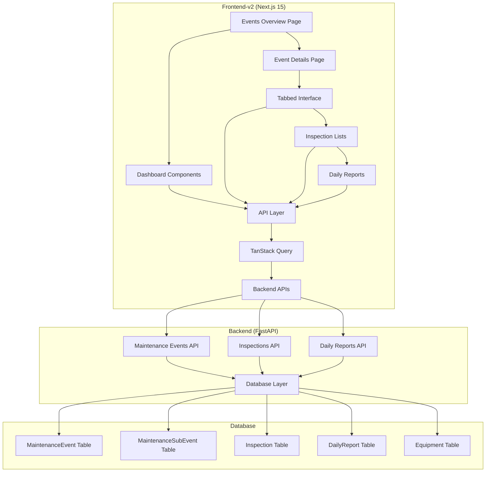
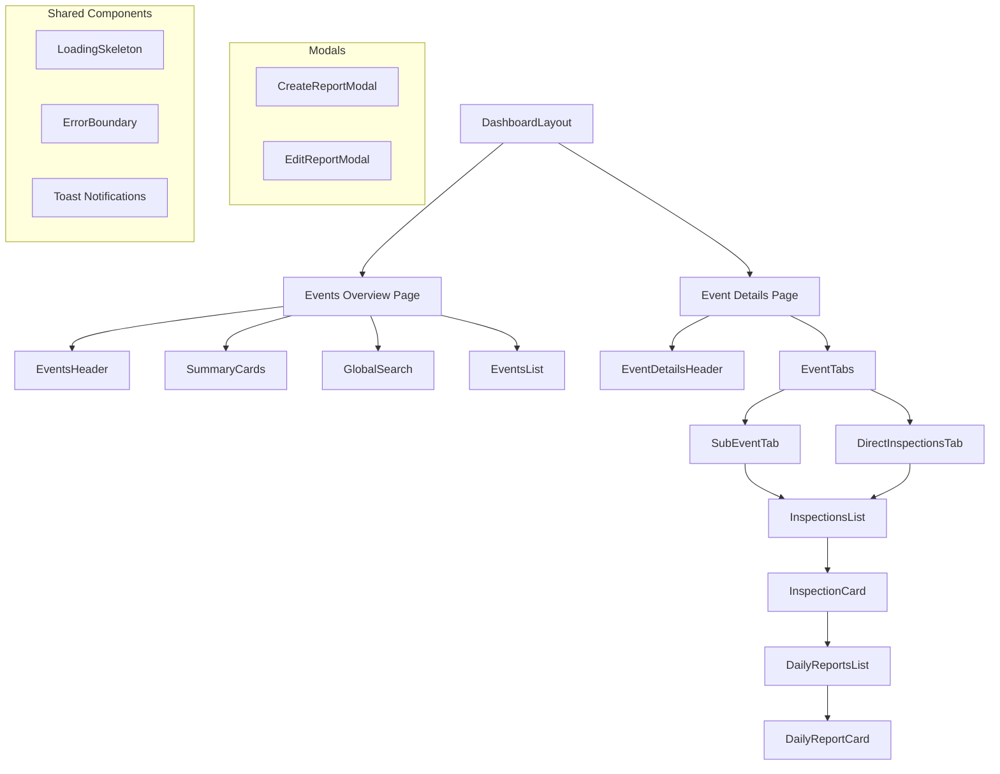

# Design Document: Maintenance Events & Daily Reports System

## Overview

This design document outlines the architecture and implementation approach for creating a new two-level Maintenance Events & Daily Reports system in frontend-v2. The system replaces the old Enhanced Daily Reports page with a modern, hierarchical navigation structure that provides better organization and context for maintenance events, inspections, and daily reports.

### Key Design Principles

1. **Two-Level Navigation**: Events Overview → Event Details for better information hierarchy
2. **Design System Consistency**: Full adherence to shadcn/ui components and Tailwind spacing standards
3. **Backend Integration**: Real-time data from maintenance events, inspections, and daily reports APIs
4. **Responsive Design**: Mobile-first approach with touch-friendly interactions
5. **Performance Optimization**: Efficient data loading and caching with TanStack Query

## Architecture

### High-Level Architecture



### Component Architecture



## Components and Interfaces

### 1. Page Components

#### Maintenance Events Overview Page
**Location**: `frontend-v2/src/app/maintenance-events/page.tsx`

```typescript
interface MaintenanceEventsOverviewPageProps {
  searchParams?: {
    search?: string
    status?: MaintenanceEventStatus
    eventType?: MaintenanceEventType
    dateFrom?: string
    dateTo?: string
  }
}

export default function MaintenanceEventsOverviewPage({ searchParams }: MaintenanceEventsOverviewPageProps) {
  return (
    <DashboardLayout 
      breadcrumbs={[
        { label: 'Inspection Management', href: '/dashboard' },
        { label: 'Maintenance Events', current: true }
      ]}
    >
      <EventsOverviewContainer initialFilters={searchParams} />
    </DashboardLayout>
  )
}
```

#### Event Details Page
**Location**: `frontend-v2/src/app/maintenance-events/[eventId]/page.tsx`

```typescript
interface EventDetailsPageProps {
  params: { eventId: string }
  searchParams?: {
    tab?: string
    search?: string
  }
}

export default function EventDetailsPage({ params, searchParams }: EventDetailsPageProps) {
  return (
    <DashboardLayout 
      breadcrumbs={[
        { label: 'Inspection Management', href: '/dashboard' },
        { label: 'Maintenance Events', href: '/maintenance-events' },
        { label: 'Event Details', current: true }
      ]}
    >
      <EventDetailsContainer 
        eventId={params.eventId} 
        initialTab={searchParams?.tab}
        initialSearch={searchParams?.search}
      />
    </DashboardLayout>
  )
}
```

### 2. Container Components

#### EventsOverviewContainer
**Location**: `frontend-v2/src/components/daily-reports/events-overview-container.tsx`

```typescript
interface EventsOverviewContainerProps {
  initialFilters?: EventsFilters
}

interface EventsFilters {
  search?: string
  status?: MaintenanceEventStatus
  eventType?: MaintenanceEventType
  dateFrom?: string
  dateTo?: string
}

export function EventsOverviewContainer({ initialFilters }: EventsOverviewContainerProps) {
  const [filters, setFilters] = useState<EventsFilters>(initialFilters || {})
  const { data: events, isLoading, error } = useMaintenanceEvents(filters)
  const { data: summary } = useEventsSummary(filters)

  return (
    <div className="flex flex-col gap-6">
      <EventsHeader />
      <SummaryCards summary={summary} loading={isLoading} />
      <div className="flex flex-col gap-4">
        <GlobalSearchAndFilters 
          filters={filters} 
          onFiltersChange={setFilters} 
        />
        <EventsList 
          events={events} 
          loading={isLoading} 
          error={error}
        />
      </div>
    </div>
  )
}
```

#### EventDetailsContainer
**Location**: `frontend-v2/src/components/daily-reports/event-details-container.tsx`

```typescript
interface EventDetailsContainerProps {
  eventId: string
  initialTab?: string
  initialSearch?: string
}

export function EventDetailsContainer({ 
  eventId, 
  initialTab, 
  initialSearch 
}: EventDetailsContainerProps) {
  const [activeTab, setActiveTab] = useState(initialTab || 'direct-inspections')
  const [search, setSearch] = useState(initialSearch || '')
  
  const { data: event, isLoading } = useMaintenanceEvent(eventId)
  const { data: subEvents } = useMaintenanceSubEvents(eventId)
  
  if (isLoading) return <EventDetailsSkeleton />
  if (!event) return <EventNotFound />

  return (
    <div className="flex flex-col gap-6">
      <EventDetailsHeader event={event} />
      <EventTabs 
        event={event}
        subEvents={subEvents}
        activeTab={activeTab}
        onTabChange={setActiveTab}
        search={search}
        onSearchChange={setSearch}
      />
    </div>
  )
}
```

### 3. Display Components

#### SummaryCards
**Location**: `frontend-v2/src/components/daily-reports/summary-cards.tsx`

```typescript
interface SummaryCardsProps {
  summary?: EventsSummary
  loading?: boolean
  onCardClick?: (metric: string) => void
}

interface EventsSummary {
  totalEvents: number
  activeEvents: number
  completedEvents: number
  overdueEvents: number
  totalInspections: number
  activeInspections: number
  totalReports: number
  reportsThisMonth: number
}

export function SummaryCards({ summary, loading, onCardClick }: SummaryCardsProps) {
  const cards = [
    {
      title: 'Total Events',
      value: summary?.totalEvents || 0,
      icon: <Wrench className="h-4 w-4" />,
      description: 'All maintenance events',
      onClick: () => onCardClick?.('total-events')
    },
    {
      title: 'Active Events',
      value: summary?.activeEvents || 0,
      icon: <Activity className="h-4 w-4" />,
      description: 'Currently in progress',
      onClick: () => onCardClick?.('active-events')
    },
    // ... more cards
  ]

  return (
    <div className="grid gap-4 md:grid-cols-2 lg:grid-cols-4">
      {cards.map((card, index) => (
        <Card 
          key={index}
          className="cursor-pointer hover:shadow-md transition-shadow"
          onClick={card.onClick}
        >
          <CardHeader className="flex flex-row items-center justify-between space-y-0 pb-2">
            <CardTitle className="text-sm font-medium">
              {card.title}
            </CardTitle>
            {card.icon}
          </CardHeader>
          <CardContent>
            {loading ? (
              <Skeleton className="h-8 w-20" />
            ) : (
              <div className="text-2xl font-bold">{card.value}</div>
            )}
            <p className="text-xs text-muted-foreground">
              {card.description}
            </p>
          </CardContent>
        </Card>
      ))}
    </div>
  )
}
```

#### EventsList
**Location**: `frontend-v2/src/components/daily-reports/events-list.tsx`

```typescript
interface EventsListProps {
  events?: MaintenanceEvent[]
  loading?: boolean
  error?: Error | null
}

export function EventsList({ events, loading, error }: EventsListProps) {
  if (loading) return <EventsListSkeleton />
  if (error) return <EventsListError error={error} />
  if (!events?.length) return <EventsListEmpty />

  return (
    <div className="grid gap-4 md:grid-cols-2 lg:grid-cols-3">
      {events.map((event) => (
        <EventCard key={event.id} event={event} />
      ))}
    </div>
  )
}
```

#### EventCard
**Location**: `frontend-v2/src/components/daily-reports/event-card.tsx`

```typescript
interface EventCardProps {
  event: MaintenanceEvent
}

export function EventCard({ event }: EventCardProps) {
  const router = useRouter()
  
  const handleClick = () => {
    router.push(`/daily-reports/events/${event.id}`)
  }

  return (
    <Card 
      className="cursor-pointer hover:shadow-md transition-shadow"
      onClick={handleClick}
    >
      <CardHeader className="pb-3">
        <div className="flex items-center justify-between">
          <CardTitle className="text-lg">{event.title}</CardTitle>
          <Badge variant={getStatusVariant(event.status)}>
            {event.status}
          </Badge>
        </div>
        <CardDescription className="text-sm">
          {event.event_number}
        </CardDescription>
      </CardHeader>
      <CardContent className="space-y-3">
        <div className="flex items-center gap-2 text-sm text-muted-foreground">
          <Calendar className="h-4 w-4" />
          <span>
            {format(new Date(event.planned_start_date), 'MMM dd, yyyy')} - 
            {format(new Date(event.planned_end_date), 'MMM dd, yyyy')}
          </span>
        </div>
        
        <div className="flex items-center justify-between text-sm">
          <div className="flex items-center gap-2">
            <Layers className="h-4 w-4" />
            <span>{event.sub_events_count || 0} Sub-events</span>
          </div>
          <div className="flex items-center gap-2">
            <ClipboardList className="h-4 w-4" />
            <span>{event.inspections_count || 0} Inspections</span>
          </div>
        </div>
        
        {event.description && (
          <p className="text-sm text-muted-foreground line-clamp-2">
            {event.description}
          </p>
        )}
      </CardContent>
    </Card>
  )
}
```

#### EventTabs
**Location**: `frontend-v2/src/components/daily-reports/event-tabs.tsx`

```typescript
interface EventTabsProps {
  event: MaintenanceEvent
  subEvents?: MaintenanceSubEvent[]
  activeTab: string
  onTabChange: (tab: string) => void
  search: string
  onSearchChange: (search: string) => void
}

export function EventTabs({ 
  event, 
  subEvents, 
  activeTab, 
  onTabChange, 
  search, 
  onSearchChange 
}: EventTabsProps) {
  const tabs = useMemo(() => {
    const tabList = []
    
    // Direct inspections tab (always present)
    tabList.push({
      id: 'direct-inspections',
      label: 'Direct Inspections',
      badge: event.direct_inspections_count || 0
    })
    
    // Sub-event tabs
    if (subEvents?.length) {
      subEvents.forEach(subEvent => {
        tabList.push({
          id: `sub-event-${subEvent.id}`,
          label: subEvent.title,
          badge: subEvent.inspections_count || 0
        })
      })
    }
    
    return tabList
  }, [event, subEvents])

  return (
    <div className="space-y-4">
      <div className="flex items-center justify-between">
        <Tabs value={activeTab} onValueChange={onTabChange}>
          <TabsList className="grid w-full grid-cols-auto">
            {tabs.map(tab => (
              <TabsTrigger key={tab.id} value={tab.id} className="relative">
                {tab.label}
                {tab.badge > 0 && (
                  <Badge 
                    variant="secondary" 
                    className="ml-2 h-5 w-5 rounded-full p-0 text-xs"
                  >
                    {tab.badge}
                  </Badge>
                )}
              </TabsTrigger>
            ))}
          </TabsList>
        </Tabs>
        
        <div className="flex items-center gap-2">
          <div className="relative">
            <Search className="absolute left-2 top-2.5 h-4 w-4 text-muted-foreground" />
            <Input
              placeholder="Search inspections..."
              value={search}
              onChange={(e) => onSearchChange(e.target.value)}
              className="pl-8 w-64"
            />
          </div>
        </div>
      </div>
      
      {tabs.map(tab => (
        <TabsContent key={tab.id} value={tab.id}>
          <InspectionsList 
            eventId={event.id}
            subEventId={tab.id.startsWith('sub-event-') ? 
              parseInt(tab.id.replace('sub-event-', '')) : 
              undefined
            }
            search={search}
          />
        </TabsContent>
      ))}
    </div>
  )
}
```

#### InspectionsList
**Location**: `frontend-v2/src/components/daily-reports/inspections-list.tsx`

```typescript
interface InspectionsListProps {
  eventId: string
  subEventId?: number
  search?: string
}

export function InspectionsList({ eventId, subEventId, search }: InspectionsListProps) {
  const { data: inspections, isLoading } = useInspections({
    eventId,
    subEventId,
    search
  })

  if (isLoading) return <InspectionsListSkeleton />
  if (!inspections?.length) return <InspectionsListEmpty />

  return (
    <div className="space-y-4">
      {inspections.map(inspection => (
        <InspectionCard 
          key={inspection.id} 
          inspection={inspection}
          searchTerm={search}
        />
      ))}
    </div>
  )
}
```

#### InspectionCard
**Location**: `frontend-v2/src/components/daily-reports/inspection-card.tsx`

```typescript
interface InspectionCardProps {
  inspection: Inspection
  searchTerm?: string
}

export function InspectionCard({ inspection, searchTerm }: InspectionCardProps) {
  const [isExpanded, setIsExpanded] = useState(false)
  const { data: dailyReports } = useDailyReports({ inspectionId: inspection.id })
  
  const highlightText = (text: string, searchTerm?: string) => {
    if (!searchTerm) return text
    // Highlight matching text
    const regex = new RegExp(`(${searchTerm})`, 'gi')
    return text.replace(regex, '<mark>$1</mark>')
  }

  return (
    <Card className={cn(
      "transition-all duration-200",
      isExpanded && "shadow-md"
    )}>
      {/* Sticky Header */}
      <div className="sticky top-0 bg-card border-b border-border z-10">
        <CardHeader className="pb-3">
          <div className="flex items-center justify-between">
            <div className="flex items-center gap-3">
              <Button
                variant="ghost"
                size="sm"
                onClick={() => setIsExpanded(!isExpanded)}
                className="p-1"
              >
                {isExpanded ? (
                  <ChevronDown className="h-4 w-4" />
                ) : (
                  <ChevronRight className="h-4 w-4" />
                )}
              </Button>
              
              <div>
                <CardTitle 
                  className="text-lg"
                  dangerouslySetInnerHTML={{
                    __html: highlightText(inspection.title, searchTerm)
                  }}
                />
                <CardDescription className="flex items-center gap-2">
                  <span>{inspection.inspection_number}</span>
                  <Separator orientation="vertical" className="h-4" />
                  <span 
                    dangerouslySetInnerHTML={{
                      __html: highlightText(inspection.equipment_tag || '', searchTerm)
                    }}
                  />
                </CardDescription>
              </div>
            </div>
            
            <div className="flex items-center gap-2">
              <Badge variant={getInspectionStatusVariant(inspection.status)}>
                {inspection.status}
              </Badge>
              
              {dailyReports && dailyReports.length > 0 && (
                <Badge variant="outline" className="gap-1">
                  <FileText className="h-3 w-3" />
                  {dailyReports.length}
                </Badge>
              )}
              
              <Button
                variant="outline"
                size="sm"
                onClick={() => {/* Open create report modal */}}
              >
                <Plus className="h-4 w-4 mr-1" />
                Add Report
              </Button>
            </div>
          </div>
        </CardHeader>
      </div>
      
      {/* Expandable Content */}
      <Collapsible open={isExpanded} onOpenChange={setIsExpanded}>
        <CollapsibleContent>
          <CardContent className="pt-0">
            <div className="space-y-4">
              {/* Inspection Details */}
              <div className="grid grid-cols-2 gap-4 text-sm">
                <div>
                  <span className="text-muted-foreground">Start Date:</span>
                  <span className="ml-2">
                    {format(new Date(inspection.start_date), 'MMM dd, yyyy')}
                  </span>
                </div>
                <div>
                  <span className="text-muted-foreground">End Date:</span>
                  <span className="ml-2">
                    {inspection.end_date ? 
                      format(new Date(inspection.end_date), 'MMM dd, yyyy') : 
                      'Not set'
                    }
                  </span>
                </div>
              </div>
              
              {/* Daily Reports List */}
              <div className="space-y-2">
                <h4 className="font-medium text-sm">Daily Reports</h4>
                {dailyReports?.length ? (
                  <div className="space-y-2">
                    {dailyReports.map(report => (
                      <DailyReportCard 
                        key={report.id} 
                        report={report} 
                        compact={true}
                      />
                    ))}
                  </div>
                ) : (
                  <div className="text-center py-4 text-muted-foreground text-sm">
                    No daily reports yet
                  </div>
                )}
              </div>
            </div>
          </CardContent>
        </CollapsibleContent>
      </Collapsible>
    </Card>
  )
}
```

#### DailyReportCard
**Location**: `frontend-v2/src/components/daily-reports/daily-report-card.tsx`

```typescript
interface DailyReportCardProps {
  report: DailyReport
  compact?: boolean
  onEdit?: () => void
  onDelete?: () => void
}

export function DailyReportCard({ report, compact = false, onEdit, onDelete }: DailyReportCardProps) {
  if (compact) {
    return (
      <Card className="p-3 hover:shadow-sm transition-shadow">
        <div className="flex items-center justify-between">
          <div className="flex-1">
            <div className="flex items-center gap-2 text-sm">
              <Calendar className="h-3 w-3 text-muted-foreground" />
              <span className="font-medium">
                {format(new Date(report.report_date), 'MMM dd, yyyy')}
              </span>
              {report.inspector_names && (
                <>
                  <Separator orientation="vertical" className="h-3" />
                  <span className="text-muted-foreground">
                    {report.inspector_names}
                  </span>
                </>
              )}
            </div>
            {report.description && (
              <p className="text-xs text-muted-foreground mt-1 line-clamp-1">
                {report.description}
              </p>
            )}
          </div>
          
          <div className="flex items-center gap-1">
            <Button
              variant="ghost"
              size="sm"
              onClick={onEdit}
              className="h-7 w-7 p-0"
            >
              <Edit className="h-3 w-3" />
            </Button>
            <Button
              variant="ghost"
              size="sm"
              onClick={onDelete}
              className="h-7 w-7 p-0 text-destructive hover:text-destructive"
            >
              <Trash2 className="h-3 w-3" />
            </Button>
          </div>
        </div>
      </Card>
    )
  }

  // Full card view for standalone display
  return (
    <Card>
      <CardHeader>
        <div className="flex items-center justify-between">
          <CardTitle className="text-lg">
            Daily Report - {format(new Date(report.report_date), 'MMM dd, yyyy')}
          </CardTitle>
          <div className="flex items-center gap-2">
            <Button variant="outline" size="sm" onClick={onEdit}>
              <Edit className="h-4 w-4 mr-1" />
              Edit
            </Button>
            <Button variant="outline" size="sm" onClick={onDelete}>
              <Trash2 className="h-4 w-4 mr-1" />
              Delete
            </Button>
          </div>
        </div>
        {report.inspector_names && (
          <CardDescription>
            Inspector(s): {report.inspector_names}
          </CardDescription>
        )}
      </CardHeader>
      
      <CardContent className="space-y-4">
        {report.description && (
          <div>
            <h4 className="font-medium text-sm mb-2">Description</h4>
            <p className="text-sm text-muted-foreground">{report.description}</p>
          </div>
        )}
        
        {report.findings && (
          <div>
            <h4 className="font-medium text-sm mb-2">Findings</h4>
            <p className="text-sm text-muted-foreground">{report.findings}</p>
          </div>
        )}
        
        {report.recommendations && (
          <div>
            <h4 className="font-medium text-sm mb-2">Recommendations</h4>
            <p className="text-sm text-muted-foreground">{report.recommendations}</p>
          </div>
        )}
        
        <div className="flex items-center gap-4 text-xs text-muted-foreground">
          <span>Created: {format(new Date(report.created_at), 'MMM dd, yyyy HH:mm')}</span>
          {report.updated_at !== report.created_at && (
            <span>Updated: {format(new Date(report.updated_at), 'MMM dd, yyyy HH:mm')}</span>
          )}
        </div>
      </CardContent>
    </Card>
  )
}
```

### 4. Modal Components

#### CreateReportModal
**Location**: `frontend-v2/src/components/daily-reports/create-report-modal.tsx`

```typescript
interface CreateReportModalProps {
  isOpen: boolean
  onClose: () => void
  inspectionId: string
  onSuccess?: (report: DailyReport) => void
}

export function CreateReportModal({ isOpen, onClose, inspectionId, onSuccess }: CreateReportModalProps) {
  // Modal for creating new daily reports with form validation
}
```

## Data Models

### TypeScript Interfaces

```typescript
// Core data types
interface MaintenanceEvent {
  id: number
  event_number: string
  title: string
  description?: string
  event_type: MaintenanceEventType
  status: MaintenanceEventStatus
  planned_start_date: string
  planned_end_date: string
  actual_start_date?: string
  actual_end_date?: string
  created_by?: string
  approved_by?: string
  approval_date?: string
  notes?: string
  sub_events_count?: number
  inspections_count?: number
  direct_inspections_count?: number
  created_at: string
  updated_at: string
}

interface MaintenanceSubEvent {
  id: number
  parent_event_id: number
  sub_event_number: string
  title: string
  description?: string
  sub_type?: OverhaulSubType
  status: MaintenanceEventStatus
  planned_start_date: string
  planned_end_date: string
  actual_start_date?: string
  actual_end_date?: string
  completion_percentage: number
  notes?: string
  inspections_count?: number
  created_at: string
  updated_at: string
}

interface Inspection {
  id: number
  inspection_number: string
  title: string
  description?: string
  start_date: string
  end_date?: string
  status: InspectionStatus
  equipment_id: number
  equipment_tag?: string
  equipment_description?: string
  requesting_department: RefineryDepartment
  final_report?: string
  work_order?: string
  permit_number?: string
  daily_reports_count?: number
  maintenance_event_id?: number
  maintenance_sub_event_id?: number
  created_at: string
  updated_at: string
}

interface DailyReport {
  id: number
  inspection_id: number
  report_date: string
  description: string
  inspector_ids: number[]
  inspector_names?: string
  findings?: string
  recommendations?: string
  weather_conditions?: string
  safety_notes?: string
  attachments?: string[]
  created_at: string
  updated_at: string
}

// Enums
enum MaintenanceEventType {
  Overhaul = 'Overhaul',
  Inspection = 'Inspection',
  Repair = 'Repair',
  Preventive = 'Preventive',
  Emergency = 'Emergency'
}

enum MaintenanceEventStatus {
  Planned = 'Planned',
  InProgress = 'InProgress',
  Completed = 'Completed',
  Cancelled = 'Cancelled',
  Postponed = 'Postponed'
}

enum InspectionStatus {
  InProgress = 'InProgress',
  Completed = 'Completed',
  Cancelled = 'Cancelled',
  OnHold = 'OnHold'
}

enum RefineryDepartment {
  Operations = 'Operations',
  Maintenance = 'Maintenance',
  Safety = 'Safety',
  Engineering = 'Engineering',
  QualityControl = 'QualityControl'
}

// Summary and filter types
interface EventsSummary {
  totalEvents: number
  activeEvents: number
  completedEvents: number
  overdueEvents: number
  totalInspections: number
  activeInspections: number
  totalReports: number
  reportsThisMonth: number
}

interface EventsFilters {
  search?: string
  status?: MaintenanceEventStatus
  eventType?: MaintenanceEventType
  dateFrom?: string
  dateTo?: string
}

interface InspectionsFilters {
  eventId?: string
  subEventId?: number
  search?: string
  status?: InspectionStatus
  equipmentTag?: string
}

// Hierarchical display types
type HierarchicalItem = MaintenanceEventItem | InspectionItem

interface MaintenanceEventItem {
  type: 'maintenance'
  id: string
  data: MaintenanceEvent
  children?: InspectionItem[]
}

interface InspectionItem {
  type: 'inspection'
  id: string
  data: Inspection
  children?: DailyReportItem[]
}

interface DailyReportItem {
  type: 'daily-report'
  id: string
  data: DailyReport
}
```

## API Integration Layer

### API Service Architecture

```typescript
// API client configuration
class ApiClient {
  private baseURL = '/api/v1'
  
  async get<T>(endpoint: string, params?: Record<string, any>): Promise<T> {
    const url = new URL(endpoint, this.baseURL)
    if (params) {
      Object.entries(params).forEach(([key, value]) => {
        if (value !== undefined && value !== null) {
          url.searchParams.append(key, String(value))
        }
      })
    }
    
    const response = await fetch(url.toString())
    if (!response.ok) {
      throw new ApiError(response.status, await response.text())
    }
    return response.json()
  }
  
  async post<T>(endpoint: string, data: any): Promise<T> {
    const response = await fetch(`${this.baseURL}${endpoint}`, {
      method: 'POST',
      headers: { 'Content-Type': 'application/json' },
      body: JSON.stringify(data)
    })
    if (!response.ok) {
      throw new ApiError(response.status, await response.text())
    }
    return response.json()
  }
  
  async put<T>(endpoint: string, data: any): Promise<T> {
    const response = await fetch(`${this.baseURL}${endpoint}`, {
      method: 'PUT',
      headers: { 'Content-Type': 'application/json' },
      body: JSON.stringify(data)
    })
    if (!response.ok) {
      throw new ApiError(response.status, await response.text())
    }
    return response.json()
  }
  
  async delete<T>(endpoint: string): Promise<T> {
    const response = await fetch(`${this.baseURL}${endpoint}`, {
      method: 'DELETE'
    })
    if (!response.ok) {
      throw new ApiError(response.status, await response.text())
    }
    return response.json()
  }
}

// Maintenance Events API service
class MaintenanceEventsApiService {
  constructor(private client: ApiClient) {}
  
  async getMaintenanceEvents(filters?: EventsFilters): Promise<MaintenanceEvent[]> {
    return this.client.get('/maintenance/events', filters)
  }
  
  async getMaintenanceEvent(id: string): Promise<MaintenanceEvent> {
    return this.client.get(`/maintenance/events/${id}`)
  }
  
  async getMaintenanceSubEvents(parentEventId: string): Promise<MaintenanceSubEvent[]> {
    return this.client.get('/maintenance/sub-events', { parent_event_id: parentEventId })
  }
  
  async getEventsSummary(filters?: EventsFilters): Promise<EventsSummary> {
    return this.client.get('/maintenance/statistics/summary', filters)
  }
}

// Inspections API service
class InspectionsApiService {
  constructor(private client: ApiClient) {}
  
  async getInspections(filters?: InspectionsFilters): Promise<Inspection[]> {
    return this.client.get('/inspections', filters)
  }
  
  async getInspection(id: number): Promise<Inspection> {
    return this.client.get(`/inspections/${id}`)
  }
  
  async updateInspectionStatus(id: number, status: InspectionStatus): Promise<Inspection> {
    return this.client.put(`/inspections/${id}`, { status })
  }
}

// Daily Reports API service
class DailyReportsApiService {
  constructor(private client: ApiClient) {}
  
  async getDailyReports(filters?: { inspectionId?: number }): Promise<DailyReport[]> {
    return this.client.get('/daily-reports', filters)
  }
  
  async createDailyReport(data: CreateDailyReportRequest): Promise<DailyReport> {
    return this.client.post('/daily-reports', data)
  }
  
  async updateDailyReport(id: number, data: UpdateDailyReportRequest): Promise<DailyReport> {
    return this.client.put(`/daily-reports/${id}`, data)
  }
  
  async deleteDailyReport(id: number): Promise<void> {
    return this.client.delete(`/daily-reports/${id}`)
  }
}

// API instances
const apiClient = new ApiClient()
export const maintenanceEventsApi = new MaintenanceEventsApiService(apiClient)
export const inspectionsApi = new InspectionsApiService(apiClient)
export const dailyReportsApi = new DailyReportsApiService(apiClient)
```

### TanStack Query Integration

```typescript
// Query keys factory
export const queryKeys = {
  maintenanceEvents: {
    all: ['maintenance-events'] as const,
    lists: () => [...queryKeys.maintenanceEvents.all, 'list'] as const,
    list: (filters: EventsFilters) => [...queryKeys.maintenanceEvents.lists(), filters] as const,
    details: () => [...queryKeys.maintenanceEvents.all, 'detail'] as const,
    detail: (id: string) => [...queryKeys.maintenanceEvents.details(), id] as const,
    summary: (filters: EventsFilters) => [...queryKeys.maintenanceEvents.all, 'summary', filters] as const,
    subEvents: (parentId: string) => [...queryKeys.maintenanceEvents.all, 'sub-events', parentId] as const,
  },
  inspections: {
    all: ['inspections'] as const,
    lists: () => [...queryKeys.inspections.all, 'list'] as const,
    list: (filters: InspectionsFilters) => [...queryKeys.inspections.lists(), filters] as const,
    details: () => [...queryKeys.inspections.all, 'detail'] as const,
    detail: (id: number) => [...queryKeys.inspections.details(), id] as const,
  },
  dailyReports: {
    all: ['daily-reports'] as const,
    lists: () => [...queryKeys.dailyReports.all, 'list'] as const,
    list: (filters: { inspectionId?: number }) => [...queryKeys.dailyReports.lists(), filters] as const,
    details: () => [...queryKeys.dailyReports.all, 'detail'] as const,
    detail: (id: number) => [...queryKeys.dailyReports.details(), id] as const,
  },
}

// Maintenance Events hooks
export function useMaintenanceEvents(filters: EventsFilters = {}) {
  return useQuery({
    queryKey: queryKeys.maintenanceEvents.list(filters),
    queryFn: () => maintenanceEventsApi.getMaintenanceEvents(filters),
    staleTime: 5 * 60 * 1000, // 5 minutes
    retry: 3,
  })
}

export function useMaintenanceEvent(id: string) {
  return useQuery({
    queryKey: queryKeys.maintenanceEvents.detail(id),
    queryFn: () => maintenanceEventsApi.getMaintenanceEvent(id),
    staleTime: 5 * 60 * 1000,
    enabled: !!id,
  })
}

export function useMaintenanceSubEvents(parentEventId: string) {
  return useQuery({
    queryKey: queryKeys.maintenanceEvents.subEvents(parentEventId),
    queryFn: () => maintenanceEventsApi.getMaintenanceSubEvents(parentEventId),
    staleTime: 5 * 60 * 1000,
    enabled: !!parentEventId,
  })
}

export function useEventsSummary(filters: EventsFilters = {}) {
  return useQuery({
    queryKey: queryKeys.maintenanceEvents.summary(filters),
    queryFn: () => maintenanceEventsApi.getEventsSummary(filters),
    staleTime: 2 * 60 * 1000, // 2 minutes
  })
}

// Inspections hooks
export function useInspections(filters: InspectionsFilters = {}) {
  return useQuery({
    queryKey: queryKeys.inspections.list(filters),
    queryFn: () => inspectionsApi.getInspections(filters),
    staleTime: 5 * 60 * 1000,
    enabled: !!(filters.eventId || filters.subEventId),
  })
}

export function useInspection(id: number) {
  return useQuery({
    queryKey: queryKeys.inspections.detail(id),
    queryFn: () => inspectionsApi.getInspection(id),
    staleTime: 5 * 60 * 1000,
    enabled: !!id,
  })
}

// Daily Reports hooks
export function useDailyReports(filters: { inspectionId?: number } = {}) {
  return useQuery({
    queryKey: queryKeys.dailyReports.list(filters),
    queryFn: () => dailyReportsApi.getDailyReports(filters),
    staleTime: 2 * 60 * 1000, // 2 minutes
    enabled: !!filters.inspectionId,
  })
}

// Mutations
export function useCreateDailyReport() {
  const queryClient = useQueryClient()
  
  return useMutation({
    mutationFn: dailyReportsApi.createDailyReport,
    onSuccess: (newReport) => {
      // Invalidate daily reports list for the inspection
      queryClient.invalidateQueries({ 
        queryKey: queryKeys.dailyReports.list({ inspectionId: newReport.inspection_id })
      })
      // Invalidate inspections to update counts
      queryClient.invalidateQueries({ queryKey: queryKeys.inspections.all })
    },
  })
}

export function useUpdateDailyReport() {
  const queryClient = useQueryClient()
  
  return useMutation({
    mutationFn: ({ id, data }: { id: number; data: UpdateDailyReportRequest }) =>
      dailyReportsApi.updateDailyReport(id, data),
    onSuccess: (updatedReport) => {
      queryClient.invalidateQueries({ 
        queryKey: queryKeys.dailyReports.list({ inspectionId: updatedReport.inspection_id })
      })
      queryClient.setQueryData(
        queryKeys.dailyReports.detail(updatedReport.id),
        updatedReport
      )
    },
  })
}

export function useDeleteDailyReport() {
  const queryClient = useQueryClient()
  
  return useMutation({
    mutationFn: dailyReportsApi.deleteDailyReport,
    onSuccess: (_, deletedId) => {
      queryClient.invalidateQueries({ queryKey: queryKeys.dailyReports.all })
      queryClient.invalidateQueries({ queryKey: queryKeys.inspections.all })
    },
  })
}
```

## Error Handling

### Error Boundary Implementation

```typescript
interface DailyReportsErrorBoundaryProps {
  children: React.ReactNode
  fallback?: React.ComponentType<{ error: Error; resetError: () => void }>
}

export function DailyReportsErrorBoundary({ children, fallback: Fallback }: DailyReportsErrorBoundaryProps) {
  return (
    <ErrorBoundary
      FallbackComponent={Fallback || DefaultErrorFallback}
      onError={(error, errorInfo) => {
        console.error('Daily Reports Error:', error, errorInfo)
        // Send to error tracking service
      }}
    >
      {children}
    </ErrorBoundary>
  )
}

function DefaultErrorFallback({ error, resetError }: { error: Error; resetError: () => void }) {
  return (
    <div className="flex flex-col items-center justify-center p-8 space-y-4">
      <AlertTriangle className="h-12 w-12 text-destructive" />
      <h2 className="text-lg font-semibold">Something went wrong</h2>
      <p className="text-sm text-muted-foreground text-center max-w-md">
        {error.message || 'An unexpected error occurred while loading the daily reports.'}
      </p>
      <Button onClick={resetError} variant="outline">
        Try Again
      </Button>
    </div>
  )
}
```

### API Error Handling

```typescript
class ApiError extends Error {
  constructor(
    message: string,
    public statusCode: number,
    public code?: string
  ) {
    super(message)
    this.name = 'ApiError'
  }
}

async function handleApiResponse<T>(response: Response): Promise<T> {
  if (!response.ok) {
    const errorData = await response.json().catch(() => ({ message: 'Unknown error' }))
    throw new ApiError(
      errorData.message || `HTTP ${response.status}: ${response.statusText}`,
      response.status,
      errorData.code
    )
  }
  
  return response.json()
}

// Error toast notifications
export function useErrorHandler() {
  const { toast } = useToast()
  
  return useCallback((error: unknown) => {
    if (error instanceof ApiError) {
      if (error.statusCode === 401) {
        toast({
          title: 'Authentication Required',
          description: 'Please log in to continue.',
          variant: 'destructive',
        })
        // Redirect to login
      } else if (error.statusCode >= 500) {
        toast({
          title: 'Server Error',
          description: 'A server error occurred. Please try again later.',
          variant: 'destructive',
        })
      } else {
        toast({
          title: 'Error',
          description: error.message,
          variant: 'destructive',
        })
      }
    } else {
      toast({
        title: 'Unexpected Error',
        description: 'An unexpected error occurred. Please try again.',
        variant: 'destructive',
      })
    }
  }, [toast])
}
```

## Testing Strategy

### Component Testing

```typescript
// Example test for DailyReportsContainer
describe('DailyReportsContainer', () => {
  it('should load and display daily reports', async () => {
    const mockReports = [
      { id: 1, inspectionId: 1, reportDate: '2025-01-15', description: 'Test report' }
    ]
    
    server.use(
      http.get('/api/v1/daily-reports', () => {
        return HttpResponse.json(mockReports)
      })
    )
    
    render(<DailyReportsContainer />)
    
    expect(screen.getByText('Loading...')).toBeInTheDocument()
    
    await waitFor(() => {
      expect(screen.getByText('Test report')).toBeInTheDocument()
    })
  })
  
  it('should handle API errors gracefully', async () => {
    server.use(
      http.get('/api/v1/daily-reports', () => {
        return new HttpResponse(null, { status: 500 })
      })
    )
    
    render(<DailyReportsContainer />)
    
    await waitFor(() => {
      expect(screen.getByText(/server error/i)).toBeInTheDocument()
    })
  })
})
```

### Integration Testing

```typescript
// E2E test for daily reports workflow
test('daily reports workflow', async ({ page }) => {
  await page.goto('/daily-reports')
  
  // Wait for data to load
  await page.waitForSelector('[data-testid="daily-reports-list"]')
  
  // Test filtering
  await page.fill('[data-testid="search-input"]', 'pump')
  await page.waitForSelector('[data-testid="filtered-results"]')
  
  // Test creating a report
  await page.click('[data-testid="create-report-button"]')
  await page.fill('[data-testid="report-description"]', 'New test report')
  await page.click('[data-testid="submit-report"]')
  
  // Verify report was created
  await page.waitForSelector('text=New test report')
})
```

## Performance Optimization

### Virtualization for Large Lists

```typescript
import { FixedSizeList as List } from 'react-window'

interface VirtualizedListProps {
  items: HierarchicalItem[]
  height: number
  itemHeight: number
}

export function VirtualizedHierarchicalList({ items, height, itemHeight }: VirtualizedListProps) {
  const Row = ({ index, style }: { index: number; style: React.CSSProperties }) => (
    <div style={style}>
      <HierarchicalItemCard item={items[index]} />
    </div>
  )
  
  return (
    <List
      height={height}
      itemCount={items.length}
      itemSize={itemHeight}
      width="100%"
    >
      {Row}
    </List>
  )
}
```

### Optimistic Updates

```typescript
export function useOptimisticDailyReportUpdate() {
  const queryClient = useQueryClient()
  
  return useMutation({
    mutationFn: ({ id, data }: { id: number; data: UpdateDailyReportRequest }) =>
      dailyReportsApi.updateDailyReport(id, data),
    onMutate: async ({ id, data }) => {
      // Cancel outgoing refetches
      await queryClient.cancelQueries({ queryKey: dailyReportsKeys.detail(id) })
      
      // Snapshot previous value
      const previousReport = queryClient.getQueryData(dailyReportsKeys.detail(id))
      
      // Optimistically update
      queryClient.setQueryData(dailyReportsKeys.detail(id), (old: DailyReport) => ({
        ...old,
        ...data,
      }))
      
      return { previousReport }
    },
    onError: (err, { id }, context) => {
      // Rollback on error
      if (context?.previousReport) {
        queryClient.setQueryData(dailyReportsKeys.detail(id), context.previousReport)
      }
    },
    onSettled: (_, __, { id }) => {
      queryClient.invalidateQueries({ queryKey: dailyReportsKeys.detail(id) })
    },
  })
}
```

## Migration Strategy

### Phase 1: Infrastructure Setup
1. Create new page structure in frontend-v2
2. Set up API client and TanStack Query configuration
3. Create basic TypeScript interfaces
4. Set up error boundaries and loading states

### Phase 2: Core Components
1. Migrate and adapt UI components to shadcn/ui
2. Implement data fetching hooks
3. Create summary cards with real data
4. Implement basic filtering

### Phase 3: Advanced Features
1. Add hierarchical list with virtualization
2. Implement create/edit/delete operations
3. Add advanced filtering and search
4. Implement real-time updates

### Phase 4: Testing and Optimization
1. Add comprehensive test coverage
2. Optimize performance with virtualization
3. Implement error handling and recovery
4. Add accessibility improvements

This design provides a comprehensive foundation for migrating the Enhanced Daily Reports page to the new frontend-v2 system while maintaining all existing functionality and improving the overall user experience through better performance, design consistency, and real backend integration.