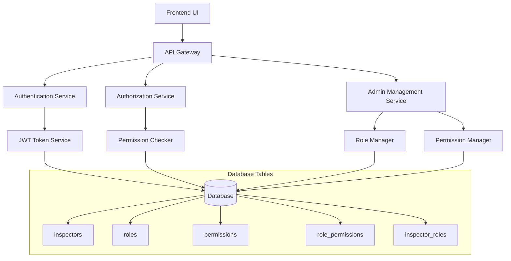

# Design Document

## Overview

This document outlines the design for implementing a Dynamic Role-Based Access Control (RBAC) system that replaces the current enum-based inspector types with a flexible, database-driven permission system. The design enables administrators to create roles and permissions dynamically while maintaining backward compatibility during migration.

The system follows standard RBAC principles with four core entities: Users (Inspectors), Roles, Permissions, and their relationships. This approach provides fine-grained access control while remaining simple to understand and maintain.

## Architecture

### High-Level Architecture



### Core Components

1. **Authentication Layer**: Handles login, JWT token generation, and user session management
2. **Authorization Layer**: Manages permission checking and access control enforcement
3. **Admin Management Layer**: Provides interfaces for managing roles, permissions, and assignments
4. **Database Layer**: Stores RBAC entities and relationships
5. **Frontend Layer**: Dynamic UI rendering based on user permissions

## Components and Interfaces

### 1. Database Schema

#### Enhanced Inspector Model
```python
class Inspector(SQLModel, table=True):
    """Model for inspector information"""
    __tablename__ = "inspectors"  # type: ignore
    
    id: Optional[int] = Field(default=None, primary_key=True)
    # Basic Information
    first_name: str = Field(sa_column=Column(String, index=True))
    last_name: str = Field(sa_column=Column(String, index=True))
    employee_id: str = Field(sa_column=Column(String, unique=True, index=True))
    national_id: str = Field(sa_column=Column(String, unique=True))
    
    email: str
    phone: Optional[str] = None
    
    # Educational Information
    education_degree: Optional[str] = None
    education_field: Optional[str] = None
    education_institute: Optional[str] = None
    graduation_year: Optional[int] = None
    
    # Experience and qualifications
    years_experience: int
    previous_companies: List[str] = Field(default=[], sa_column=Column(JSON))
    
    # Status and authentication
    active: bool = Field(default=True, description="Whether the inspector is currently employed")
    username: Optional[str] = Field(default=None, unique=True, index=True)
    password_hash: Optional[str] = Field(default=None)
    can_login: bool = Field(default=False)
    last_login: Optional[datetime] = None
    
    # Profile information
    date_of_birth: Optional[date] = None
    birth_place: Optional[str] = None
    profile_image_url: Optional[str] = None
    marital_status: Optional[str] = None
    
    created_at: datetime = Field(default_factory=datetime.utcnow)
    updated_at: datetime = Field(default_factory=datetime.utcnow)
    
    # Relationships
    certifications: List["InspectorCertificationRecord"] = Relationship(back_populates="inspector")
    roles: List["InspectorRole"] = Relationship(back_populates="inspector")
    documents: List["InspectorDocument"] = Relationship(back_populates="inspector")
    
    # Notification relationships
    notifications: List["Notification"] = Relationship(back_populates="recipient")
    notification_preferences: Optional["NotificationPreference"] = Relationship(back_populates="inspector")
    
    # Inspection team assignments (for workload tracking)
    inspection_assignments: List["InspectionTeam"] = Relationship(back_populates="inspector")
    
    # Payroll information
    base_hourly_rate: Optional[float] = None
    overtime_multiplier: Optional[float] = None
    night_shift_multiplier: Optional[float] = None
    on_call_multiplier: Optional[float] = None
    
    attendance_tracking_enabled: bool = Field(default=False)
    
    def get_full_name(self) -> str:
        """Get inspector's full name"""
        return f"{self.first_name} {self.last_name}"
```

#### RBAC Core Models (Already Exist)
```python
class Role(SQLModel, table=True):
    id: Optional[int] = Field(default=None, primary_key=True)
    name: str = Field(unique=True, index=True)
    description: Optional[str] = None
    display_label: str  # For UI display
    created_at: datetime
    updated_at: datetime

class Permission(SQLModel, table=True):
    id: Optional[int] = Field(default=None, primary_key=True)
    name: str = Field(unique=True, index=True)
    description: Optional[str] = None
    resource: str  # e.g., "psv", "ndt", "report"
    action: str    # e.g., "create", "approve", "delete"
    display_label: str  # For UI display
    created_at: datetime
    updated_at: datetime

class RolePermission(SQLModel, table=True):
    role_id: int = Field(foreign_key="roles.id", primary_key=True)
    permission_id: int = Field(foreign_key="permissions.id", primary_key=True)
    created_at: datetime

class InspectorRole(SQLModel, table=True):
    inspector_id: int = Field(foreign_key="inspectors.id", primary_key=True)
    role_id: int = Field(foreign_key="roles.id", primary_key=True)
    created_at: datetime
```

### 2. Authentication Service Enhancement

```python
class AuthService:
    @staticmethod
    async def authenticate_inspector(db: AsyncSession, username: str, password: str) -> Optional[Inspector]:
        """Authenticate inspector and load roles/permissions"""
        # Existing authentication logic
        # Enhanced to load roles and permissions
        
    @staticmethod
    def create_access_token(inspector: Inspector) -> str:
        """Create JWT token with roles and permissions"""
        roles = [role.role.name for role in inspector.roles]
        permissions = []
        
        for inspector_role in inspector.roles:
            role_perms = await get_role_permissions(inspector_role.role_id)
            permissions.extend([f"{p.resource}:{p.action}" for p in role_perms])
        
        token_data = {
            "sub": str(inspector.id),
            "roles": roles,
            "permissions": list(set(permissions))  # Remove duplicates
        }
        
        return create_jwt_token(token_data)
    
    @staticmethod
    async def has_permission(db: AsyncSession, inspector: Inspector, resource: str, action: str) -> bool:
        """Check if inspector has specific permission"""
        # Query through role relationships
        # Cache results for performance
```

### 3. Authorization Middleware

```python
def require_permission(resource: str, action: str):
    """Dependency for protecting endpoints with specific permissions"""
    async def permission_checker(
        db: AsyncSession = Depends(get_db),
        current_inspector: Inspector = Depends(get_current_active_inspector)
    ):
        if not await AuthService.has_permission(db, current_inspector, resource, action):
            raise HTTPException(
                status_code=403,
                detail=f"Insufficient permissions for {resource}:{action}"
            )
        return current_inspector
    return permission_checker

# Usage in routes
@router.post("/psv/reports")
async def create_psv_report(
    inspector: Inspector = Depends(require_permission("psv", "create"))
):
    # Only inspectors with psv:create permission can access
```

### 4. Admin Management APIs

```python
# Role Management
@router.post("/admin/roles")
async def create_role(role_data: RoleCreate, admin: Inspector = Depends(require_permission("admin", "manage_roles")))

@router.get("/admin/roles")
async def list_roles(admin: Inspector = Depends(require_permission("admin", "view_roles")))

@router.put("/admin/roles/{role_id}/permissions")
async def assign_permissions_to_role(role_id: int, permission_ids: List[int])

# Inspector Role Assignment
@router.put("/admin/inspectors/{inspector_id}/roles")
async def assign_roles_to_inspector(inspector_id: int, role_ids: List[int])

# Dynamic Permission Discovery
@router.get("/admin/permissions")
async def list_available_permissions()
```

### 5. Frontend Permission Context

```typescript
// Permission Context Provider
interface PermissionContextType {
  permissions: string[];
  hasPermission: (resource: string, action: string) => boolean;
  roles: string[];
  hasRole: (roleName: string) => boolean;
}

// Permission Hook
export function usePermissions() {
  const { permissions, roles } = useAuth();
  
  const hasPermission = (resource: string, action: string) => {
    return permissions.includes(`${resource}:${action}`);
  };
  
  const hasRole = (roleName: string) => {
    return roles.includes(roleName);
  };
  
  return { permissions, roles, hasPermission, hasRole };
}

// Protected Route Component
export function ProtectedRoute({ 
  permission, 
  children 
}: { 
  permission: string; 
  children: React.ReactNode; 
}) {
  const { hasPermission } = usePermissions();
  const [resource, action] = permission.split(':');
  
  if (!hasPermission(resource, action)) {
    return <AccessDenied />;
  }
  
  return <>{children}</>;
}
```

## Data Models

### Role Hierarchy Design

```
Global Admin (مدیر کل)
├── All Permissions (*)
│
Section Managers (مدیران بخش)
├── Mechanical Manager (مدیر مکانیک)
│   ├── mechanical:approve
│   ├── mechanical:delete_section
│   └── mechanical:manage_inspectors
├── NDT Manager (مدیر NDT)
│   ├── ndt:approve
│   ├── ndt:delete_section
│   └── ndt:manage_inspectors
│
Quality Control (کنترل کیفیت)
├── QC Manager (مدیر کنترل کیفیت)
│   ├── report:final_approve
│   ├── quality:manage
│   └── admin:manage_users
├── QC Inspector (بازرس کنترل کیفیت)
│   ├── quality:inspect
│   └── report:quality_approve
│
Technical Inspectors (بازرس‌های فنی)
├── NDT Inspector
│   ├── ndt:create
│   ├── ndt:edit_own
│   └── ndt:view
├── Mechanical Inspector
│   ├── mechanical:create
│   ├── mechanical:edit_own
│   └── mechanical:view
├── PSV Inspector
│   ├── psv:create
│   ├── psv:edit_own
│   └── psv:view
│
Operators (اپراتورها)
└── PSV Test Operator
    ├── psv:execute_test
    └── psv:view
```

### Permission Naming Convention

Format: `{resource}:{action}`

**Resources:**
- `psv` - PSV calibration reports
- `ndt` - NDT inspection reports  
- `mechanical` - Mechanical inspection reports
- `corrosion` - Corrosion analysis reports
- `crane` - Crane inspection reports
- `electrical` - Electrical inspection reports
- `instrumentation` - Instrumentation reports
- `report` - General report operations
- `admin` - Administrative functions
- `quality` - Quality control functions

**Actions:**
- `create` - Create new records
- `view` - View records
- `edit_own` - Edit own records
- `edit_all` - Edit any records
- `approve` - Approve records
- `final_approve` - Final approval
- `delete_own` - Delete own records
- `delete_section` - Delete section records
- `delete_all` - Delete any records
- `manage` - Full management access

## Error Handling

### Authentication Errors
- **401 Unauthorized**: Invalid credentials, expired token
- **403 Forbidden**: Valid user but insufficient permissions
- **423 Locked**: Account disabled or suspended

### Authorization Errors
- **403 Forbidden**: Missing required permission
- **404 Not Found**: Resource doesn't exist or no access
- **409 Conflict**: Role/permission assignment conflicts

### Admin Operation Errors
- **400 Bad Request**: Invalid role/permission data
- **409 Conflict**: Duplicate role names, circular dependencies
- **422 Unprocessable Entity**: Cannot delete role with active assignments

## Testing Strategy

### Unit Tests
- Permission checking logic
- JWT token generation and validation
- Role and permission CRUD operations
- Database relationship integrity

### Integration Tests
- End-to-end authentication flow
- Permission enforcement across API endpoints
- Admin management workflows
- Migration from enum-based system

### Performance Tests
- Permission checking under load
- Database query optimization
- Token validation performance
- Cache effectiveness

### Security Tests
- JWT token security
- Permission bypass attempts
- SQL injection in role/permission queries
- Privilege escalation scenarios

## Migration Strategy

### Phase 1: Parallel System Setup
1. Create new RBAC tables alongside existing enum system
2. Implement authentication service enhancements
3. Create migration scripts for existing data
4. Set up admin management interfaces

### Phase 2: Fresh Database Setup
1. Delete existing SQLite database file
2. Update Inspector model to remove `inspector_type` enum and `specialties` JSON fields
3. Remove complex relationship mappings (psv_calibrations, corrosion_analysis_reports, etc.)
4. Simplify to only essential relationships (roles, certifications, documents, notifications, etc.)
5. Recreate database with Alembic migrations using the new clean schema

### Phase 2: Gradual Migration
1. Migrate existing inspector types to roles
2. Convert specialties to permissions
3. Update API endpoints to use new permission system
4. Maintain backward compatibility

### Phase 3: Frontend Updates
1. Implement permission-based UI rendering
2. Update navigation and access controls
3. Create admin interfaces for role management
4. Test all user workflows

### Phase 4: Cleanup
1. Remove enum-based access controls
2. Clean up deprecated code
3. Optimize database queries
4. Complete documentation

## Performance Considerations

### Caching Strategy
- Cache user permissions in Redis with TTL
- Invalidate cache on role/permission changes
- Use database query optimization for permission checks

### Database Optimization
- Index on frequently queried fields (inspector_id, role_id, permission combinations)
- Use materialized views for complex permission queries
- Implement connection pooling for high concurrency

### Scalability
- Horizontal scaling support through stateless design
- Database sharding considerations for large user bases
- CDN caching for static permission metadata