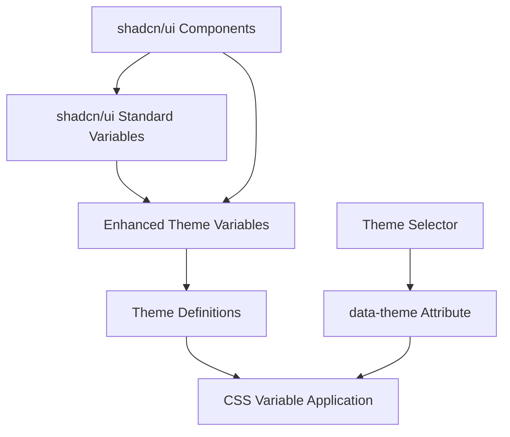
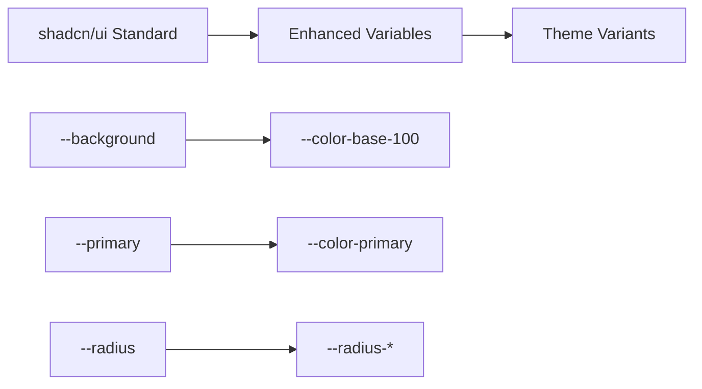

# Design Document

## Overview

This design outlines a simple and effective theme system for shadcn/ui components that uses standard shadcn/ui CSS variables enhanced with additional theme control. The solution maintains compatibility with shadcn/ui defaults while adding comprehensive theming capabilities similar to DaisyUI.

## Architecture

### High-Level Architecture



### CSS Variable Hierarchy



## Components and Interfaces

### 1. Standard shadcn/ui Variables (Keep These)

shadcn/ui uses these standard CSS variables that we must maintain:

```css
:root {
  /* Core shadcn/ui variables */
  --background: 0 0% 100%;           /* Main background */
  --foreground: 222.2 84% 4.9%;     /* Main text color */
  --primary: 221.2 83.2% 53.3%;     /* Primary color */
  --primary-foreground: 210 40% 98%; /* Text on primary */
  --secondary: 210 40% 96%;          /* Secondary background */
  --secondary-foreground: 222.2 84% 4.9%; /* Text on secondary */
  --muted: 210 40% 96%;              /* Muted background */
  --muted-foreground: 215.4 16.3% 46.9%; /* Muted text */
  --accent: 210 40% 96%;             /* Accent background */
  --accent-foreground: 222.2 84% 4.9%; /* Text on accent */
  --card: 0 0% 100%;                 /* Card background */
  --card-foreground: 222.2 84% 4.9%; /* Card text */
  --border: 214.3 31.8% 91.4%;      /* Border color */
  --input: 214.3 31.8% 91.4%;       /* Input border */
  --ring: 221.2 83.2% 53.3%;        /* Focus ring */
  --radius: 0.5rem;                  /* Default border radius */
}
```

### 2. Enhanced Theme Variables (Add These)

Additional variables for comprehensive theme control:

```css
:root {
  /* Enhanced color system */
  --color-base-100: hsl(var(--background));
  --color-base-200: hsl(var(--secondary));
  --color-base-300: hsl(var(--muted));
  --color-base-content: hsl(var(--foreground));
  
  --color-primary: hsl(var(--primary));
  --color-primary-content: hsl(var(--primary-foreground));
  
  /* Status colors */
  --color-success: 142.1 76.2% 36.3%;
  --color-success-content: 355.7 100% 97.3%;
  --color-warning: 32.2 95% 44.1%;
  --color-warning-content: 355.7 100% 97.3%;
  --color-error: 0 84.2% 60.2%;
  --color-error-content: 355.7 100% 97.3%;
  --color-info: 221.2 83.2% 53.3%;
  --color-info-content: 210 40% 98%;
  
  /* Component-specific radius */
  --radius-sm: calc(var(--radius) - 2px);
  --radius-md: var(--radius);
  --radius-lg: calc(var(--radius) + 2px);
  --radius-xl: calc(var(--radius) * 1.5);
  
  /* Component sizing */
  --size-sm: 2rem;
  --size-md: 2.5rem;
  --size-lg: 3rem;
  
  /* Effects */
  --shadow-sm: 0 1px 2px 0 rgb(0 0 0 / 0.05);
  --shadow-md: 0 4px 6px -1px rgb(0 0 0 / 0.1), 0 2px 4px -2px rgb(0 0 0 / 0.1);
  --shadow-lg: 0 10px 15px -3px rgb(0 0 0 / 0.1), 0 4px 6px -4px rgb(0 0 0 / 0.1);
}
```

### 3. Theme Definitions

Each theme modifies both standard and enhanced variables:

```css
/* Light Theme (Default) */
:root {
  --background: 0 0% 100%;
  --foreground: 222.2 84% 4.9%;
  --primary: 221.2 83.2% 53.3%;
  --radius: 0.5rem;
}

/* Dark Theme */
[data-theme="dark"] {
  --background: 222.2 84% 4.9%;
  --foreground: 210 40% 98%;
  --primary: 217.2 91.2% 59.8%;
  --card: 222.2 84% 4.9%;
  --border: 217.2 32.6% 17.5%;
}

/* Rounded Theme Variant */
[data-theme="rounded"] {
  --radius: 1rem;
}

/* Sharp Theme Variant */
[data-theme="sharp"] {
  --radius: 0.125rem;
}

/* Compact Theme Variant */
[data-theme="compact"] {
  --size-sm: 1.75rem;
  --size-md: 2.25rem;
  --size-lg: 2.75rem;
}

/* Spacious Theme Variant */
[data-theme="spacious"] {
  --size-sm: 2.25rem;
  --size-md: 2.75rem;
  --size-lg: 3.25rem;
}
```

### 4. Component Integration Strategy

#### Button Component Enhancement

```tsx
const buttonVariants = cva(
  "inline-flex items-center justify-center whitespace-nowrap rounded-md text-sm font-medium ring-offset-background transition-colors focus-visible:outline-none focus-visible:ring-2 focus-visible:ring-ring focus-visible:ring-offset-2 disabled:pointer-events-none disabled:opacity-50",
  {
    variants: {
      variant: {
        default: "bg-primary text-primary-foreground hover:bg-primary/90",
        secondary: "bg-secondary text-secondary-foreground hover:bg-secondary/80",
        success: "bg-[hsl(var(--color-success))] text-[hsl(var(--color-success-content))] hover:bg-[hsl(var(--color-success))]/90",
        warning: "bg-[hsl(var(--color-warning))] text-[hsl(var(--color-warning-content))] hover:bg-[hsl(var(--color-warning))]/90",
        error: "bg-[hsl(var(--color-error))] text-[hsl(var(--color-error-content))] hover:bg-[hsl(var(--color-error))]/90",
        outline: "border border-input bg-background hover:bg-accent hover:text-accent-foreground",
        ghost: "hover:bg-accent hover:text-accent-foreground",
        link: "text-primary underline-offset-4 hover:underline",
      },
      size: {
        sm: "h-[var(--size-sm)] px-3 rounded-[var(--radius-sm)]",
        default: "h-[var(--size-md)] px-4 py-2 rounded-[var(--radius-md)]",
        lg: "h-[var(--size-lg)] px-8 rounded-[var(--radius-lg)]",
        icon: "h-[var(--size-md)] w-[var(--size-md)] rounded-[var(--radius-md)]",
      },
    },
    defaultVariants: {
      variant: "default",
      size: "default",
    },
  }
)
```

#### Card Component Enhancement

```tsx
const Card = React.forwardRef<HTMLDivElement, CardProps>(
  ({ className, ...props }, ref) => (
    <div
      ref={ref}
      className={cn(
        "rounded-[var(--radius-lg)] border bg-card text-card-foreground shadow-[var(--shadow-sm)]",
        className
      )}
      {...props}
    />
  )
)
```

#### Input Component Enhancement

```tsx
const Input = React.forwardRef<HTMLInputElement, InputProps>(
  ({ className, type, ...props }, ref) => {
    return (
      <input
        type={type}
        className={cn(
          "flex h-[var(--size-md)] w-full rounded-[var(--radius-md)] border border-input bg-background px-3 py-2 text-sm ring-offset-background file:border-0 file:bg-transparent file:text-sm file:font-medium placeholder:text-muted-foreground focus-visible:outline-none focus-visible:ring-2 focus-visible:ring-ring focus-visible:ring-offset-2 disabled:cursor-not-allowed disabled:opacity-50",
          className
        )}
        ref={ref}
        {...props}
      />
    )
  }
)
```

## Data Models

### 1. Theme Configuration Interface

```typescript
interface ThemeConfig {
  id: string
  name: string
  description: string
  
  // Standard shadcn/ui variables (HSL values without hsl())
  colors: {
    background: string
    foreground: string
    primary: string
    'primary-foreground': string
    secondary: string
    'secondary-foreground': string
    muted: string
    'muted-foreground': string
    accent: string
    'accent-foreground': string
    card: string
    'card-foreground': string
    border: string
    input: string
    ring: string
  }
  
  // Enhanced variables
  radius: string
  sizing: {
    sm: string
    md: string
    lg: string
  }
  
  shadows: {
    sm: string
    md: string
    lg: string
  }
}
```

### 2. Theme Variant Interface

```typescript
interface ThemeVariant {
  id: string
  name: string
  description: string
  category: 'shape' | 'size' | 'effect'
  
  // CSS variable overrides
  overrides: {
    [key: string]: string
  }
}
```

### 3. Available Themes

```typescript
const themes: ThemeConfig[] = [
  {
    id: 'light',
    name: 'Light',
    description: 'Clean light theme',
    colors: {
      background: '0 0% 100%',
      foreground: '222.2 84% 4.9%',
      primary: '221.2 83.2% 53.3%',
      'primary-foreground': '210 40% 98%',
      // ... other colors
    },
    radius: '0.5rem',
    sizing: {
      sm: '2rem',
      md: '2.5rem',
      lg: '3rem'
    },
    shadows: {
      sm: '0 1px 2px 0 rgb(0 0 0 / 0.05)',
      md: '0 4px 6px -1px rgb(0 0 0 / 0.1)',
      lg: '0 10px 15px -3px rgb(0 0 0 / 0.1)'
    }
  },
  {
    id: 'dark',
    name: 'Dark',
    description: 'Dark theme for low light',
    colors: {
      background: '222.2 84% 4.9%',
      foreground: '210 40% 98%',
      primary: '217.2 91.2% 59.8%',
      // ... other colors
    },
    radius: '0.5rem',
    // ... other properties
  }
]

const variants: ThemeVariant[] = [
  {
    id: 'rounded',
    name: 'Rounded',
    description: 'Large border radius for friendly appearance',
    category: 'shape',
    overrides: {
      '--radius': '1rem'
    }
  },
  {
    id: 'sharp',
    name: 'Sharp',
    description: 'Minimal border radius for professional look',
    category: 'shape',
    overrides: {
      '--radius': '0.125rem'
    }
  },
  {
    id: 'compact',
    name: 'Compact',
    description: 'Smaller sizing for dense layouts',
    category: 'size',
    overrides: {
      '--size-sm': '1.75rem',
      '--size-md': '2.25rem',
      '--size-lg': '2.75rem'
    }
  }
]
```

## Error Handling

### 1. CSS Variable Fallbacks

```css
:root {
  /* Fallback values for all variables */
  --background: 0 0% 100%;
  --foreground: 222.2 84% 4.9%;
  --radius: 0.5rem;
  --size-md: 2.5rem;
}

/* Component usage with fallbacks */
.button {
  height: var(--size-md, 2.5rem);
  border-radius: var(--radius, 0.5rem);
  background-color: hsl(var(--primary, 221.2 83.2% 53.3%));
}
```

### 2. Theme Validation

```typescript
function validateTheme(theme: ThemeConfig): boolean {
  // Check required properties
  if (!theme.id || !theme.name) return false
  
  // Validate HSL color format
  const hslRegex = /^\d+(\.\d+)?\s+\d+(\.\d+)?%\s+\d+(\.\d+)?%$/
  for (const [key, value] of Object.entries(theme.colors)) {
    if (!hslRegex.test(value)) {
      console.warn(`Invalid HSL color for ${key}: ${value}`)
      return false
    }
  }
  
  // Validate CSS units
  const cssUnitRegex = /^\d*\.?\d+(px|em|rem|%|vh|vw)$/
  if (!cssUnitRegex.test(theme.radius)) {
    console.warn(`Invalid radius value: ${theme.radius}`)
    return false
  }
  
  return true
}
```

## Testing Strategy

### 1. Component Testing

```typescript
describe('Theme System', () => {
  test('Button uses theme variables', () => {
    render(<Button>Test</Button>)
    
    const button = screen.getByRole('button')
    const styles = getComputedStyle(button)
    
    expect(styles.height).toBe('var(--size-md)')
    expect(styles.borderRadius).toBe('var(--radius-md)')
  })
  
  test('Theme switching works', () => {
    document.documentElement.setAttribute('data-theme', 'rounded')
    
    const rootStyles = getComputedStyle(document.documentElement)
    expect(rootStyles.getPropertyValue('--radius')).toBe('1rem')
  })
})
```

### 2. Visual Regression Testing

```typescript
// Storybook stories for visual testing
export default {
  title: 'Theme System',
  parameters: {
    chromatic: { 
      modes: {
        'light': { theme: 'light' },
        'dark': { theme: 'dark' },
        'rounded': { theme: 'rounded' },
        'sharp': { theme: 'sharp' }
      }
    }
  }
}

export const AllComponents = () => (
  <div className="space-y-4 p-4">
    <Button>Primary Button</Button>
    <Button variant="secondary">Secondary Button</Button>
    <Button variant="success">Success Button</Button>
    <Card>
      <CardHeader>
        <CardTitle>Card Title</CardTitle>
      </CardHeader>
      <CardContent>Card content</CardContent>
    </Card>
    <Input placeholder="Input field" />
  </div>
)
```

## Implementation Plan

### Phase 1: CSS Variable Setup (Day 1)
1. Clean up existing globals.css
2. Add standard shadcn/ui variables
3. Add enhanced theme variables
4. Create base theme definitions

### Phase 2: Component Integration (Day 2-3)
1. Update Button component to use theme variables
2. Update Card component with enhanced variables
3. Update Input component with sizing variables
4. Test component rendering with different themes

### Phase 3: Theme System (Day 4)
1. Create theme selector component
2. Implement theme switching logic
3. Add theme persistence
4. Create theme variants

### Phase 4: Testing & Polish (Day 5)
1. Write component tests
2. Create Storybook stories
3. Test theme switching
4. Documentation and examples

This design provides a simple, maintainable theme system that works with standard shadcn/ui components while adding comprehensive theming capabilities.