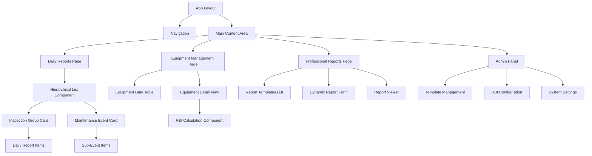
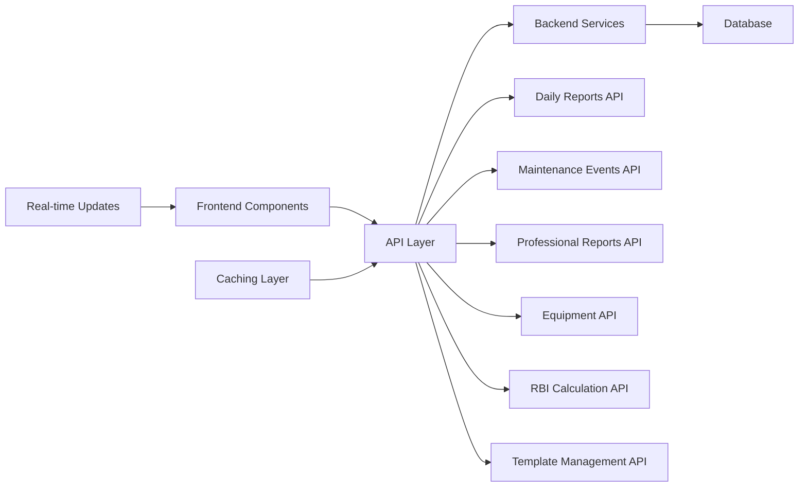

# Frontend Modernization Design Document

## Overview

The Frontend Modernization project aims to transform the current basic daily reports interface into a comprehensive inspection management system that integrates with the new Professional Report System and RBI Calculation System. The design maintains the successful hierarchical expandable UX pattern while extending it to support maintenance events, professional reporting, and advanced RBI calculations.

## Architecture

### Component Architecture



### Data Flow Architecture



## Components and Interfaces

### 1. Enhanced Daily Reports Page

#### Hierarchical List Component
```typescript
interface HierarchicalListProps {
  items: (Inspection | MaintenanceEvent)[]
  expandedItems: Set<string>
  onToggleExpand: (id: string) => void
  onCreateReport: (inspectionId: string) => void
  onEditItem: (item: any) => void
  onDeleteItem: (item: any) => void
}

interface Inspection {
  id: string
  equipmentTag: string
  startDate: string
  endDate?: string
  status: InspectionStatus
  dailyReports: DailyReport[]
  canCreateReport: boolean
}

interface MaintenanceEvent {
  id: string
  eventNumber: string
  title: string
  eventType: MaintenanceEventType
  status: MaintenanceEventStatus
  plannedStartDate: string
  plannedEndDate: string
  subEvents: MaintenanceSubEvent[]
}
```

#### Report Creation Flow Component
```typescript
interface ReportCreationFlowProps {
  inspectionId: string
  isOpen: boolean
  onClose: () => void
  onComplete: (reportId: string) => void
}

interface ReportTypeSelectionProps {
  availableTypes: ReportType[]
  onSelect: (type: ReportType) => void
}

interface TemplateSelectionProps {
  reportType: ReportType
  templates: Template[]
  onSelect: (template: Template) => void
}
```

### 2. Professional Reports System

#### Dynamic Report Form Component
```typescript
interface DynamicReportFormProps {
  template: Template
  inspectionData: InspectionData
  equipmentData: EquipmentData
  userData: UserData
  onSubmit: (fieldValues: Record<string, any>) => void
  onSave: (fieldValues: Record<string, any>) => void
}

interface TemplateSection {
  id: string
  title: string
  sectionType: SectionType
  order: number
  subsections: TemplateSubSection[]
}

interface TemplateField {
  id: string
  label: string
  fieldType: FieldType
  valueSource: ValueSource
  isRequired: boolean
  options?: string[]
  autoSourceKey?: string
  row: number
  col: number
  rowspan: number
  colspan: number
}
```

#### Report Viewer Component
```typescript
interface ReportViewerProps {
  reportId: string
  template: Template
  fieldValues: Record<string, any>
  canEdit: boolean
  canExport: boolean
  onEdit: () => void
  onExport: (format: ExportFormat) => void
}
```

### 3. Equipment Management System

#### Equipment Data Table Component
```typescript
interface EquipmentTableProps {
  equipment: Equipment[]
  filters: EquipmentFilters
  sorting: SortingState
  pagination: PaginationState
  onFilterChange: (filters: EquipmentFilters) => void
  onSortChange: (sorting: SortingState) => void
  onRowClick: (equipment: Equipment) => void
}

interface Equipment {
  id: string
  tag: string
  location: string
  type: string
  riskLevel: RiskLevel
  lastInspectionDate?: string
  nextInspectionDate?: string
  inspectionStatus: InspectionStatus
  maintenanceStatus: MaintenanceStatus
  rbiCalculationDate?: string
}
```

#### Equipment Detail View Component
```typescript
interface EquipmentDetailProps {
  equipmentId: string
  equipment: Equipment
  inspectionHistory: Inspection[]
  maintenanceHistory: MaintenanceEvent[]
  reports: FinalReport[]
  rbiData: RBICalculationResult
  onInspectionCreate: () => void
  onMaintenanceSchedule: () => void
  onRBIRecalculate: () => void
}
```

### 4. RBI Calculation System

#### RBI Configuration Component
```typescript
interface RBIConfigurationProps {
  configurations: RBIConfiguration[]
  activeConfigId?: string
  onCreateConfig: (config: RBIConfigurationData) => void
  onUpdateConfig: (id: string, config: RBIConfigurationData) => void
  onActivateConfig: (id: string) => void
  onDeleteConfig: (id: string) => void
}

interface RBIScoringTablesProps {
  tables: ScoringTables
  onUpdateTable: (tableType: string, table: ScoringTable) => void
}
```

#### RBI Calculation Results Component
```typescript
interface RBIResultsProps {
  equipmentId: string
  calculationResult: RBICalculationResult
  calculationHistory: RBICalculationResult[]
  onRecalculate: (level: RBILevel) => void
  onViewDetails: () => void
}
```

### 5. Admin Template Management

#### Template Builder Component
```typescript
interface TemplateBuilderProps {
  template?: Template
  onSave: (template: TemplateData) => void
  onCancel: () => void
  onPreview: (template: TemplateData) => void
}

interface SectionBuilderProps {
  section: TemplateSection
  onUpdate: (section: TemplateSection) => void
  onDelete: () => void
}

interface FieldBuilderProps {
  field: TemplateField
  availableAutoSources: AutoSource[]
  onUpdate: (field: TemplateField) => void
  onDelete: () => void
}
```

## Data Models

### Frontend Data Models

```typescript
// Enhanced Daily Reports Models
interface InspectionGroup {
  id: string
  equipmentTag: string
  startDate: string
  endDate?: string
  status: InspectionStatus
  dailyReports: DailyReport[]
  canCreateReport: boolean
  reportCount: number
}

interface MaintenanceEventGroup {
  id: string
  eventNumber: string
  title: string
  eventType: MaintenanceEventType
  status: MaintenanceEventStatus
  plannedStartDate: string
  plannedEndDate: string
  actualStartDate?: string
  actualEndDate?: string
  subEvents: MaintenanceSubEvent[]
  completionPercentage: number
}

// Professional Reports Models
interface ReportTemplate {
  id: string
  name: string
  description: string
  reportType: string
  isActive: boolean
  sections: TemplateSection[]
  createdAt: string
  updatedAt: string
}

interface FinalReport {
  id: string
  inspectionId: string
  templateId: string
  createdBy: string
  status: ReportStatus
  serialNumber: string
  fieldValues: Record<string, any>
  createdAt: string
  updatedAt: string
}

// Equipment Management Models
interface EquipmentDetail {
  id: string
  tag: string
  location: string
  type: string
  description: string
  installationDate: string
  designPressure: number
  designTemperature: number
  material: string
  riskLevel: RiskLevel
  inspectionHistory: Inspection[]
  maintenanceHistory: MaintenanceEvent[]
  reports: FinalReport[]
  rbiData: RBICalculationResult
}

// RBI Calculation Models
interface RBICalculationResult {
  equipmentId: string
  calculationLevel: RBILevel
  requestedLevel: RBILevel
  fallbackOccurred: boolean
  nextInspectionDate: string
  riskLevel: RiskLevel
  pofScore: number
  cofScores: {
    safety: number
    environmental: number
    economic: number
  }
  confidenceScore: number
  dataQualityScore: number
  calculationTimestamp: string
  inputParameters: Record<string, any>
  missingData: string[]
  estimatedParameters: string[]
}
```

## User Interface Design

### 1. Enhanced Daily Reports Page Layout

```
┌─────────────────────────────────────────────────────────────┐
│ Daily Reports & Maintenance Events                          │
├─────────────────────────────────────────────────────────────┤
│ [Summary Cards: Active Inspections | Maintenance Events |   │
│  Reports This Month | Active Inspectors]                    │
├─────────────────────────────────────────────────────────────┤
│ [New Inspection Form] [New Maintenance Event Form]          │
├─────────────────────────────────────────────────────────────┤
│ [Filters: Date Range | Status | Inspector | Equipment]      │
├─────────────────────────────────────────────────────────────┤
│ ▼ Inspection: TK-101 (In Progress) [Complete] [Report]      │
│   ├─ Daily Report: 2024-01-15 - Thickness measurements     │
│   ├─ Daily Report: 2024-01-16 - Visual inspection          │
│   └─ Daily Report: 2024-01-17 - Final assessment           │
│                                                             │
│ ▼ Maintenance: Overhaul TK-101 (Planned) [Start] [Edit]    │
│   ├─ Sub-Event: Preparation (Not Started)                  │
│   ├─ Sub-Event: Disassembly (Not Started)                  │
│   └─ Sub-Event: Reassembly (Not Started)                   │
│                                                             │
│ ▶ Inspection: PP-102 (Completed) [View Reports]            │
└─────────────────────────────────────────────────────────────┘
```

### 2. Report Creation Flow

```
Step 1: Completion Confirmation
┌─────────────────────────────────────┐
│ Inspection Complete                 │
│                                     │
│ Do you want to create a report?     │
│                                     │
│ [Yes]  [No]                        │
└─────────────────────────────────────┘

Step 2: Report Type Selection
┌─────────────────────────────────────┐
│ Select Report Type                  │
│                                     │
│ ○ Pressure Vessel Inspection       │
│ ○ Heat Exchanger Inspection        │
│ ○ General Equipment Inspection     │
│ ○ Corrosion Assessment             │
│                                     │
│ [Continue]  [Cancel]               │
└─────────────────────────────────────┘

Step 3: Template Selection
┌─────────────────────────────────────┐
│ Available Templates                 │
│                                     │
│ ○ Standard PV Inspection Report    │
│ ○ Detailed PV Assessment           │
│ ○ Quick PV Checkup                 │
│                                     │
│ [Create Report]  [Back]            │
└─────────────────────────────────────┘
```

### 3. Dynamic Report Form Layout

```
┌─────────────────────────────────────────────────────────────┐
│ Report: Standard PV Inspection Report                       │
├─────────────────────────────────────────────────────────────┤
│ Section: Header Information                                 │
│ ┌─────────────────┬─────────────────┬─────────────────────┐ │
│ │ Report Title    │ Date            │ Inspector Name      │ │
│ │ [Auto-filled]   │ [Auto-filled]   │ [Auto-filled]       │ │
│ └─────────────────┴─────────────────┴─────────────────────┘ │
│                                                             │
│ Section: Equipment Details                                  │
│ ┌─────────────────┬─────────────────┬─────────────────────┐ │
│ │ Equipment Tag   │ Location        │ Type                │ │
│ │ [Auto-filled]   │ [Auto-filled]   │ [Auto-filled]       │ │
│ └─────────────────┴─────────────────┴─────────────────────┘ │
│                                                             │
│ Section: Inspection Findings                               │
│ ┌─────────────────────────────────────────────────────────┐ │
│ │ Description                                             │ │
│ │ [Text Area - Manual Input]                              │ │
│ └─────────────────────────────────────────────────────────┘ │
│                                                             │
│ [Save Draft]  [Submit Report]  [Cancel]                    │
└─────────────────────────────────────────────────────────────┘
```

### 4. Equipment Management Page Layout

```
┌─────────────────────────────────────────────────────────────┐
│ Equipment Management                                        │
├─────────────────────────────────────────────────────────────┤
│ [Search] [Filters: Type | Risk Level | Status] [Export]    │
├─────────────────────────────────────────────────────────────┤
│ Tag     │ Location │ Type │ Risk  │ Last Insp │ Next Insp  │
│ TK-101  │ Unit-3   │ Tank │ High  │ 2024-01-15│ 2024-07-15 │
│ PP-102  │ Unit-12  │ Pump │ Low   │ 2023-12-01│ 2024-12-01 │
│ HE-201  │ Unit-5   │ HX   │ Med   │ 2024-01-10│ 2024-10-10 │
└─────────────────────────────────────────────────────────────┘

Equipment Detail View:
┌─────────────────────────────────────────────────────────────┐
│ Equipment: TK-101                                           │
├─────────────────────────────────────────────────────────────┤
│ [Basic Info] [Inspection History] [Maintenance] [Reports]  │
│ [RBI Calculations]                                          │
├─────────────────────────────────────────────────────────────┤
│ Current Risk Level: High                                    │
│ Next Inspection: 2024-07-15 (in 6 months)                 │
│ Last RBI Calculation: 2024-01-01                           │
│                                                             │
│ [Schedule Inspection] [Calculate RBI] [View Reports]       │
└─────────────────────────────────────────────────────────────┘
```

### 5. Admin Template Management Interface

```
┌─────────────────────────────────────────────────────────────┐
│ Template Management (Admin Only)                           │
├─────────────────────────────────────────────────────────────┤
│ [Create New Template] [Import] [Export]                    │
├─────────────────────────────────────────────────────────────┤
│ Template Name                    │ Type      │ Status │ Actions│
│ Standard PV Inspection Report    │ PV        │ Active │ [Edit] │
│ Heat Exchanger Assessment        │ HX        │ Active │ [Edit] │
│ General Equipment Inspection     │ General   │ Draft  │ [Edit] │
└─────────────────────────────────────────────────────────────┘

Template Builder:
┌─────────────────────────────────────────────────────────────┐
│ Template Builder: Standard PV Inspection Report            │
├─────────────────────────────────────────────────────────────┤
│ [Template Info] [Sections] [Preview] [Save]               │
├─────────────────────────────────────────────────────────────┤
│ Sections:                                                   │
│ ▼ Header Information                                        │
│   ├─ Report Title (Auto: inspection.title)                 │
│   ├─ Date (Auto: current.date)                            │
│   └─ Inspector Name (Auto: user.full_name)                │
│                                                             │
│ ▼ Equipment Details                                         │
│   ├─ Equipment Tag (Auto: equipment.tag)                   │
│   ├─ Location (Auto: equipment.location)                   │
│   └─ Type (Auto: equipment.type)                          │
│                                                             │
│ ▼ Inspection Findings                                       │
│   ├─ Description (Manual: textarea)                        │
│   ├─ Severity (Manual: select)                            │
│   └─ Images (Manual: file)                                │
│                                                             │
│ [Add Section] [Add Field]                                  │
└─────────────────────────────────────────────────────────────┘
```

## Error Handling

### User-Friendly Error Messages

```typescript
interface ErrorHandlingStrategy {
  // Network Errors
  networkError: {
    message: "Connection lost. Please check your internet connection."
    action: "Retry"
    fallback: "Work offline with cached data"
  }
  
  // Validation Errors
  validationError: {
    message: "Please check the highlighted fields"
    action: "Show field-specific errors"
    fallback: "Save as draft"
  }
  
  // Permission Errors
  permissionError: {
    message: "You don't have permission to perform this action"
    action: "Contact administrator"
    fallback: "Return to previous page"
  }
  
  // Data Loading Errors
  dataLoadError: {
    message: "Failed to load data"
    action: "Retry"
    fallback: "Show cached data if available"
  }
}
```

### Loading States and Feedback

```typescript
interface LoadingStates {
  // Page Loading
  pageLoading: "Loading..." | SkeletonComponent
  
  // Data Operations
  saving: "Saving..." | SpinnerComponent
  calculating: "Calculating RBI..." | ProgressComponent
  exporting: "Generating report..." | ProgressComponent
  
  // Background Operations
  backgroundSync: ToastNotification
  autoSave: "Auto-saved" | CheckmarkIcon
}
```

## Performance Considerations

### Optimization Strategies

1. **Virtual Scrolling**: For large equipment lists and inspection history
2. **Lazy Loading**: Load report templates and configurations on demand
3. **Caching**: Cache frequently accessed equipment data and templates
4. **Debounced Search**: Prevent excessive API calls during search
5. **Optimistic Updates**: Update UI immediately for better UX
6. **Code Splitting**: Load admin components only for admin users

### Data Management

```typescript
interface DataManagementStrategy {
  // Caching Strategy
  caching: {
    equipment: "Cache for 5 minutes"
    templates: "Cache until modified"
    userPreferences: "Cache in localStorage"
  }
  
  // Pagination Strategy
  pagination: {
    equipmentList: "50 items per page"
    inspectionHistory: "20 items per page"
    reportsList: "25 items per page"
  }
  
  // Real-time Updates
  realTime: {
    inspectionStatus: "WebSocket updates"
    maintenanceEvents: "Polling every 30 seconds"
    reportSubmissions: "Immediate updates"
  }
}
```

## Security and Access Control

### Role-Based Access Control

```typescript
interface AccessControlMatrix {
  inspector: {
    dailyReports: ["read", "create", "update"]
    inspections: ["read", "create", "update", "complete"]
    reports: ["read", "create"]
    equipment: ["read"]
    rbi: ["read"]
  }
  
  maintenancePlanner: {
    dailyReports: ["read"]
    inspections: ["read"]
    maintenanceEvents: ["read", "create", "update"]
    reports: ["read"]
    equipment: ["read", "update"]
    rbi: ["read", "calculate"]
  }
  
  admin: {
    all: ["read", "create", "update", "delete"]
    templates: ["read", "create", "update", "delete"]
    configurations: ["read", "create", "update", "delete"]
    userManagement: ["read", "create", "update", "delete"]
  }
}
```

### Data Validation

```typescript
interface ValidationRules {
  // Form Validation
  reportForm: {
    requiredFields: "Client-side and server-side validation"
    dataTypes: "Type checking for all inputs"
    businessRules: "Custom validation rules per field type"
  }
  
  // Template Validation
  templateBuilder: {
    structureValidation: "Ensure valid hierarchy"
    fieldValidation: "Check field configurations"
    autoSourceValidation: "Verify auto-source availability"
  }
  
  // Configuration Validation
  rbiConfiguration: {
    scoringTables: "Validate scoring ranges"
    riskMatrix: "Ensure complete matrix"
    intervalSettings: "Check interval ranges"
  }
}
```

## Integration Points

### API Integration

```typescript
interface APIIntegration {
  // Professional Reports API
  reportsAPI: {
    getTemplates: "/api/v1/report/templates"
    createReport: "/api/v1/report/reports"
    getReport: "/api/v1/report/reports/{id}"
    updateFieldValues: "/api/v1/report/reports/{id}/fields"
    exportReport: "/api/v1/report/reports/{id}/export"
  }
  
  // Maintenance Events API
  maintenanceAPI: {
    getEvents: "/api/v1/maintenance/events"
    createEvent: "/api/v1/maintenance/events"
    getSubEvents: "/api/v1/maintenance/sub-events"
    updateEventStatus: "/api/v1/maintenance/events/{id}/status"
  }
  
  // RBI Calculation API
  rbiAPI: {
    getConfigurations: "/api/v1/rbi/configurations"
    calculateRBI: "/api/v1/rbi/equipment/{id}/calculate"
    getScoringTables: "/api/v1/rbi/scoring-tables"
    updateConfiguration: "/api/v1/rbi/configurations/{id}"
  }
}
```

### State Management

```typescript
interface StateManagement {
  // Global State (Context/Redux)
  globalState: {
    user: "Current user and permissions"
    theme: "UI theme and preferences"
    notifications: "System notifications"
  }
  
  // Page-Level State
  pageState: {
    dailyReports: "Expanded items, filters, pagination"
    equipment: "Selected equipment, filters, sorting"
    reports: "Current report, form state, validation"
  }
  
  // Component State
  componentState: {
    forms: "Form data, validation errors"
    modals: "Modal visibility, data"
    tables: "Sorting, filtering, selection"
  }
}
```

This design provides a comprehensive foundation for modernizing the frontend while maintaining the successful UX patterns and extending them to support the new professional reporting and RBI calculation systems.