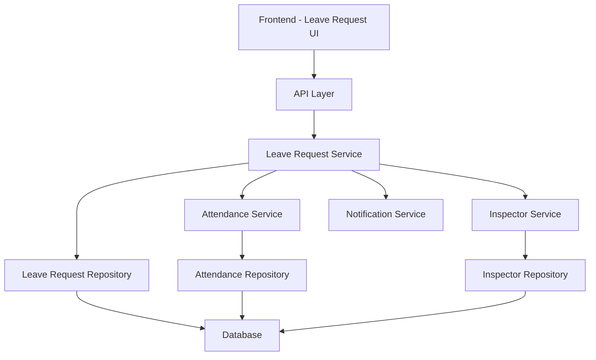

# Design Document: Leave Request Management

## Overview

The Leave Request Management system will enable inspectors to submit leave requests and administrators to review, approve, or reject these requests. The system will integrate with the existing work cycle forecasting functionality to ensure that approved leave requests are properly reflected in attendance data, while maintaining data integrity when work cycle parameters are modified.

All dates in the system will be handled using the Jalali (Persian) calendar, which is the official calendar of Iran. The system will store both Gregorian dates (for database consistency) and Jalali dates (for display and user interaction).

This design builds upon the existing implementation where leave requests are part of the attendance system. We'll enhance the current functionality to fully meet the requirements while maintaining compatibility with the existing code.

## Architecture

The Leave Request Management feature will follow the existing Domain-Driven Design (DDD) architecture of the application. We will create a separate domain for leave requests with its own models, services, and API endpoints. This approach provides better separation of concerns while still allowing integration with the attendance system when necessary.

### Domain Structure

```
backend/app/domains/
├── inspector/              # Existing inspector domain
│   ├── models/             
│   │   ├── attendance.py   # Will remove leave request code from here
│   │   └── ...
│   ├── services/
│   │   ├── attendance_service.py  # Will remove leave request code from here
│   │   └── ...
│   └── ...
└── leave/                  # New leave request domain
    ├── models/
    │   ├── leave_request.py
    │   └── leave_type.py
    ├── schemas/
    │   └── leave_request.py
    ├── services/
    │   └── leave_service.py
    └── api/
        └── leave_request.py
```

### High-Level Components



## Components and Interfaces

### 1. Data Models

#### New LeaveRequest Model

We'll create a new LeaveRequest model in the leave domain:

```python
# New model (to be created in backend/app/domains/leave/models/leave_request.py)
from typing import Optional
import datetime
from sqlmodel import SQLModel, Field, Relationship
from app.domains.inspector.models.enums import LeaveType, LeaveRequestStatus

class LeaveRequest(SQLModel, table=True):
    __tablename__ = "leave_requests"
    
    id: Optional[int] = Field(default=None, primary_key=True)
    inspector_id: int = Field(index=True, foreign_key="inspectors.id")
    start_date: datetime.date = Field(index=True)
    end_date: datetime.date = Field(index=True)
    jalali_start_date: str = Field(index=True)  # Jalali calendar support
    jalali_end_date: str = Field(index=True)    # Jalali calendar support
    leave_type: LeaveType
    reason: str
    status: LeaveRequestStatus = Field(default=LeaveRequestStatus.Pending)
    approved_by: Optional[int] = None
    approved_at: Optional[datetime.datetime] = None
    rejection_reason: Optional[str] = None
    admin_comment: Optional[str] = None
    created_at: datetime.datetime = Field(default_factory=datetime.datetime.utcnow)
    updated_at: datetime.datetime = Field(default_factory=datetime.datetime.utcnow)
    
    # Relationships can be added if using SQLModel's relationship features
    # inspector: Optional["Inspector"] = Relationship(back_populates="leave_requests")
```

#### New LeaveTypeConfig Model

We'll create a new model for configuring leave types:

```python
# New model (to be created in backend/app/domains/leave/models/leave_type.py)
from typing import Optional
import datetime
from sqlmodel import SQLModel, Field

class LeaveTypeConfig(SQLModel, table=True):
    __tablename__ = "leave_type_configs"
    
    id: Optional[int] = Field(default=None, primary_key=True)
    name: str = Field(unique=True)
    display_name: str
    requires_approval: bool = Field(default=True)
    max_days_per_year: Optional[int] = None
    color: Optional[str] = None  # For UI display
    description: Optional[str] = None
    created_at: datetime.datetime = Field(default_factory=datetime.datetime.utcnow)
    updated_at: datetime.datetime = Field(default_factory=datetime.datetime.utcnow)
```

We'll continue using the existing enums from `backend/app/domains/inspector/models/enums.py`:

```python
class LeaveType(str, Enum):
    """Enumeration for leave types"""
    Vacation = "vacation"
    Sick = "sick"
    Personal = "personal"
    Bereavement = "bereavement"
    JuryDuty = "jury_duty"

class LeaveRequestStatus(str, Enum):
    """Enumeration for leave request status"""
    Pending = "pending"
    Approved = "approved"
    Denied = "denied"
    Cancelled = "cancelled"
```

We may want to enhance the LeaveType enum to include additional types as needed.

#### LeaveType Configuration Model

```python
class LeaveTypeConfig(Base):
    __tablename__ = "leave_type_configs"

    id: Mapped[int] = mapped_column(primary_key=True)
    name: Mapped[str] = mapped_column(unique=True)
    requires_approval: Mapped[bool] = mapped_column(default=True)
    max_days_per_year: Mapped[Optional[int]]
    created_at: Mapped[datetime] = mapped_column(default=datetime.utcnow)
    updated_at: Mapped[datetime] = mapped_column(default=datetime.utcnow, onupdate=datetime.utcnow)
```

### 2. API Endpoints

#### Current API Endpoints

The system already has the following endpoints implemented in `backend/app/domains/inspector/api/attendance.py`:

```python
@router.get("/inspectors/{inspector_id}/leave-requests", response_model=List[LeaveRequestResponse])
def get_leave_requests(
    inspector_id: int,
    status: Optional[LeaveRequestStatus] = Query(None),
    db: Session = Depends(get_session),
    current_user=Depends(get_current_user)
):
    """
    Get leave requests for an inspector. Admins can view all, inspectors only their own.
    """
    service = AttendanceService(db)
    leaves = service.get_leave_requests(inspector_id, status)
    return leaves

@router.post("/inspectors/{inspector_id}/leave-requests", response_model=LeaveRequestResponse)
def create_leave_request(
    inspector_id: int,
    leave_request_data: LeaveRequestCreate,
    db: Session = Depends(get_session),
    current_user=Depends(get_current_user)
):
    """
    Create a leave request (inspector only).
    """
    service = AttendanceService(db)
    leave = service.create_leave_request(inspector_id, leave_request_data)
    return leave

@router.put("/leave-requests/{request_id}/approve", response_model=LeaveRequestResponse)
def approve_leave_request(
    request_id: int,
    db: Session = Depends(get_session),
    current_user=Depends(require_admin)
):
    """
    Approve a leave request (admin only). Automatically updates attendance days.
    """
    service = AttendanceService(db)
    # TODO: Pass approver_id from current_user
    leave = service.approve_leave_request(request_id, approver_id=1)
    return leave

@router.put("/leave-requests/{request_id}/reject", response_model=LeaveRequestResponse)
def reject_leave_request(
    request_id: int,
    reason: str,
    db: Session = Depends(get_session),
    current_user=Depends(require_admin)
):
    """
    Reject a leave request (admin only).
    """
    service = AttendanceService(db)
    leave = service.reject_leave_request(request_id, reason)
    return leave
```

#### Enhanced API Endpoints

We'll enhance the existing endpoints and add new ones to fully support the leave request management requirements:

##### Inspector Endpoints

```python
# Existing endpoint with enhanced validation and error handling
@router.post("/inspectors/{inspector_id}/leave-requests", response_model=LeaveRequestResponse)
def create_leave_request(
    inspector_id: int,
    leave_request_data: LeaveRequestCreate,
    db: Session = Depends(get_session),
    current_user=Depends(get_current_user)
):
    """
    Create a leave request. Inspectors can only create for themselves.
    """
    # Enhanced implementation with better validation

# New endpoint for inspectors to view their own leave requests
@router.get("/leave-requests/me", response_model=List[LeaveRequestResponse])
def get_my_leave_requests(
    status: Optional[LeaveRequestStatus] = Query(None),
    db: Session = Depends(get_session),
    current_user=Depends(get_current_user)
):
    """
    Get current inspector's leave requests with optional status filtering.
    """
    service = AttendanceService(db)
    leaves = service.get_leave_requests(current_user.id, status)
    return leaves

# New endpoint for viewing a specific leave request
@router.get("/leave-requests/{request_id}", response_model=LeaveRequestDetailResponse)
def get_leave_request_details(
    request_id: int,
    db: Session = Depends(get_session),
    current_user=Depends(get_current_user)
):
    """
    Get detailed information about a specific leave request.
    Inspectors can only view their own requests.
    """
    # Implementation details

# New endpoint for canceling a pending leave request
@router.delete("/leave-requests/{request_id}", status_code=status.HTTP_204_NO_CONTENT)
def cancel_leave_request(
    request_id: int,
    db: Session = Depends(get_session),
    current_user=Depends(get_current_user)
):
    """
    Cancel a pending leave request.
    Inspectors can only cancel their own pending requests.
    """
    # Implementation details
```

##### Admin Endpoints

```python
# Enhanced version of existing endpoint with more filtering options
@router.get("/admin/leave-requests", response_model=List[LeaveRequestWithInspectorResponse])
def get_all_leave_requests(
    status: Optional[LeaveRequestStatus] = Query(None),
    inspector_id: Optional[int] = Query(None),
    start_date: Optional[date] = Query(None),
    end_date: Optional[date] = Query(None),
    db: Session = Depends(get_session),
    current_user=Depends(require_admin)
):
    """
    Get all leave requests with filtering options (admin only).
    """
    # Enhanced implementation with more filtering options

# Enhanced version of existing endpoint with comment support
@router.put("/leave-requests/{request_id}/approve", response_model=LeaveRequestResponse)
def approve_leave_request(
    request_id: int,
    approval_data: LeaveRequestApproval = Body(...),
    db: Session = Depends(get_session),
    current_user=Depends(require_admin)
):
    """
    Approve a leave request (admin only).
    Automatically updates attendance days.
    """
    service = AttendanceService(db)
    leave = service.approve_leave_request(
        request_id,
        approver_id=current_user.id,
        admin_comment=approval_data.admin_comment
    )
    return leave

# Enhanced version of existing endpoint with structured rejection data
@router.put("/leave-requests/{request_id}/reject", response_model=LeaveRequestResponse)
def reject_leave_request(
    request_id: int,
    rejection_data: LeaveRequestRejection = Body(...),
    db: Session = Depends(get_session),
    current_user=Depends(require_admin)
):
    """
    Reject a leave request (admin only).
    """
    service = AttendanceService(db)
    leave = service.reject_leave_request(
        request_id,
        rejection_data.admin_comment
    )
    return leave

# New endpoints for leave type configuration
@router.get("/admin/leave-types", response_model=List[LeaveTypeConfigResponse])
def get_leave_types(
    db: Session = Depends(get_session),
    current_user=Depends(require_admin)
):
    """
    Get all leave type configurations (admin only).
    """
    # Implementation details

@router.post("/admin/leave-types", response_model=LeaveTypeConfigResponse)
def create_leave_type(
    leave_type_in: LeaveTypeConfigCreate,
    db: Session = Depends(get_session),
    current_user=Depends(require_admin)
):
    """
    Create a new leave type configuration (admin only).
    """
    # Implementation details

@router.put("/admin/leave-types/{type_id}", response_model=LeaveTypeConfigResponse)
def update_leave_type(
    type_id: int,
    leave_type_in: LeaveTypeConfigUpdate,
    db: Session = Depends(get_session),
    current_user=Depends(require_admin)
):
    """
    Update a leave type configuration (admin only).
    """
    # Implementation details
```

### 3. Services

#### LeaveRequestService

```python
class LeaveRequestService:
    @staticmethod
    async def create_leave_request(
        db: AsyncSession,
        inspector_id: int,
        start_date: date,
        end_date: date,
        leave_type: str,
        reason: Optional[str] = None
    ) -> LeaveRequest:
        """Create a new leave request"""
        # Implementation details

    @staticmethod
    async def get_inspector_leave_requests(
        db: AsyncSession,
        inspector_id: int,
        status: Optional[str] = None
    ) -> List[LeaveRequest]:
        """Get leave requests for a specific inspector"""
        # Implementation details

    @staticmethod
    async def get_leave_request(
        db: AsyncSession,
        request_id: int
    ) -> Optional[LeaveRequest]:
        """Get a specific leave request by ID"""
        # Implementation details

    @staticmethod
    async def approve_leave_request(
        db: AsyncSession,
        request_id: int,
        admin_comment: Optional[str] = None
    ) -> LeaveRequest:
        """Approve a leave request and update attendance data"""
        # Implementation details

    @staticmethod
    async def reject_leave_request(
        db: AsyncSession,
        request_id: int,
        admin_comment: str
    ) -> LeaveRequest:
        """Reject a leave request"""
        # Implementation details

    @staticmethod
    async def cancel_leave_request(
        db: AsyncSession,
        request_id: int,
        inspector_id: int
    ) -> bool:
        """Cancel a pending leave request"""
        # Implementation details
```

#### AttendanceService Integration

```python
class AttendanceService:
    # Existing methods...

    @staticmethod
    async def update_attendance_for_leave(
        db: AsyncSession,
        inspector_id: int,
        start_date: date,
        end_date: date,
        is_leave: bool = True
    ) -> bool:
        """Update attendance records for approved leave"""
        # Implementation details

    @staticmethod
    async def handle_work_cycle_change(
        db: AsyncSession,
        inspector_id: int,
        new_start_date: date,
        cycle_type: str
    ) -> List[LeaveRequest]:
        """Handle work cycle changes and identify conflicts with leave requests"""
        # Implementation details
```

## Data Models

### Schema Definitions

#### LeaveRequestCreate Schema

```python
class LeaveRequestCreate(BaseModel):
    start_date: date
    end_date: date
    leave_type: str
    reason: Optional[str] = None

    @validator('end_date')
    def end_date_must_be_after_start_date(cls, v, values):
        if 'start_date' in values and v < values['start_date']:
            raise ValueError('End date must be after start date')
        return v
```

#### LeaveRequestResponse Schema

```python
class LeaveRequestResponse(BaseModel):
    id: int
    inspector_id: int
    start_date: date
    end_date: date
    leave_type: str
    reason: Optional[str]
    status: str
    created_at: datetime
    updated_at: datetime

    class Config:
        orm_mode = True
```

#### LeaveRequestWithInspectorResponse Schema

```python
class LeaveRequestWithInspectorResponse(LeaveRequestResponse):
    inspector: InspectorBasicInfo

    class Config:
        orm_mode = True
```

#### LeaveRequestDetailResponse Schema

```python
class LeaveRequestDetailResponse(LeaveRequestResponse):
    admin_comment: Optional[str]

    class Config:
        orm_mode = True
```

#### LeaveRequestApproval Schema

```python
class LeaveRequestApproval(BaseModel):
    admin_comment: Optional[str] = None
```

#### LeaveRequestRejection Schema

```python
class LeaveRequestRejection(BaseModel):
    admin_comment: str

    @validator('admin_comment')
    def comment_required_for_rejection(cls, v):
        if not v or not v.strip():
            raise ValueError('Comment is required for rejection')
        return v
```

## Error Handling

### Validation Errors

- Validate that end date is after start date
- Validate that leave type is valid
- Validate that leave requests don't exceed maximum allowed days per year
- Validate that leave requests don't overlap with existing approved requests

### Business Logic Errors

- Handle cases where leave requests conflict with work cycle changes
- Handle cases where leave requests are submitted for past dates
- Handle cases where leave requests are submitted for dates when the inspector is already on leave

### Error Responses

```python
# Example error responses
{
    "detail": "Leave request dates are invalid"
}

{
    "detail": "Leave request overlaps with existing approved request"
}

{
    "detail": "Cannot cancel an already approved or rejected leave request"
}

{
    "detail": "Work cycle change conflicts with approved leave requests"
}
```

## Testing Strategy

### Unit Tests

- Test leave request validation logic
- Test leave request service methods
- Test attendance service integration

### Integration Tests

- Test API endpoints for creating, retrieving, and updating leave requests
- Test approval and rejection workflows
- Test work cycle change handling

### End-to-End Tests

- Test the complete leave request workflow from submission to approval
- Test the integration with the attendance system
- Test the handling of work cycle changes with existing leave requests

## Frontend Components

### Inspector Leave Request UI

1. Leave Request Form

   - Date range picker with Jalali calendar support
   - Leave type dropdown
   - Reason text field
   - Submit button

2. Leave Request List

   - Filterable list of leave requests
   - Status indicators
   - Date range display
   - Action buttons (view details, cancel)

3. Leave Request Details
   - Full details of the leave request
   - Status history
   - Admin comments

### Admin Leave Request Management UI

1. Leave Request Dashboard

   - Overview of pending, approved, and rejected requests
   - Filtering options (by inspector, date range, status)
   - Bulk action capabilities

2. Leave Request Review

   - Detailed view of leave request
   - Approve/reject buttons
   - Comment field
   - Conflict warnings

3. Leave Type Configuration
   - Form to create/edit leave types
   - Settings for approval requirements
   - Maximum days configuration

## Integration with Work Cycle System

### Work Cycle Change Handling

When a work cycle start date is changed:

1. The system will preserve all past attendance records
2. Future attendance forecasts will be recalculated
3. The system will identify any conflicts with approved leave requests
4. Administrators will be notified of conflicts and provided with options to resolve them

### Conflict Resolution Options

1. Maintain leave requests as approved (override forecast)
2. Adjust leave request dates to align with new forecast
3. Cancel conflicting leave requests (with notification to inspectors)

## Database Schema Updates

```sql
-- Leave Requests Table
CREATE TABLE leave_requests (
    id INTEGER PRIMARY KEY AUTOINCREMENT,
    inspector_id INTEGER NOT NULL,
    start_date DATE NOT NULL,
    end_date DATE NOT NULL,
    leave_type VARCHAR(50) NOT NULL,
    reason TEXT,
    status VARCHAR(20) NOT NULL DEFAULT 'pending',
    admin_comment TEXT,
    created_at TIMESTAMP NOT NULL DEFAULT CURRENT_TIMESTAMP,
    updated_at TIMESTAMP NOT NULL DEFAULT CURRENT_TIMESTAMP,
    FOREIGN KEY (inspector_id) REFERENCES inspectors(id)
);

-- Leave Type Configurations Table
CREATE TABLE leave_type_configs (
    id INTEGER PRIMARY KEY AUTOINCREMENT,
    name VARCHAR(50) NOT NULL UNIQUE,
    requires_approval BOOLEAN NOT NULL DEFAULT TRUE,
    max_days_per_year INTEGER,
    created_at TIMESTAMP NOT NULL DEFAULT CURRENT_TIMESTAMP,
    updated_at TIMESTAMP NOT NULL DEFAULT CURRENT_TIMESTAMP
);

-- Indexes
CREATE INDEX idx_leave_requests_inspector_id ON leave_requests(inspector_id);
CREATE INDEX idx_leave_requests_status ON leave_requests(status);
CREATE INDEX idx_leave_requests_dates ON leave_requests(start_date, end_date);
```

## Permissions

New permissions will be added to the system:

- `LEAVE_REQUEST_CREATE`: Allow creating leave requests
- `LEAVE_REQUEST_VIEW_OWN`: Allow viewing own leave requests
- `LEAVE_REQUEST_CANCEL_OWN`: Allow canceling own pending leave requests
- `LEAVE_REQUEST_VIEW_ALL`: Allow viewing all leave requests (admin)
- `LEAVE_REQUEST_APPROVE`: Allow approving leave requests (admin)
- `LEAVE_REQUEST_REJECT`: Allow rejecting leave requests (admin)
- `LEAVE_TYPE_MANAGE`: Allow managing leave type configurations (admin)

These permissions will be assigned to appropriate roles in the system.
