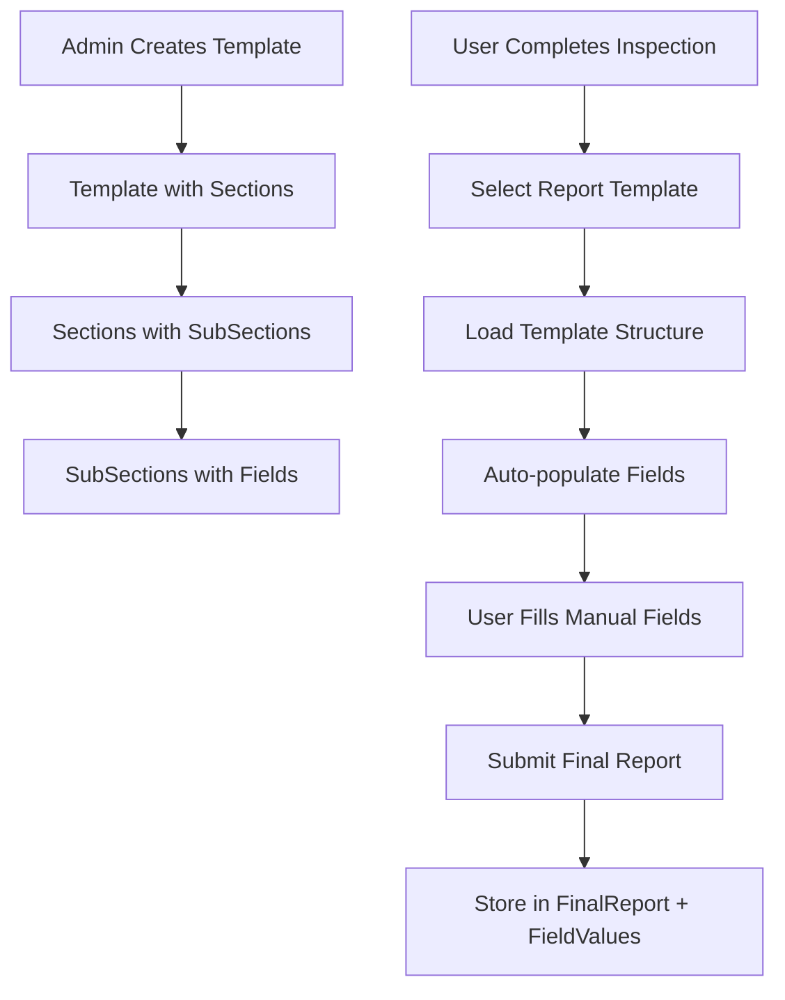

# Professional Report System Design

## Overview

The Professional Report System is designed to provide a flexible, hierarchical structure for creating and managing inspection reports. The system follows a template-driven approach where administrators can create reusable report templates with various field types, sections, and auto-population capabilities. Users can then select appropriate templates and fill out structured reports that are stored in a normalized database structure.

The system architecture follows Domain-Driven Design (DDD) principles and integrates seamlessly with the existing inspection management system.

## Architecture

### Domain Structure
The report system will be implemented as a new domain within the existing backend architecture:

```
backend/app/domains/report/
├── models/
│   ├── __init__.py
│   ├── enums.py
│   ├── template.py
│   ├── template_section.py
│   ├── template_subsection.py
│   ├── template_field.py
│   ├── final_report.py
│   └── report_field_value.py
├── services/
│   ├── __init__.py
│   ├── template_service.py
│   ├── report_service.py
│   └── auto_field_service.py
└── api/
    ├── __init__.py
    ├── template_routes.py
    └── report_routes.py
```

### Data Flow Architecture



## Components and Interfaces

### Core Models

#### 1. Template Model
The root model that represents a report template:

```python
class Template(SQLModel, table=True):
    __tablename__ = "report_templates"
    
    id: Optional[int] = Field(default=None, primary_key=True)
    name: str = Field(max_length=255, index=True)
    description: Optional[str] = None
    is_active: bool = Field(default=True)
    created_at: datetime = Field(default_factory=datetime.utcnow)
    updated_at: datetime = Field(default_factory=datetime.utcnow)
    
    # Relationships
    sections: List["TemplateSection"] = Relationship(back_populates="template")
    final_reports: List["FinalReport"] = Relationship(back_populates="template")
```

#### 2. TemplateSection Model
Represents major sections of a report (Header, Body, Footer, etc.):

```python
class TemplateSection(SQLModel, table=True):
    __tablename__ = "report_template_sections"
    
    id: Optional[int] = Field(default=None, primary_key=True)
    template_id: int = Field(foreign_key="report_templates.id")
    title: str = Field(max_length=255)
    section_type: SectionType
    order: int
    
    # Relationships
    template: Template = Relationship(back_populates="sections")
    subsections: List["TemplateSubSection"] = Relationship(back_populates="section")
```

#### 3. TemplateSubSection Model
Represents logical groupings within sections:

```python
class TemplateSubSection(SQLModel, table=True):
    __tablename__ = "report_template_subsections"
    
    id: Optional[int] = Field(default=None, primary_key=True)
    section_id: int = Field(foreign_key="report_template_sections.id")
    title: Optional[str] = None
    order: int
    
    # Relationships
    section: TemplateSection = Relationship(back_populates="subsections")
    fields: List["TemplateField"] = Relationship(back_populates="subsection")
```

#### 4. TemplateField Model
Individual form fields with positioning and behavior configuration:

```python
class TemplateField(SQLModel, table=True):
    __tablename__ = "report_template_fields"
    
    id: Optional[int] = Field(default=None, primary_key=True)
    subsection_id: int = Field(foreign_key="report_template_subsections.id")
    label: str = Field(max_length=255)
    field_type: FieldType
    value_source: ValueSource
    order: int
    
    # Canvas positioning
    row: int = Field(default=0)
    col: int = Field(default=0)
    rowspan: int = Field(default=1)
    colspan: int = Field(default=1)
    
    # Field configuration
    options: Optional[str] = None  # JSON string for select options
    is_required: bool = Field(default=False)
    placeholder: Optional[str] = None
    auto_source_key: Optional[str] = None  # For auto-filled fields
    purpose: Optional[str] = None  # For RBI analysis
    
    # Relationships
    subsection: TemplateSubSection = Relationship(back_populates="fields")
    field_values: List["ReportFieldValue"] = Relationship(back_populates="template_field")
```

#### 5. FinalReport Model
Stores completed reports with metadata:

```python
class FinalReport(SQLModel, table=True):
    __tablename__ = "final_reports"
    
    id: Optional[int] = Field(default=None, primary_key=True)
    inspection_id: int = Field(foreign_key="inspections.id")
    template_id: int = Field(foreign_key="report_templates.id")
    created_by: int = Field(foreign_key="users.id")  # Assuming user system exists
    created_at: datetime = Field(default_factory=datetime.utcnow)
    updated_at: datetime = Field(default_factory=datetime.utcnow)
    
    # Report metadata
    report_serial_number: Optional[str] = None
    status: ReportStatus = Field(default=ReportStatus.DRAFT)
    
    # Relationships
    inspection: "Inspection" = Relationship(back_populates="final_reports")
    template: Template = Relationship(back_populates="final_reports")
    field_values: List["ReportFieldValue"] = Relationship(back_populates="final_report")
```

#### 6. ReportFieldValue Model
Stores actual field values for submitted reports:

```python
class ReportFieldValue(SQLModel, table=True):
    __tablename__ = "report_field_values"
    
    id: Optional[int] = Field(default=None, primary_key=True)
    final_report_id: int = Field(foreign_key="final_reports.id")
    template_field_id: int = Field(foreign_key="report_template_fields.id")
    
    # Value storage (using appropriate field based on data type)
    text_value: Optional[str] = None
    number_value: Optional[float] = None
    date_value: Optional[date] = None
    boolean_value: Optional[bool] = None
    json_value: Optional[str] = None  # For complex data types
    
    # Relationships
    final_report: FinalReport = Relationship(back_populates="field_values")
    template_field: TemplateField = Relationship(back_populates="field_values")
```

### Enumerations

#### Field Types
```python
class FieldType(str, Enum):
    TEXT = "text"
    TEXTAREA = "textarea"
    NUMBER = "number"
    DATE = "date"
    SELECT = "select"
    CHECKBOX = "checkbox"
    IMAGE = "image"
    FILE = "file"
```

#### Value Sources
```python
class ValueSource(str, Enum):
    MANUAL = "manual"
    AUTO = "auto"
```

#### Section Types
```python
class SectionType(str, Enum):
    HEADER = "header"
    BODY = "body"
    FOOTER = "footer"
    ATTACHMENTS = "attachments"
    CUSTOM = "custom"
```

#### Report Status
```python
class ReportStatus(str, Enum):
    DRAFT = "draft"
    SUBMITTED = "submitted"
    APPROVED = "approved"
    REJECTED = "rejected"
```

### Auto-Field Service

The auto-field service will handle automatic population of fields based on predefined sources:

```python
AUTO_SOURCES = {
    "inspection.start_date": "Inspection start date",
    "inspection.end_date": "Inspection end date", 
    "inspection.status": "Inspection status",
    "inspection.number": "Inspection number",
    "equipment.tag": "Equipment tag",
    "equipment.name": "Equipment name",
    "equipment.location": "Equipment location",
    "daily_report.inspectors": "List of involved inspectors",
    "report.serial_number": "Report serial number",
    "user.full_name": "Report creator full name",
    "user.department": "User department",
    "current.date": "Current date",
    "current.time": "Current time"
}
```

## Data Models

### Template Structure Hierarchy
```
Template
├── TemplateSection (Header)
│   ├── TemplateSubSection (General Info)
│   │   ├── TemplateField (Report Title)
│   │   ├── TemplateField (Date)
│   │   └── TemplateField (Inspector Name)
│   └── TemplateSubSection (Equipment Details)
│       ├── TemplateField (Equipment Tag)
│       └── TemplateField (Equipment Type)
├── TemplateSection (Body)
│   ├── TemplateSubSection (Findings)
│   │   ├── TemplateField (Description)
│   │   ├── TemplateField (Severity)
│   │   └── TemplateField (Images)
│   └── TemplateSubSection (Measurements)
│       ├── TemplateField (Thickness)
│       └── TemplateField (Pressure)
└── TemplateSection (Footer)
    └── TemplateSubSection (Signatures)
        ├── TemplateField (Inspector Signature)
        └── TemplateField (Supervisor Approval)
```

### Field Value Storage Strategy
The system uses a hybrid approach for storing field values:

1. **Typed Columns**: Common data types (text, number, date, boolean) are stored in dedicated columns for better performance and type safety.
2. **JSON Storage**: Complex data types and arrays are stored as JSON strings.
3. **File References**: Images and files are stored as file paths/URLs in text fields.

## Error Handling

### Validation Rules
1. **Template Validation**:
   - Template names must be unique
   - At least one section is required
   - Section orders must be sequential

2. **Field Validation**:
   - Required fields must have values
   - Data type validation based on field_type
   - Canvas positioning must not overlap (optional constraint)

3. **Auto-Field Validation**:
   - Auto-source keys must exist in AUTO_SOURCES
   - Auto fields cannot be marked as required if source data might be missing

### Error Response Structure
```python
class ValidationError(Exception):
    def __init__(self, field: str, message: str, code: str = None):
        self.field = field
        self.message = message
        self.code = code
```

## Testing Strategy

### Unit Tests
1. **Model Tests**:
   - Test model relationships and constraints
   - Test enum validations
   - Test field value storage and retrieval

2. **Service Tests**:
   - Test template creation and validation
   - Test auto-field population logic
   - Test report submission workflow

3. **Integration Tests**:
   - Test complete report creation workflow
   - Test template-to-report data flow
   - Test database constraints and relationships

### Test Data Strategy
- Create fixture templates for common report types
- Mock inspection and equipment data for auto-field testing
- Test edge cases like missing auto-source data

### Performance Considerations
1. **Database Indexing**:
   - Index on template.name for quick template lookup
   - Index on final_report.inspection_id for report retrieval
   - Composite index on (final_report_id, template_field_id) for field values

2. **Query Optimization**:
   - Use eager loading for template structure queries
   - Implement pagination for large report lists
   - Cache frequently accessed templates

3. **Storage Optimization**:
   - Compress JSON field values for large data
   - Implement file storage service for images/attachments
   - Archive old reports to separate tables

## Integration Points

### Existing System Integration
1. **Inspection Model**: Add relationship to FinalReport
2. **User System**: Reference user IDs for report creators
3. **Equipment Model**: Used for auto-field population
4. **File Storage**: Integration with existing file upload system

### API Design Principles
1. **RESTful Endpoints**: Follow existing API patterns
2. **Consistent Response Format**: Use existing response wrappers
3. **Authentication**: Integrate with existing auth middleware
4. **Validation**: Use existing validation patterns

This design provides a robust, scalable foundation for the professional report system while maintaining consistency with the existing codebase architecture.