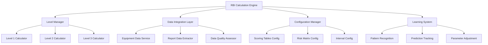

# RBI Calculation System Design Document

## Overview

The RBI Calculation System is designed as a modular, configurable platform that implements qualitative Risk-Based Inspection methodology for refinery equipment. The system features a multi-level calculation approach with intelligent fallback mechanisms, learning capabilities, and seamless integration with existing inspection report systems.

## Architecture

### High-Level Architecture



### System Layers

1. **Presentation Layer**: API endpoints and user interfaces for configuration and reporting
2. **Business Logic Layer**: Core RBI calculation engines and decision logic
3. **Data Access Layer**: Integration with equipment databases and inspection reports
4. **Configuration Layer**: Flexible parameter and scoring table management
5. **Learning Layer**: Adaptive algorithms for continuous improvement

## Components and Interfaces

### 1. RBI Calculation Engine

**Primary Interface:**
```python
class RBICalculationEngine:
    def calculate_next_inspection_date(
        self, 
        equipment_id: str, 
        requested_level: str = "Level_3"
    ) -> RBICalculationResult
    
    def recalculate_for_equipment_group(
        self, 
        equipment_group: List[str]
    ) -> List[RBICalculationResult]
```

**Responsibilities:**
- Orchestrate the entire RBI calculation process
- Coordinate between different calculation levels
- Apply fallback logic when data is insufficient
- Generate comprehensive calculation reports

### 2. Level Manager

**Interface:**
```python
class RBILevelManager:
    def determine_feasible_level(
        self, 
        requested_level: str, 
        available_data: Dict
    ) -> LevelDeterminationResult
    
    def execute_calculation(
        self, 
        level: str, 
        equipment_data: Dict, 
        config: RBIConfig
    ) -> CalculationResult
```

**Level-Specific Calculators:**

**Level 1 Calculator (Static):**
- Uses fixed intervals from equipment master data
- Minimal data requirements
- Conservative default values

**Level 2 Calculator (Semi-Quantitative):**
- Scoring table-based calculations
- Weighted factor combinations
- Moderate data requirements

**Level 3 Calculator (Fully Quantitative):**
- Advanced mathematical models
- Historical trend analysis
- Comprehensive data requirements

### 3. Data Integration Layer

**Equipment Data Service:**
```python
class EquipmentDataService:
    def get_equipment_master_data(self, equipment_id: str) -> EquipmentData
    def get_operating_conditions(self, equipment_id: str) -> OperatingConditions
    def get_design_parameters(self, equipment_id: str) -> DesignParameters
```

**Report Data Extractor:**
```python
class ReportDataExtractor:
    def extract_rbi_parameters(
        self, 
        equipment_id: str, 
        report_history: List[InspectionReport]
    ) -> ExtractedRBIData
    
    def calculate_historical_trends(
        self, 
        thickness_data: List[ThicknessMeasurement]
    ) -> TrendAnalysis
```

**Data Quality Assessor:**
```python
class DataQualityAssessor:
    def assess_data_completeness(self, data: Dict) -> DataQualityScore
    def estimate_missing_parameters(self, partial_data: Dict) -> EstimatedData
    def generate_data_improvement_recommendations(self, assessment: DataQualityScore) -> List[Recommendation]
```

### 4. Configuration Manager

**Scoring Tables Configuration:**
```python
class ScoringTablesConfig:
    pof_tables: Dict[str, ScoringTable] = {
        "corrosion_rate": ScoringTable,
        "equipment_age": ScoringTable,
        "damage_mechanisms": ScoringTable,
        "coating_quality": ScoringTable,
        "inspection_coverage": ScoringTable
    }
    
    cof_tables: Dict[str, Dict[str, ScoringTable]] = {
        "safety": {"location": ScoringTable, "pressure": ScoringTable, "fluid": ScoringTable},
        "environmental": {"fluid": ScoringTable, "containment": ScoringTable},
        "economic": {"downtime": ScoringTable, "production_impact": ScoringTable, "repair_cost": ScoringTable}
    }
```

**Risk Matrix Configuration:**
```python
class RiskMatrixConfig:
    matrix: Dict[Tuple[str, str], str]  # (PoF, CoF) -> Risk Level
    inspection_intervals: Dict[str, int]  # Risk Level -> Months
    fallback_safety_factors: Dict[str, float]  # Fallback scenario -> multiplier
```

### 5. Learning System

**Pattern Recognition Engine:**
```python
class PatternRecognitionEngine:
    def identify_equipment_families(self) -> List[EquipmentFamily]
    def learn_service_specific_patterns(self, service_type: str) -> ServicePattern
    def detect_degradation_anomalies(self, equipment_id: str) -> List[Anomaly]
```

**Prediction Tracking:**
```python
class PredictionTracker:
    def record_prediction(self, equipment_id: str, prediction: RBIPrediction) -> None
    def compare_with_actual_findings(self, equipment_id: str, findings: InspectionFindings) -> AccuracyAssessment
    def calculate_prediction_accuracy(self, time_period: DateRange) -> AccuracyMetrics
```

## Data Models

### Core Data Structures

```python
@dataclass
class RBICalculationResult:
    equipment_id: str
    calculation_level: str
    requested_level: str
    fallback_occurred: bool
    next_inspection_date: datetime
    risk_level: str
    pof_score: float
    cof_scores: Dict[str, float]  # safety, environmental, economic
    confidence_score: float
    data_quality_score: float
    calculation_timestamp: datetime
    input_parameters: Dict
    missing_data: List[str]
    estimated_parameters: List[str]

@dataclass
class EquipmentData:
    equipment_id: str
    equipment_type: str
    service_type: str
    installation_date: datetime
    design_pressure: float
    design_temperature: float
    material: str
    coating_type: Optional[str]
    criticality_level: str

@dataclass
class ExtractedRBIData:
    thickness_measurements: List[ThicknessMeasurement]
    corrosion_rate: Optional[float]
    coating_condition: Optional[str]
    damage_mechanisms: List[str]
    inspection_findings: List[InspectionFinding]
    last_inspection_date: datetime
    inspection_quality: str

@dataclass
class ScoringTable:
    parameter_name: str
    scoring_rules: Dict[str, int]  # condition -> score
    weights: Dict[str, float]
    description: str
```

### Configuration Data Models

```python
@dataclass
class RBIConfig:
    level_requirements: Dict[str, LevelRequirements]
    scoring_tables: ScoringTablesConfig
    risk_matrix: RiskMatrixConfig
    weighting_factors: WeightingFactors
    fallback_settings: FallbackSettings
    learning_settings: LearningSettings

@dataclass
class LevelRequirements:
    mandatory_fields: List[str]
    optional_fields: List[str]
    minimum_data_completeness: float
    confidence_threshold: float
```

## Error Handling

### Data Availability Scenarios

1. **Insufficient Data for Any Level**: 
   - Apply emergency fallback using industry standard intervals
   - Flag equipment for immediate data collection
   - Apply maximum conservative factors

2. **Partial Data Availability**:
   - Use intelligent estimation algorithms
   - Apply uncertainty factors
   - Document all assumptions

3. **Data Quality Issues**:
   - Flag questionable data points
   - Use alternative calculation methods
   - Generate data improvement recommendations

### Calculation Error Handling

```python
class RBICalculationError(Exception):
    def __init__(self, equipment_id: str, error_type: str, details: Dict):
        self.equipment_id = equipment_id
        self.error_type = error_type
        self.details = details

class ErrorRecoveryStrategy:
    def handle_calculation_error(self, error: RBICalculationError) -> RecoveryAction
    def apply_conservative_fallback(self, equipment_id: str) -> RBICalculationResult
    def generate_error_report(self, error: RBICalculationError) -> ErrorReport
```

## Testing Strategy

### Unit Testing
- Individual calculator components (Level 1, 2, 3)
- Data extraction and quality assessment functions
- Configuration validation logic
- Learning algorithm components

### Integration Testing
- End-to-end calculation workflows
- Data integration with external systems
- Fallback mechanism validation
- Configuration change impact testing

### Performance Testing
- Bulk calculation performance for large equipment inventories
- Response time for real-time calculation requests
- Memory usage optimization for historical data processing

### Accuracy Testing
- Validation against known RBI calculation examples
- Comparison with manual calculations
- Historical prediction accuracy assessment

## Security and Compliance

### Data Security
- Encryption of sensitive equipment and operational data
- Access control for configuration changes
- Audit logging for all calculations and modifications

### Regulatory Compliance
- Alignment with API 580/581 standards
- Documentation requirements for regulatory inspections
- Traceability of all calculation decisions

## Performance Considerations

### Optimization Strategies
- Caching of frequently accessed equipment data
- Batch processing for multiple equipment calculations
- Lazy loading of historical data
- Database query optimization for trend analysis

### Scalability Design
- Horizontal scaling capability for calculation engines
- Distributed processing for large equipment inventories
- Efficient data storage for historical calculations
- API rate limiting and resource management

## Monitoring and Observability

### Key Metrics
- Calculation success rates by level
- Fallback frequency and reasons
- Data quality trends over time
- Prediction accuracy metrics
- System performance indicators

### Alerting
- Data quality degradation alerts
- Calculation failure notifications
- Configuration change approvals
- Prediction accuracy threshold breaches

This design provides a robust, scalable foundation for implementing the RBI calculation system with all the features discussed in our requirements analysis.