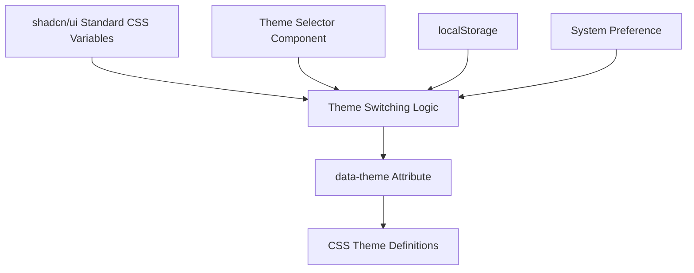

# Design Document

## Overview

This design outlines a simple theme system using standard shadcn/ui components with basic dark/light theme switching. The solution uses shadcn/ui's built-in CSS variables and adds minimal theme switching functionality.

## Architecture

### High-Level Architecture



### CSS Variable Structure

shadcn/ui v4 uses OKLCH color format for better color accuracy:

```css
:root {
  --radius: 0.625rem;
  --background: oklch(1 0 0);                    /* white */
  --foreground: oklch(0.145 0 0);               /* dark text */
  --card: oklch(1 0 0);                         /* card background */
  --card-foreground: oklch(0.145 0 0);          /* card text */
  --popover: oklch(1 0 0);                      /* popover background */
  --popover-foreground: oklch(0.145 0 0);       /* popover text */
  --primary: oklch(0.205 0 0);                  /* primary color */
  --primary-foreground: oklch(0.985 0 0);       /* text on primary */
  --secondary: oklch(0.97 0 0);                 /* secondary background */
  --secondary-foreground: oklch(0.205 0 0);     /* text on secondary */
  --muted: oklch(0.97 0 0);                     /* muted background */
  --muted-foreground: oklch(0.556 0 0);         /* muted text */
  --accent: oklch(0.97 0 0);                    /* accent background */
  --accent-foreground: oklch(0.205 0 0);        /* text on accent */
  --destructive: oklch(0.577 0.245 27.325);     /* destructive/error color */
  --border: oklch(0.922 0 0);                   /* border color */
  --input: oklch(0.922 0 0);                    /* input border */
  --ring: oklch(0.708 0 0);                     /* focus ring */
}
```

## Components and Interfaces

### 1. Clean globals.css Structure (shadcn/ui v4)

```css
@tailwind base;
@tailwind components;
@tailwind utilities;

@layer base {
  :root {
    /* Light theme (default) - OKLCH format */
    --radius: 0.625rem;
    --background: oklch(1 0 0);
    --foreground: oklch(0.145 0 0);
    --card: oklch(1 0 0);
    --card-foreground: oklch(0.145 0 0);
    --popover: oklch(1 0 0);
    --popover-foreground: oklch(0.145 0 0);
    --primary: oklch(0.205 0 0);
    --primary-foreground: oklch(0.985 0 0);
    --secondary: oklch(0.97 0 0);
    --secondary-foreground: oklch(0.205 0 0);
    --muted: oklch(0.97 0 0);
    --muted-foreground: oklch(0.556 0 0);
    --accent: oklch(0.97 0 0);
    --accent-foreground: oklch(0.205 0 0);
    --destructive: oklch(0.577 0.245 27.325);
    --border: oklch(0.922 0 0);
    --input: oklch(0.922 0 0);
    --ring: oklch(0.708 0 0);
  }

  .dark {
    /* Dark theme - OKLCH format */
    --background: oklch(0.145 0 0);
    --foreground: oklch(0.985 0 0);
    --card: oklch(0.205 0 0);
    --card-foreground: oklch(0.985 0 0);
    --popover: oklch(0.269 0 0);
    --popover-foreground: oklch(0.985 0 0);
    --primary: oklch(0.922 0 0);
    --primary-foreground: oklch(0.205 0 0);
    --secondary: oklch(0.269 0 0);
    --secondary-foreground: oklch(0.985 0 0);
    --muted: oklch(0.269 0 0);
    --muted-foreground: oklch(0.708 0 0);
    --accent: oklch(0.371 0 0);
    --accent-foreground: oklch(0.985 0 0);
    --destructive: oklch(0.704 0.191 22.216);
    --border: oklch(1 0 0 / 10%);
    --input: oklch(1 0 0 / 15%);
    --ring: oklch(0.556 0 0);
  }
}

@layer base {
  * {
    @apply border-border;
  }
  body {
    @apply bg-background text-foreground;
  }
}
```

### 2. Simple Theme Provider

```tsx
'use client'

import React, { createContext, useContext, useEffect, useState } from 'react'

type Theme = 'light' | 'dark' | 'system'

interface ThemeContextType {
  theme: Theme
  setTheme: (theme: Theme) => void
}

const ThemeContext = createContext<ThemeContextType | undefined>(undefined)

export function ThemeProvider({
  children,
  defaultTheme = 'system',
  storageKey = 'ui-theme'
}: {
  children: React.ReactNode
  defaultTheme?: Theme
  storageKey?: string
}) {
  const [theme, setTheme] = useState<Theme>(defaultTheme)

  useEffect(() => {
    const root = window.document.documentElement
    root.classList.remove('light', 'dark')

    if (theme === 'system') {
      const systemTheme = window.matchMedia('(prefers-color-scheme: dark)').matches
        ? 'dark'
        : 'light'
      root.classList.add(systemTheme)
      return
    }

    root.classList.add(theme)
  }, [theme])

  const value = {
    theme,
    setTheme: (theme: Theme) => {
      localStorage.setItem(storageKey, theme)
      setTheme(theme)
    }
  }

  useEffect(() => {
    const storedTheme = localStorage.getItem(storageKey) as Theme
    if (storedTheme) {
      setTheme(storedTheme)
    }
  }, [storageKey])

  return (
    <ThemeContext.Provider value={value}>
      {children}
    </ThemeContext.Provider>
  )
}

export const useTheme = () => {
  const context = useContext(ThemeContext)
  if (context === undefined) {
    throw new Error('useTheme must be used within a ThemeProvider')
  }
  return context
}
```

### 3. Simple Theme Toggle Component

```tsx
'use client'

import { Moon, Sun } from 'lucide-react'
import { Button } from '@/components/ui/button'
import {
  DropdownMenu,
  DropdownMenuContent,
  DropdownMenuItem,
  DropdownMenuTrigger,
} from '@/components/ui/dropdown-menu'
import { useTheme } from './theme-provider'

export function ThemeToggle() {
  const { setTheme } = useTheme()

  return (
    <DropdownMenu>
      <DropdownMenuTrigger asChild>
        <Button variant="outline" size="icon">
          <Sun className="h-[1.2rem] w-[1.2rem] rotate-0 scale-100 transition-all dark:-rotate-90 dark:scale-0" />
          <Moon className="absolute h-[1.2rem] w-[1.2rem] rotate-90 scale-0 transition-all dark:rotate-0 dark:scale-100" />
          <span className="sr-only">Toggle theme</span>
        </Button>
      </DropdownMenuTrigger>
      <DropdownMenuContent align="end">
        <DropdownMenuItem onClick={() => setTheme('light')}>
          Light
        </DropdownMenuItem>
        <DropdownMenuItem onClick={() => setTheme('dark')}>
          Dark
        </DropdownMenuItem>
        <DropdownMenuItem onClick={() => setTheme('system')}>
          System
        </DropdownMenuItem>
      </DropdownMenuContent>
    </DropdownMenu>
  )
}
```

### 4. Layout Integration

```tsx
// app/layout.tsx
import { ThemeProvider } from '@/components/theme-provider'

export default function RootLayout({
  children,
}: {
  children: React.ReactNode
}) {
  return (
    <html lang="en" suppressHydrationWarning>
      <body>
        <ThemeProvider
          attribute="class"
          defaultTheme="system"
          enableSystem
          disableTransitionOnChange
        >
          {children}
        </ThemeProvider>
      </body>
    </html>
  )
}
```

## Data Models

### 1. Theme Configuration

```typescript
interface ThemeConfig {
  name: string
  value: 'light' | 'dark' | 'system'
  icon: React.ComponentType
}

const themes: ThemeConfig[] = [
  {
    name: 'Light',
    value: 'light',
    icon: Sun
  },
  {
    name: 'Dark', 
    value: 'dark',
    icon: Moon
  },
  {
    name: 'System',
    value: 'system',
    icon: Monitor
  }
]
```

### 2. Standard shadcn/ui Components

All standard shadcn/ui components work automatically:

```tsx
// Button component (standard shadcn/ui)
import { Button } from '@/components/ui/button'

<Button>Click me</Button>           // Uses --primary colors
<Button variant="secondary">Secondary</Button>  // Uses --secondary colors
<Button variant="destructive">Delete</Button>   // Uses --destructive colors

// Card component (standard shadcn/ui)
import { Card, CardHeader, CardTitle, CardContent } from '@/components/ui/card'

<Card>                              // Uses --card background
  <CardHeader>
    <CardTitle>Title</CardTitle>    // Uses --card-foreground text
  </CardHeader>
  <CardContent>
    Content here                    // Uses --card-foreground text
  </CardContent>
</Card>

// Input component (standard shadcn/ui)
import { Input } from '@/components/ui/input'

<Input placeholder="Enter text" />  // Uses --input border, --background fill
```

## Error Handling

### 1. Hydration Mismatch Prevention

```tsx
// Use suppressHydrationWarning on html element
<html lang="en" suppressHydrationWarning>

// Check for window object before accessing localStorage
useEffect(() => {
  if (typeof window !== 'undefined') {
    const storedTheme = localStorage.getItem(storageKey)
    if (storedTheme) {
      setTheme(storedTheme as Theme)
    }
  }
}, [])
```

### 2. Fallback Theme

```tsx
// Always provide fallback values
const getSystemTheme = (): 'light' | 'dark' => {
  if (typeof window === 'undefined') return 'light'
  
  return window.matchMedia('(prefers-color-scheme: dark)').matches 
    ? 'dark' 
    : 'light'
}
```

## Testing Strategy

### 1. Theme Switching Tests

```typescript
describe('Theme System', () => {
  test('applies light theme by default', () => {
    render(
      <ThemeProvider>
        <div data-testid="content">Content</div>
      </ThemeProvider>
    )
    
    expect(document.documentElement).not.toHaveClass('dark')
  })
  
  test('switches to dark theme', () => {
    const { getByRole } = render(
      <ThemeProvider>
        <ThemeToggle />
      </ThemeProvider>
    )
    
    fireEvent.click(getByRole('button'))
    fireEvent.click(screen.getByText('Dark'))
    
    expect(document.documentElement).toHaveClass('dark')
  })
  
  test('persists theme selection', () => {
    const { rerender } = render(
      <ThemeProvider storageKey="test-theme">
        <ThemeToggle />
      </ThemeProvider>
    )
    
    // Set dark theme
    fireEvent.click(screen.getByRole('button'))
    fireEvent.click(screen.getByText('Dark'))
    
    // Remount component
    rerender(
      <ThemeProvider storageKey="test-theme">
        <ThemeToggle />
      </ThemeProvider>
    )
    
    expect(document.documentElement).toHaveClass('dark')
  })
})
```

### 2. Component Theme Integration Tests

```typescript
describe('Component Theme Integration', () => {
  test('Button uses theme colors', () => {
    render(
      <ThemeProvider>
        <Button data-testid="button">Test</Button>
      </ThemeProvider>
    )
    
    const button = screen.getByTestId('button')
    const styles = getComputedStyle(button)
    
    // Should use CSS variables
    expect(styles.backgroundColor).toContain('hsl(var(--primary))')
  })
  
  test('Card uses theme colors in dark mode', () => {
    document.documentElement.classList.add('dark')
    
    render(
      <Card data-testid="card">
        <CardContent>Content</CardContent>
      </Card>
    )
    
    const card = screen.getByTestId('card')
    const styles = getComputedStyle(card)
    
    expect(styles.backgroundColor).toContain('hsl(var(--card))')
  })
})
```

## Implementation Plan

### Phase 1: Clean CSS Setup (2 hours)
1. Replace current globals.css with clean shadcn/ui structure
2. Remove all custom CSS variables and complex theme definitions
3. Add standard light/dark theme CSS variables
4. Test that existing components still render

### Phase 2: Simple Theme Provider (2 hours)
1. Create simple ThemeProvider component
2. Add theme persistence with localStorage
3. Add system theme detection
4. Replace existing enhanced theme provider

### Phase 3: Theme Toggle Component (1 hour)
1. Create simple ThemeToggle component
2. Replace existing theme selector
3. Add to navigation header
4. Test theme switching functionality

### Phase 4: Testing & Cleanup (1 hour)
1. Remove unused design system files
2. Update imports throughout codebase
3. Test all pages work with new theme system
4. Verify theme persistence works

### Total Time: ~6 hours

This design provides a clean, simple theme system that works with standard shadcn/ui components without any custom complexity.