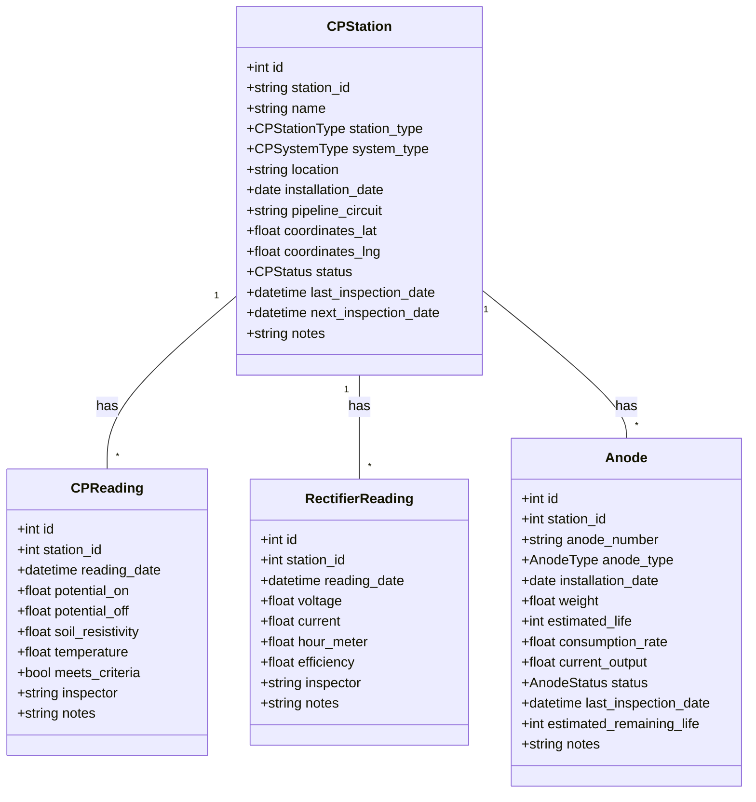

# Cathodic Protection Management Implementation Plan

## 1. Overview

This implementation plan outlines the steps needed to add a Cathodic Protection Management module to your existing inspection management system, which already includes equipment management, PSV management, corrosion coupon monitoring, and crane management modules.

## 2. System Architecture

Your current application follows a well-structured architecture:

- **Backend**: FastAPI with SQLModel ORM and PostgreSQL database
- **Frontend**: Next.js with React components and Tailwind CSS UI

The new Cathodic Protection module will maintain consistency with this existing architecture.

## 3. Data Models



### 3.1 Backend Model Implementation

Create a new file `backend/app/cathodic_models.py`:

```python
from datetime import datetime, date
from typing import Optional, List
from sqlmodel import SQLModel, Field, Relationship
from enum import Enum

class CPStationType(str, Enum):
    """Types of cathodic protection stations"""
    Rectifier = "Rectifier"
    GalvanicAnode = "GalvanicAnode"
    TestPoint = "TestPoint"
    BondingStation = "BondingStation"

class CPSystemType(str, Enum):
    """Types of cathodic protection systems"""
    ImposedCurrent = "ImposedCurrent"
    SacrificialAnode = "SacrificialAnode"
    Hybrid = "Hybrid"

class CPStatus(str, Enum):
    """Operational status of CP stations"""
    Active = "Active"
    UnderMaintenance = "UnderMaintenance"
    Inactive = "Inactive"

class CPStation(SQLModel, table=True):
    """Model for cathodic protection stations"""
    __tablename__ = "cp_stations"
    
    id: Optional[int] = Field(default=None, primary_key=True)
    station_id: str = Field(unique=True, index=True)
    name: str
    station_type: CPStationType
    system_type: CPSystemType
    location: str = Field(index=True)
    installation_date: date
    pipeline_circuit: str = Field(index=True)
    coordinates_lat: Optional[float] = None
    coordinates_lng: Optional[float] = None
    status: CPStatus = Field(default=CPStatus.Active)
    last_inspection_date: Optional[datetime] = None
    next_inspection_date: Optional[datetime] = None
    notes: Optional[str] = None
    created_at: datetime = Field(default_factory=datetime.utcnow)
    updated_at: datetime = Field(default_factory=datetime.utcnow)
    
    # Relationships
    readings: List["CPReading"] = Relationship(back_populates="station")
    rectifier_readings: List["RectifierReading"] = Relationship(back_populates="station")
    anodes: List["Anode"] = Relationship(back_populates="station")

class CPReading(SQLModel, table=True):
    """Model for cathodic protection potential readings"""
    __tablename__ = "cp_readings"
    
    id: Optional[int] = Field(default=None, primary_key=True)
    station_id: int = Field(foreign_key="cp_stations.id")
    reading_date: datetime
    potential_on: float  # mV
    potential_off: Optional[float] = None  # mV
    soil_resistivity: Optional[float] = None  # ohm-cm
    temperature: Optional[float] = None  # Celsius
    meets_criteria: bool  # Based on NACE criteria (-850 mV)
    inspector: str
    notes: Optional[str] = None
    created_at: datetime = Field(default_factory=datetime.utcnow)
    
    # Relationship
    station: CPStation = Relationship(back_populates="readings")

class RectifierReading(SQLModel, table=True):
    """Model for rectifier readings (for impressed current systems)"""
    __tablename__ = "rectifier_readings"
    
    id: Optional[int] = Field(default=None, primary_key=True)
    station_id: int = Field(foreign_key="cp_stations.id")
    reading_date: datetime
    voltage: float  # Volts
    current: float  # Amperes
    hour_meter: Optional[float] = None
    efficiency: Optional[float] = None  # %
    inspector: str
    notes: Optional[str] = None
    created_at: datetime = Field(default_factory=datetime.utcnow)
    
    # Relationship
    station: CPStation = Relationship(back_populates="rectifier_readings")

class AnodeType(str, Enum):
    """Types of anodes used"""
    Magnesium = "Magnesium"
    Zinc = "Zinc"
    AluminumAlloy = "AluminumAlloy"
    MMO = "MMO"  # Mixed Metal Oxide
    HighSilicon = "HighSilicon"
    Graphite = "Graphite"

class AnodeStatus(str, Enum):
    """Status of anodes"""
    New = "New"
    Active = "Active"
    Depleted = "Depleted"
    Replaced = "Replaced"

class Anode(SQLModel, table=True):
    """Model for tracking sacrificial anodes"""
    __tablename__ = "anodes"
    
    id: Optional[int] = Field(default=None, primary_key=True)
    station_id: int = Field(foreign_key="cp_stations.id")
    anode_number: str
    anode_type: AnodeType
    installation_date: date
    weight: float  # kg
    estimated_life: int  # months
    consumption_rate: Optional[float] = None  # kg/year
    current_output: Optional[float] = None  # mA
    status: AnodeStatus = Field(default=AnodeStatus.New)
    last_inspection_date: Optional[datetime] = None
    estimated_remaining_life: Optional[int] = None  # months
    notes: Optional[str] = None
    created_at: datetime = Field(default_factory=datetime.utcnow)
    updated_at: datetime = Field(default_factory=datetime.utcnow)
    
    # Relationship
    station: CPStation = Relationship(back_populates="anodes")

class CPInspectionSettings(SQLModel, table=True):
    """Configuration for inspection intervals by CP station type"""
    __tablename__ = "cp_inspection_settings"
    
    id: Optional[int] = Field(default=None, primary_key=True)
    station_type: CPStationType = Field(unique=True, index=True)
    inspection_interval_months: int  # Number of months between inspections
    active: bool = Field(default=True)
    created_at: datetime = Field(default_factory=datetime.utcnow)
    updated_at: datetime = Field(default_factory=datetime.utcnow)
```

## 4. API Router Structure

Create a dedicated router directory in `backend/app/routers/cathodic_protection/` with the following structure:

```
backend/app/routers/cathodic_protection/
├── __init__.py            # Router configuration
├── station_routes.py      # CP station CRUD operations
├── readings_routes.py     # Reading management for potentials
├── rectifier_routes.py    # Rectifier reading management
├── anode_routes.py        # Anode management
├── analytics_routes.py    # Dashboard and reports
└── settings_routes.py     # Settings for protection criteria
```

### 4.1 Main Router Configuration

In `backend/app/routers/cathodic_protection/__init__.py`:

```python
from fastapi import APIRouter
from .station_routes import router as station_router
from .readings_routes import router as readings_router
from .rectifier_routes import router as rectifier_router
from .anode_routes import router as anode_router
from .analytics_routes import router as analytics_router
from .settings_routes import router as settings_router

router = APIRouter(
    prefix="/cathodic-protection",
    tags=["cathodic-protection"],
)

router.include_router(station_router)
router.include_router(readings_router)
router.include_router(rectifier_router)
router.include_router(anode_router)
router.include_router(analytics_router)
router.include_router(settings_router)
```

### 4.2 Example Station Routes Implementation

In `backend/app/routers/cathodic_protection/station_routes.py`:

```python
from fastapi import APIRouter, HTTPException, Depends, Query
from sqlmodel import Session, select
from sqlalchemy.sql import func
from typing import List, Optional
from datetime import datetime, timedelta
from ...database import get_session
from ...cathodic_models import (
    CPStation, CPStationType, CPSystemType, CPStatus
)

router = APIRouter()

@router.get("/stations", response_model=List[CPStation])
def get_stations(
    skip: int = 0, 
    limit: int = 100,
    station_type: Optional[CPStationType] = None,
    status: Optional[CPStatus] = None,
    pipeline_circuit: Optional[str] = None,
    location: Optional[str] = None,
    session: Session = Depends(get_session)
):
    """Get all CP stations with optional filtering"""
    query = select(CPStation)
    
    if station_type:
        query = query.where(CPStation.station_type == station_type)
    
    if status:
        query = query.where(CPStation.status == status)
    
    if pipeline_circuit:
        query = query.where(CPStation.pipeline_circuit.contains(pipeline_circuit))
    
    if location:
        query = query.where(CPStation.location.contains(location))
    
    stations = session.exec(query.offset(skip).limit(limit)).all()
    return stations

@router.post("/stations", response_model=CPStation)
def create_station(station: CPStation, session: Session = Depends(get_session)):
    """Create a new CP station"""
    existing = session.exec(select(CPStation).where(CPStation.station_id == station.station_id)).first()
    if existing:
        raise HTTPException(status_code=400, detail=f"CP station with ID {station.station_id} already exists")
    
    session.add(station)
    session.commit()
    session.refresh(station)
    return station

# Additional CRUD endpoints would be implemented here
```

## 5. Frontend Implementation

### 5.1 API Client Functions

Create `frontend/src/api/cathodic-protection.ts`:

```typescript
import { api } from '@/lib/axios-config';

// Types
export interface CPStation {
  id?: number;
  station_id: string;
  name: string;
  station_type: 'Rectifier' | 'GalvanicAnode' | 'TestPoint' | 'BondingStation';
  system_type: 'ImposedCurrent' | 'SacrificialAnode' | 'Hybrid';
  location: string;
  installation_date: string;
  pipeline_circuit: string;
  coordinates_lat?: number;
  coordinates_lng?: number;
  status: 'Active' | 'UnderMaintenance' | 'Inactive';
  last_inspection_date?: string;
  next_inspection_date?: string;
  notes?: string;
  created_at?: string;
  updated_at?: string;
}

export interface CPReading {
  id?: number;
  station_id: number;
  reading_date: string;
  potential_on: number;
  potential_off?: number;
  soil_resistivity?: number;
  temperature?: number;
  meets_criteria: boolean;
  inspector: string;
  notes?: string;
  created_at?: string;
}

// API functions
export const getStations = async (filters?: any) => {
  const response = await api.get('/api/cathodic-protection/stations', { params: filters });
  return response.data;
};

export const getStation = async (id: number) => {
  const response = await api.get(`/api/cathodic-protection/stations/${id}`);
  return response.data;
};

export const createStation = async (station: CPStation) => {
  const response = await api.post('/api/cathodic-protection/stations', station);
  return response.data;
};

export const updateStation = async (id: number, station: CPStation) => {
  const response = await api.put(`/api/cathodic-protection/stations/${id}`, station);
  return response.data;
};

export const deleteStation = async (id: number) => {
  const response = await api.delete(`/api/cathodic-protection/stations/${id}`);
  return response.data;
};

export const getReadings = async (filters?: any) => {
  const response = await api.get('/api/cathodic-protection/readings', { params: filters });
  return response.data;
};

export const createReading = async (reading: CPReading) => {
  const response = await api.post('/api/cathodic-protection/readings', reading);
  return response.data;
};

export const getDashboardData = async () => {
  const response = await api.get('/api/cathodic-protection/dashboard');
  return response.data;
};

// Additional API functions would be implemented here
```

### 5.2 Frontend Pages

Create the following directory structure:

```
frontend/src/app/cathodic-protection/
├── dashboard/
│   └── page.tsx         # Dashboard overview
├── stations/
│   ├── page.tsx         # Station list
│   ├── new/
│   │   └── page.tsx     # Add new station
│   └── [id]/
│       └── page.tsx     # Station details
├── readings/
│   ├── page.tsx         # Readings list
│   └── new/
│       └── page.tsx     # Add new reading
├── anodes/
│   ├── page.tsx         # Anodes list
│   └── [id]/
│       └── page.tsx     # Anode details
└── reports/
    └── page.tsx         # Reports page
```

### 5.3 Dashboard Component Example

In `frontend/src/app/cathodic-protection/dashboard/page.tsx`:

```tsx
'use client';

import { useEffect, useState } from 'react';
import { Card, CardContent, CardHeader, CardTitle } from '@/components/ui/card';
import { Tabs, TabsContent, TabsList, TabsTrigger } from '@/components/ui/tabs';
import { getDashboardData } from '@/api/cathodic-protection';
import { BarChart, LineChart, DoughnutChart } from '@/components/charts';
import { Shield, Battery, AlertTriangle, Clock } from 'lucide-react';
import { Button } from '@/components/ui/button';
import Link from 'next/link';

export default function CPDashboardPage() {
  const [dashboardData, setDashboardData] = useState<any>(null);
  const [loading, setLoading] = useState(true);

  useEffect(() => {
    const fetchData = async () => {
      try {
        const data = await getDashboardData();
        setDashboardData(data);
      } catch (error) {
        console.error('Error fetching dashboard data:', error);
      } finally {
        setLoading(false);
      }
    };

    fetchData();
  }, []);

  if (loading) {
    return <div className="flex justify-center p-8">Loading dashboard data...</div>;
  }

  return (
    <div className="container mx-auto p-6">
      <div className="flex justify-between items-center mb-6">
        <h1 className="text-3xl font-bold">Cathodic Protection Dashboard</h1>
        <div className="flex gap-2">
          <Button asChild>
            <Link href="/cathodic-protection/stations/new">Add Station</Link>
          </Button>
          <Button asChild variant="outline">
            <Link href="/cathodic-protection/readings/new">Record Reading</Link>
          </Button>
        </div>
      </div>

      <div className="grid gap-6 md:grid-cols-2 lg:grid-cols-4 mb-6">
        <StatsCard 
          title="Total CP Stations" 
          value={dashboardData.stations_by_type.reduce((sum, item) => sum + item.count, 0)} 
          icon={<Shield className="h-6 w-6" />}
          description="Across all pipeline circuits"
        />
        <StatsCard 
          title="Upcoming Inspections" 
          value={dashboardData.upcoming_inspections.length} 
          icon={<Clock className="h-6 w-6" />}
          description="Due in next 30 days"
        />
        <StatsCard 
          title="Failing Readings" 
          value={dashboardData.failing_readings_count} 
          icon={<AlertTriangle className="h-6 w-6" />}
          description="Not meeting NACE criteria"
          variant="destructive"
        />
        <StatsCard 
          title="Depleting Anodes" 
          value={dashboardData.depleting_anodes_count} 
          icon={<Battery className="h-6 w-6" />}
          description="Nearing end of service life"
          variant="warning"
        />
      </div>

      <div className="grid gap-6 md:grid-cols-2 mb-6">
        <Card>
          <CardHeader>
            <CardTitle>Stations by Type</CardTitle>
          </CardHeader>
          <CardContent>
            <DoughnutChart 
              data={{
                labels: dashboardData.stations_by_type.map(item => item.type),
                datasets: [{
                  label: 'Stations',
                  data: dashboardData.stations_by_type.map(item => item.count),
                  backgroundColor: [
                    'rgba(53, 162, 235, 0.5)',
                    'rgba(255, 99, 132, 0.5)',
                    'rgba(75, 192, 192, 0.5)',
                    'rgba(255, 206, 86, 0.5)',
                  ],
                }]
              }}
            />
          </CardContent>
        </Card>
        
        <Card>
          <CardHeader>
            <CardTitle>Stations by Status</CardTitle>
          </CardHeader>
          <CardContent>
            <BarChart 
              data={{
                labels: dashboardData.stations_by_status.map(item => item.status),
                datasets: [{
                  label: 'Stations',
                  data: dashboardData.stations_by_status.map(item => item.count),
                  backgroundColor: [
                    'rgba(75, 192, 192, 0.5)',
                    'rgba(255, 206, 86, 0.5)',
                    'rgba(255, 99, 132, 0.5)',
                  ],
                }]
              }}
            />
          </CardContent>
        </Card>
      </div>

      <Card>
        <CardHeader>
          <CardTitle>Upcoming Inspections</CardTitle>
        </CardHeader>
        <CardContent>
          <table className="w-full text-sm">
            <thead>
