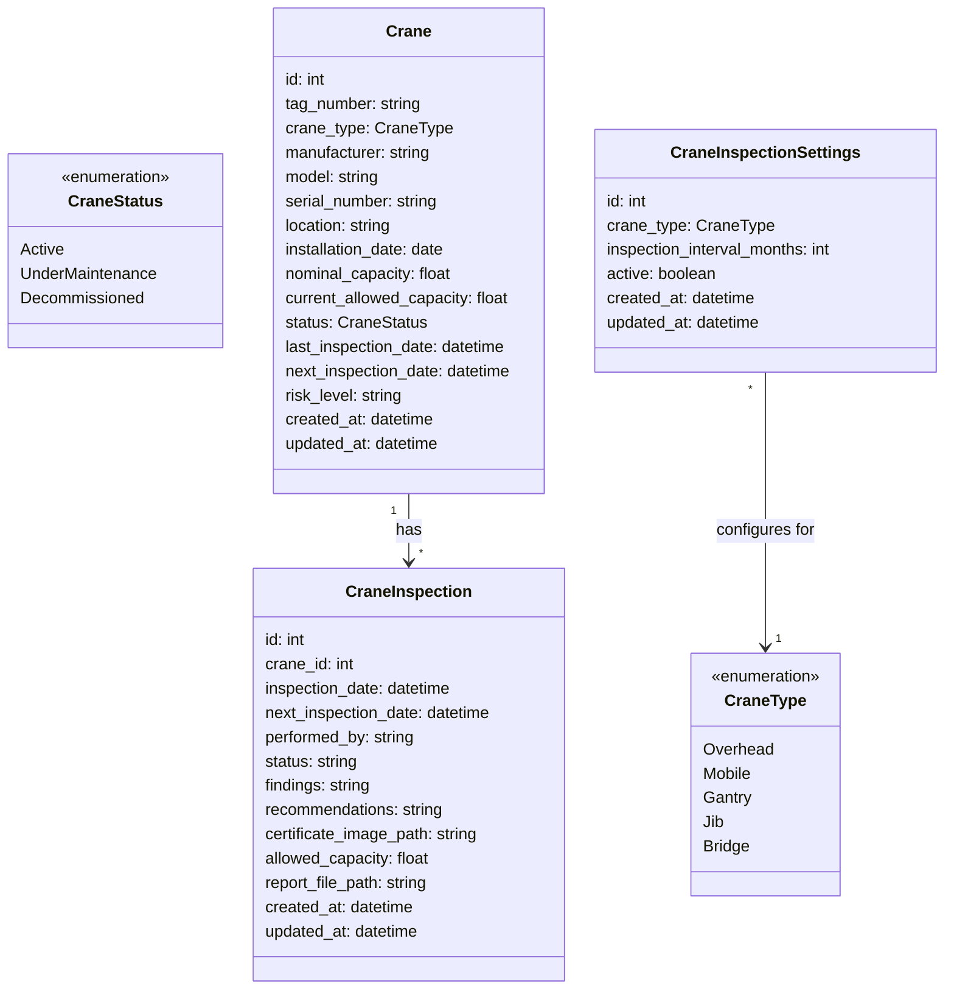

# Crane Management Implementation Plan

## Overview

This plan outlines the implementation of a new module for managing overhead and mobile cranes in the existing inspection management system. The module will track inspection dates, maintain inspection records, and manage the next scheduled inspections for each crane.

## Data Models

### Main Models



## API Structure

### Backend Endpoints

```
/api/cranes
  GET - List all cranes
  POST - Create new crane

/api/cranes/{crane_id}
  GET - Get crane details
  PUT - Update crane
  DELETE - Delete crane

/api/crane-inspections
  GET - List inspections
  POST - Create inspection

/api/crane-inspections/{inspection_id}
  GET - Inspection details
  PUT - Update inspection
  DELETE - Delete inspection

/api/crane-inspection-settings
  GET - List inspection settings
  POST - Create inspection setting

/api/crane-inspection-settings/{setting_id}
  GET - Get setting details
  PUT - Update setting
  DELETE - Delete setting
```

### Frontend Pages

```
/cranes/dashboard
  - Overview of crane status
  - Charts showing inspection status
  - Upcoming inspections
  - Similar to the corrosion coupon dashboard

/cranes
  - List all cranes
  - Filter by type, status, next inspection date
  - Actions to add, edit, and update status of cranes

/cranes/new
  - Form to add a new crane
  - All relevant fields for crane specification

/cranes/[id]
  - View crane details
  - Edit crane information
  - Update crane status (Active, Under Maintenance, Decommissioned)
  - Inspection history
  - Certificate images

/crane-inspections/new
  - Create new inspection
  - Upload certificate image
  - Set allowed capacity
  - Auto-calculate next inspection date

/crane-settings
  - Configure inspection intervals by crane type
```

## Key Features

1. **Configurable Inspection Intervals**
   - Settings to define inspection intervals based on crane type
   - Default: 6 months for mobile cranes, 12 months for overhead cranes
   - Flexible configuration options for other crane types

2. **Inspection Records with Certificates**
   - Store certificate images for each inspection
   - Track findings and recommendations
   - Record allowed load capacity (which may be reduced from nominal capacity)

3. **Automatic Next Inspection Date Calculation**
   - Based on crane type and configured settings
   - Allows for override when necessary

4. **Capacity Management**
   - Track nominal (designed) capacity
   - Record current allowed capacity after inspections
   - Highlight cranes operating with reduced capacity

5. **Dashboard & Reporting**
   - Overview of upcoming inspections
   - Expired inspections tracking
   - Crane status monitoring

## Implementation Approach

### 1. Database Changes

Create new tables:
- `cranes` - Store crane information
- `crane_inspections` - Store inspection records
- `crane_inspection_settings` - Store configuration for inspection intervals

### 2. Backend Implementation

- Create `crane_models.py` with the data models
- Implement API endpoints in `routers/cranes.py`
- Add models and routers to the main application

### 3. Frontend Implementation

- Create components for crane management:
  - Dashboard components similar to corrosion coupon dashboard
  - Data tables for crane listing with filtering and sorting
  - Forms for crane data entry and editing
  - Status management controls for changing crane operational status
  - Inspection recording forms with certificate image upload

- Dashboard Implementation:
  - Overview cards showing total cranes by type and status
  - Charts showing inspection compliance status
  - Timeline of upcoming inspections
  - Alerts for overdue inspections or cranes with reduced capacity

- Crane Management Forms:
  - Add new crane form with all relevant fields
  - Edit crane details form with status change options
  - Ability to mark cranes as decommissioned or under maintenance
  - Inspection recording with certificate upload capabilities

- Status Management System:
  - Visual indicators for different crane statuses
  - Workflow for status transitions (active → under maintenance → active)
  - History tracking for status changes

## Integration Points

- The crane module will integrate with the existing inspection system
- It will leverage the current user authentication system
- Will follow the same design patterns as the PSV and corrosion monitoring modules

## Technical Considerations

- Certificate images will be stored as files with references in the database
- Inspection interval calculations will use date arithmetic functions
- Capacity changes will trigger alerts in the system