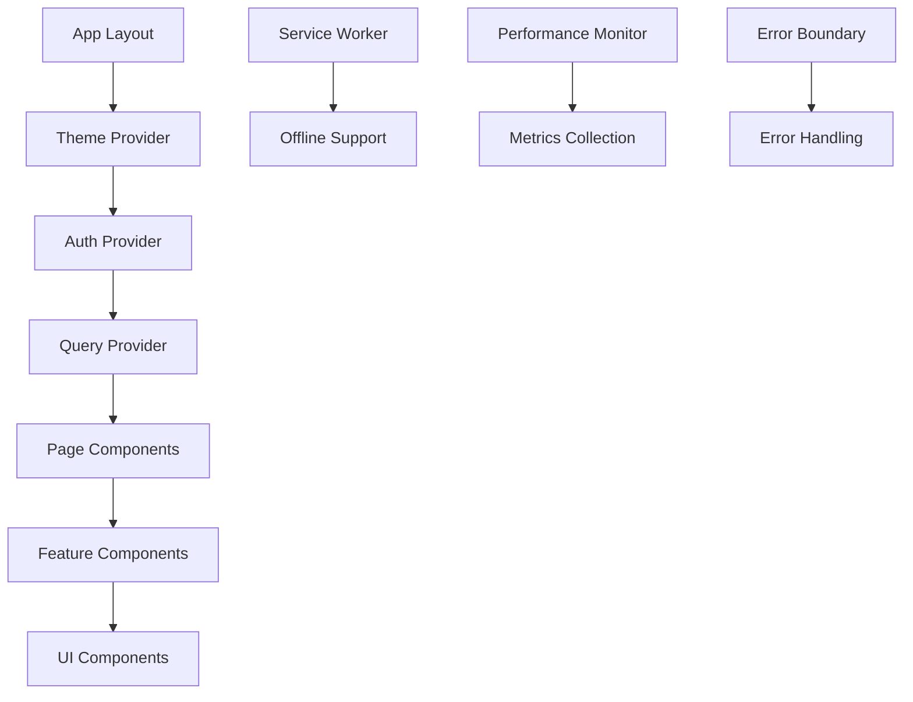

# Inspection Management System - Frontend

A modern, responsive web application for managing industrial equipment inspections built with Next.js 15, React 19, and TypeScript.

## 🚀 Features

- **Modern Tech Stack**: Next.js 15 + React 19 + TypeScript
- **Responsive Design**: Mobile-first approach with Tailwind CSS
- **Accessibility**: WCAG 2.1 AA compliant
- **Performance**: Optimized with code splitting, lazy loading, and caching
- **PWA Ready**: Service worker and offline support
- **Dark Mode**: System preference detection with manual toggle
- **Type Safety**: Strict TypeScript configuration
- **Testing**: Comprehensive test coverage with Jest and Playwright
- **Documentation**: Storybook for component development

## 📋 Table of Contents

- [Quick Start](#quick-start)
- [Development](#development)
- [Testing](#testing)
- [Deployment](#deployment)
- [Documentation](#documentation)
- [Contributing](#contributing)
- [Architecture](#architecture)

## 🚀 Quick Start

### Prerequisites

- Node.js 18.17.0 or higher
- npm 9.0.0 or higher (or pnpm 8.0+)
- Git

### Installation

```bash
# Clone the repository
git clone <repository-url>
cd inspection-management/frontend-v2

# Install dependencies
npm install

# Setup environment variables
cp .env.example .env.local
# Edit .env.local with your configuration

# Start development server
npm run dev
```

The application will be available at [http://localhost:3000](http://localhost:3000).

### Environment Variables

Create a `.env.local` file with the following variables:

```bash
# API Configuration
NEXT_PUBLIC_API_URL=http://localhost:8000
NEXT_PUBLIC_API_VERSION=v1

# Application Configuration
NEXT_PUBLIC_APP_NAME="Inspection Management System"
NEXT_PUBLIC_ENVIRONMENT=development

# Feature Flags
NEXT_PUBLIC_ENABLE_ANALYTICS=false
NEXT_PUBLIC_ENABLE_PWA=true
```

## 🛠 Development

### Available Scripts

```bash
# Development
npm run dev              # Start development server
npm run build            # Build for production
npm run start            # Start production server
npm run lint             # Run ESLint
npm run lint:fix         # Fix ESLint issues
npm run type-check       # Run TypeScript type checking

# Testing
npm run test             # Run unit tests
npm run test:watch       # Run tests in watch mode
npm run test:coverage    # Run tests with coverage
npm run e2e              # Run E2E tests
npm run e2e:ui           # Run E2E tests with UI

# Documentation
npm run storybook        # Start Storybook
npm run build-storybook  # Build Storybook

# Analysis
npm run analyze          # Analyze bundle size
```

### Project Structure

```
src/
├── app/                    # Next.js app router pages
│   ├── (auth)/            # Authentication pages
│   ├── dashboard/         # Dashboard pages
│   ├── equipment/         # Equipment management
│   └── globals.css        # Global styles
├── components/            # Reusable components
│   ├── ui/               # Basic UI components (shadcn/ui)
│   ├── forms/            # Form components
│   ├── layout/           # Layout components
│   └── [feature]/        # Feature-specific components
├── lib/                  # Utility functions
│   ├── utils.ts          # General utilities
│   ├── api.ts            # API client
│   └── validations.ts    # Zod schemas
├── hooks/                # Custom React hooks
├── contexts/             # React contexts
├── types/                # TypeScript type definitions
└── constants/            # Application constants
```

### Development Workflow

1. **Create Feature Branch**
   ```bash
   git checkout -b feature/your-feature-name
   ```

2. **Make Changes**
   - Follow [coding standards](./docs/DEVELOPMENT_WORKFLOW.md#coding-standards)
   - Write tests for new functionality
   - Update documentation if needed

3. **Test Your Changes**
   ```bash
   npm run lint
   npm run type-check
   npm run test
   npm run e2e
   ```

4. **Create Pull Request**
   - Follow [PR template](./.github/pull_request_template.md)
   - Ensure all CI checks pass
   - Request code review

## 🧪 Testing

### Unit Tests

```bash
# Run all unit tests
npm run test

# Run tests in watch mode
npm run test:watch

# Run tests with coverage
npm run test:coverage
```

### Integration Tests

```bash
# Run integration tests
npm run test -- --testPathPattern=integration
```

### End-to-End Tests

```bash
# Run E2E tests
npm run e2e

# Run E2E tests with UI
npm run e2e:ui

# Run specific test file
npx playwright test login.spec.ts
```

### Visual Testing

```bash
# Start Storybook for visual testing
npm run storybook
```

## 🚀 Deployment

### Build for Production

```bash
# Build the application
npm run build

# Test production build locally
npm run start
```

### Platform Deployment

#### Vercel (Recommended)

```bash
# Install Vercel CLI
npm i -g vercel

# Deploy to Vercel
vercel --prod
```

#### Netlify

```bash
# Install Netlify CLI
npm install -g netlify-cli

# Deploy to Netlify
netlify deploy --prod
```

#### Docker

```bash
# Build Docker image
docker build -t inspection-management-frontend .

# Run container
docker run -p 3000:3000 inspection-management-frontend
```

For detailed deployment instructions, see [Deployment Guide](./docs/DEPLOYMENT_GUIDE.md).

## 📚 Documentation

### Component Library

- **Storybook**: [http://localhost:6006](http://localhost:6006) (when running `npm run storybook`)
- **Component Docs**: [Component Library Documentation](./docs/COMPONENT_LIBRARY.md)

### Guides

- [Development Workflow](./docs/DEVELOPMENT_WORKFLOW.md)
- [Migration Guide](./docs/MIGRATION_GUIDE.md)
- [Deployment Guide](./docs/DEPLOYMENT_GUIDE.md)
- [Troubleshooting](./docs/TROUBLESHOOTING.md)

### API Documentation

- **Swagger UI**: [http://localhost:8000/docs](http://localhost:8000/docs) (backend required)
- **ReDoc**: [http://localhost:8000/redoc](http://localhost:8000/redoc) (backend required)

## 🤝 Contributing

We welcome contributions! Please see our [Development Workflow](./docs/DEVELOPMENT_WORKFLOW.md) for detailed guidelines.

### Quick Contribution Guide

1. Fork the repository
2. Create a feature branch
3. Make your changes
4. Add tests for new functionality
5. Ensure all tests pass
6. Submit a pull request

### Code Standards

- **TypeScript**: Strict mode enabled, no `any` types
- **ESLint**: Follow configured rules
- **Prettier**: Code formatting
- **Conventional Commits**: For commit messages
- **Testing**: Maintain test coverage above 80%

## 🏗 Architecture

### Technology Stack

- **Framework**: Next.js 15 with App Router
- **Language**: TypeScript 5.7+ (strict mode)
- **Styling**: Tailwind CSS 4.1+ with shadcn/ui
- **State Management**: React Query + Context API
- **Forms**: React Hook Form + Zod validation
- **Testing**: Jest + React Testing Library + Playwright
- **Documentation**: Storybook

### Key Features

#### Performance Optimizations

- **Code Splitting**: Automatic route-based splitting
- **Lazy Loading**: Dynamic imports for heavy components
- **Image Optimization**: Next.js Image component with WebP/AVIF
- **Caching**: React Query with persistence
- **Service Worker**: Offline support and caching

#### Accessibility

- **WCAG 2.1 AA**: Compliant implementation
- **Keyboard Navigation**: Full keyboard support
- **Screen Readers**: Proper ARIA attributes
- **Color Contrast**: Meets accessibility standards

#### Developer Experience

- **Type Safety**: Comprehensive TypeScript coverage
- **Hot Reload**: Fast development feedback
- **Error Boundaries**: Graceful error handling
- **Performance Monitoring**: Real-time metrics in development

### Component Architecture



## 📊 Performance

### Lighthouse Scores (Target)

- **Performance**: 95+
- **Accessibility**: 100
- **Best Practices**: 100
- **SEO**: 95+

### Core Web Vitals (Target)

- **First Contentful Paint**: < 1.8s
- **Largest Contentful Paint**: < 2.5s
- **First Input Delay**: < 100ms
- **Cumulative Layout Shift**: < 0.1

## 🔒 Security

### Security Features

- **Content Security Policy**: Configured headers
- **HTTPS**: Enforced in production
- **JWT**: Secure token handling
- **Input Validation**: Zod schema validation
- **XSS Protection**: React's built-in protection + CSP

### Environment Security

- **Environment Variables**: Proper secret management
- **API Keys**: Client-side keys prefixed with `NEXT_PUBLIC_`
- **Dependencies**: Regular security audits

## 📈 Monitoring

### Error Tracking

- **Sentry**: Error monitoring and performance tracking
- **Console Logging**: Structured logging in development

### Analytics

- **Vercel Analytics**: Performance and usage metrics
- **Google Analytics**: User behavior tracking (optional)

### Performance Monitoring

- **Core Web Vitals**: Real-time monitoring
- **Bundle Analysis**: Regular size monitoring
- **Lighthouse CI**: Automated performance testing

## 🆘 Support

### Getting Help

1. **Documentation**: Check the [docs](./docs/) directory
2. **Issues**: Create a GitHub issue
3. **Discussions**: Use GitHub discussions for questions
4. **Code Review**: Submit a PR for feedback

### Common Issues

See [Troubleshooting Guide](./docs/TROUBLESHOOTING.md) for solutions to common problems.

## 📄 License

This project is licensed under the MIT License - see the [LICENSE](LICENSE) file for details.

## 🙏 Acknowledgments

- [Next.js](https://nextjs.org/) - React framework
- [Tailwind CSS](https://tailwindcss.com/) - Utility-first CSS framework
- [shadcn/ui](https://ui.shadcn.com/) - Component library
- [React Query](https://tanstack.com/query) - Data fetching library
- [Playwright](https://playwright.dev/) - E2E testing framework

---

**Built with ❤️ by the Inspection Management Team**