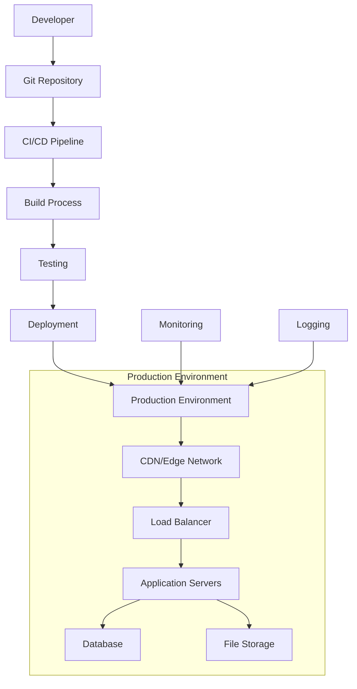

# Deployment Guide

## Overview

This guide covers the complete deployment process for the Inspection Management System frontend, including environment setup, build configuration, deployment strategies, and maintenance procedures.

## Table of Contents

1. [Deployment Architecture](#deployment-architecture)
2. [Environment Configuration](#environment-configuration)
3. [Build Process](#build-process)
4. [Deployment Strategies](#deployment-strategies)
5. [Platform-Specific Guides](#platform-specific-guides)
6. [Monitoring and Maintenance](#monitoring-and-maintenance)
7. [Rollback Procedures](#rollback-procedures)
8. [Security Considerations](#security-considerations)

---

## Deployment Architecture

### System Overview



### Infrastructure Components

| Component | Purpose | Technology Options |
|-----------|---------|-------------------|
| **Frontend Hosting** | Serve static assets and SSR | Vercel, Netlify, AWS Amplify |
| **CDN** | Global content delivery | Cloudflare, AWS CloudFront |
| **Backend API** | Business logic and data | FastAPI on AWS/GCP/Azure |
| **Database** | Data persistence | PostgreSQL (RDS/Cloud SQL) |
| **File Storage** | Images and documents | AWS S3, Google Cloud Storage |
| **Monitoring** | Performance and errors | Sentry, DataDog, New Relic |

---

## Environment Configuration

### Environment Variables

#### Required Variables

```bash
# API Configuration
NEXT_PUBLIC_API_URL=https://api.yourdomain.com
NEXT_PUBLIC_API_VERSION=v1

# Authentication
NEXT_PUBLIC_JWT_EXPIRY=3600
NEXTAUTH_SECRET=your-nextauth-secret
NEXTAUTH_URL=https://yourdomain.com

# Application Configuration
NEXT_PUBLIC_APP_NAME="Inspection Management System"
NEXT_PUBLIC_APP_VERSION=1.0.0
NEXT_PUBLIC_ENVIRONMENT=production

# Feature Flags
NEXT_PUBLIC_ENABLE_ANALYTICS=true
NEXT_PUBLIC_ENABLE_PWA=true
NEXT_PUBLIC_ENABLE_OFFLINE=true

# External Services
NEXT_PUBLIC_SENTRY_DSN=https://your-sentry-dsn
NEXT_PUBLIC_GOOGLE_ANALYTICS_ID=GA-XXXXXXXXX
```

#### Optional Variables

```bash
# Development/Debug
NEXT_PUBLIC_DEBUG_MODE=false
NEXT_PUBLIC_SHOW_PERFORMANCE_MONITOR=false

# CDN Configuration
NEXT_PUBLIC_CDN_URL=https://cdn.yourdomain.com
NEXT_PUBLIC_IMAGES_DOMAIN=images.yourdomain.com

# Third-party Integrations
NEXT_PUBLIC_STRIPE_PUBLISHABLE_KEY=pk_live_...
NEXT_PUBLIC_MAPBOX_ACCESS_TOKEN=pk.eyJ1...
```

### Environment Files Structure

```
├── .env.local          # Local development (gitignored)
├── .env.development    # Development environment
├── .env.staging        # Staging environment
├── .env.production     # Production environment
└── .env.example        # Template file (committed)
```

### Configuration Validation

```typescript
// src/lib/env.ts
import { z } from 'zod'

const envSchema = z.object({
  NEXT_PUBLIC_API_URL: z.string().url(),
  NEXT_PUBLIC_APP_NAME: z.string().min(1),
  NEXT_PUBLIC_ENVIRONMENT: z.enum(['development', 'staging', 'production']),
  NEXT_PUBLIC_ENABLE_ANALYTICS: z.string().transform(val => val === 'true'),
})

export const env = envSchema.parse({
  NEXT_PUBLIC_API_URL: process.env.NEXT_PUBLIC_API_URL,
  NEXT_PUBLIC_APP_NAME: process.env.NEXT_PUBLIC_APP_NAME,
  NEXT_PUBLIC_ENVIRONMENT: process.env.NEXT_PUBLIC_ENVIRONMENT,
  NEXT_PUBLIC_ENABLE_ANALYTICS: process.env.NEXT_PUBLIC_ENABLE_ANALYTICS,
})

// Usage in components
import { env } from '@/lib/env'
console.log(env.NEXT_PUBLIC_API_URL) // Type-safe and validated
```

---

## Build Process

### Build Configuration

#### next.config.js

```javascript
/** @type {import('next').NextConfig} */
const nextConfig = {
  // Performance optimizations
  swcMinify: true,
  compress: true,
  poweredByHeader: false,
  
  // Image optimization
  images: {
    formats: ['image/webp', 'image/avif'],
    minimumCacheTTL: 60 * 60 * 24 * 30, // 30 days
    domains: ['images.yourdomain.com'],
  },
  
  // Security headers
  async headers() {
    return [
      {
        source: '/(.*)',
        headers: [
          {
            key: 'X-Frame-Options',
            value: 'DENY',
          },
          {
            key: 'X-Content-Type-Options',
            value: 'nosniff',
          },
          {
            key: 'Referrer-Policy',
            value: 'strict-origin-when-cross-origin',
          },
          {
            key: 'Content-Security-Policy',
            value: "default-src 'self'; script-src 'self' 'unsafe-eval' 'unsafe-inline'; style-src 'self' 'unsafe-inline';",
          },
        ],
      },
    ]
  },
  
  // Redirects and rewrites
  async redirects() {
    return [
      {
        source: '/admin',
        destination: '/dashboard',
        permanent: true,
      },
    ]
  },
  
  async rewrites() {
    return [
      {
        source: '/api/:path*',
        destination: `${process.env.NEXT_PUBLIC_API_URL}/api/:path*`,
      },
    ]
  },
  
  // Bundle analysis (development only)
  ...(process.env.ANALYZE === 'true' && {
    webpack: (config) => {
      config.plugins.push(new BundleAnalyzerPlugin())
      return config
    },
  }),
}

module.exports = nextConfig
```

### Build Scripts

#### package.json

```json
{
  "scripts": {
    "dev": "next dev",
    "build": "next build",
    "start": "next start",
    "lint": "next lint",
    "lint:fix": "next lint --fix",
    "type-check": "tsc --noEmit",
    "test": "jest",
    "test:watch": "jest --watch",
    "test:coverage": "jest --coverage",
    "e2e": "playwright test",
    "e2e:ui": "playwright test --ui",
    "analyze": "ANALYZE=true npm run build",
    "build:staging": "NODE_ENV=production NEXT_PUBLIC_ENVIRONMENT=staging next build",
    "build:production": "NODE_ENV=production NEXT_PUBLIC_ENVIRONMENT=production next build",
    "export": "next export",
    "serve": "serve out"
  }
}
```

### Build Optimization

#### Webpack Configuration

```javascript
// next.config.js
module.exports = {
  webpack: (config, { dev, isServer }) => {
    // Production optimizations
    if (!dev && !isServer) {
      config.optimization.splitChunks = {
        chunks: 'all',
        cacheGroups: {
          vendor: {
            test: /[\\/]node_modules[\\/]/,
            name: 'vendors',
            chunks: 'all',
          },
          common: {
            name: 'common',
            minChunks: 2,
            chunks: 'all',
            enforce: true,
          },
        },
      }
    }
    
    return config
  },
}
```

---

## Deployment Strategies

### 1. Continuous Deployment (Recommended)

#### GitHub Actions Workflow

```yaml
# .github/workflows/deploy.yml
name: Deploy to Production

on:
  push:
    branches: [main]
  pull_request:
    branches: [main]

jobs:
  test:
    runs-on: ubuntu-latest
    steps:
      - uses: actions/checkout@v4
      - uses: actions/setup-node@v4
        with:
          node-version: '18'
          cache: 'npm'
      
      - name: Install dependencies
        run: npm ci
      
      - name: Run linting
        run: npm run lint
      
      - name: Run type checking
        run: npm run type-check
      
      - name: Run unit tests
        run: npm run test:coverage
      
      - name: Run E2E tests
        run: npm run e2e
  
  build:
    needs: test
    runs-on: ubuntu-latest
    if: github.ref == 'refs/heads/main'
    steps:
      - uses: actions/checkout@v4
      - uses: actions/setup-node@v4
        with:
          node-version: '18'
          cache: 'npm'
      
      - name: Install dependencies
        run: npm ci
      
      - name: Build application
        run: npm run build:production
        env:
          NEXT_PUBLIC_API_URL: ${{ secrets.NEXT_PUBLIC_API_URL }}
          NEXT_PUBLIC_APP_NAME: ${{ secrets.NEXT_PUBLIC_APP_NAME }}
      
      - name: Upload build artifacts
        uses: actions/upload-artifact@v4
        with:
          name: build-files
          path: .next/
  
  deploy:
    needs: build
    runs-on: ubuntu-latest
    environment: production
    steps:
      - uses: actions/checkout@v4
      - name: Deploy to Vercel
        uses: vercel/action@v1
        with:
          vercel-token: ${{ secrets.VERCEL_TOKEN }}
          vercel-org-id: ${{ secrets.VERCEL_ORG_ID }}
          vercel-project-id: ${{ secrets.VERCEL_PROJECT_ID }}
          vercel-args: '--prod'
```

### 2. Blue-Green Deployment

```bash
# Deploy to staging environment first
vercel --target staging

# Run smoke tests
npm run test:smoke

# Switch traffic to new version
vercel --prod --force

# Monitor for issues
# If problems detected, rollback immediately
vercel rollback
```

### 3. Canary Deployment

```javascript
// next.config.js - Feature flag based deployment
module.exports = {
  async rewrites() {
    const canaryPercentage = process.env.CANARY_PERCENTAGE || 0
    
    return [
      // Route percentage of traffic to new version
      {
        source: '/(.*)',
        destination: '/new-version/$1',
        has: [
          {
            type: 'header',
            key: 'x-canary-user',
            value: 'true',
          },
        ],
      },
    ]
  },
}
```

---

## Platform-Specific Guides

### Vercel Deployment

#### Setup

```bash
# Install Vercel CLI
npm i -g vercel

# Login to Vercel
vercel login

# Initialize project
vercel

# Deploy to production
vercel --prod
```

#### Configuration

```json
// vercel.json
{
  "version": 2,
  "builds": [
    {
      "src": "package.json",
      "use": "@vercel/next"
    }
  ],
  "env": {
    "NEXT_PUBLIC_API_URL": "@api-url",
    "NEXT_PUBLIC_APP_NAME": "@app-name"
  },
  "build": {
    "env": {
      "NEXT_PUBLIC_ENVIRONMENT": "production"
    }
  },
  "functions": {
    "app/api/**/*.ts": {
      "maxDuration": 30
    }
  },
  "headers": [
    {
      "source": "/(.*)",
      "headers": [
        {
          "key": "Cache-Control",
          "value": "public, max-age=31536000, immutable"
        }
      ]
    }
  ]
}
```

### Netlify Deployment

#### Setup

```bash
# Install Netlify CLI
npm install -g netlify-cli

# Login to Netlify
netlify login

# Initialize site
netlify init

# Deploy
netlify deploy --prod
```

#### Configuration

```toml
# netlify.toml
[build]
  command = "npm run build"
  publish = ".next"

[build.environment]
  NEXT_TELEMETRY_DISABLED = "1"

[[redirects]]
  from = "/api/*"
  to = "https://api.yourdomain.com/api/:splat"
  status = 200

[[headers]]
  for = "/*"
  [headers.values]
    X-Frame-Options = "DENY"
    X-XSS-Protection = "1; mode=block"
```

### AWS Amplify Deployment

#### Setup

```bash
# Install Amplify CLI
npm install -g @aws-amplify/cli

# Configure Amplify
amplify configure

# Initialize project
amplify init

# Add hosting
amplify add hosting

# Deploy
amplify publish
```

#### Configuration

```yaml
# amplify.yml
version: 1
applications:
  - frontend:
      phases:
        preBuild:
          commands:
            - npm ci
        build:
          commands:
            - npm run build:production
      artifacts:
        baseDirectory: .next
        files:
          - '**/*'
      cache:
        paths:
          - node_modules/**/*
          - .next/cache/**/*
    appRoot: frontend-v2
```

### Docker Deployment

#### Dockerfile

```dockerfile
# Multi-stage build for production
FROM node:18-alpine AS base

# Install dependencies only when needed
FROM base AS deps
RUN apk add --no-cache libc6-compat
WORKDIR /app

COPY package.json package-lock.json ./
RUN npm ci --only=production

# Rebuild the source code only when needed
FROM base AS builder
WORKDIR /app
COPY --from=deps /app/node_modules ./node_modules
COPY . .

ENV NEXT_TELEMETRY_DISABLED 1

RUN npm run build

# Production image, copy all the files and run next
FROM base AS runner
WORKDIR /app

ENV NODE_ENV production
ENV NEXT_TELEMETRY_DISABLED 1

RUN addgroup --system --gid 1001 nodejs
RUN adduser --system --uid 1001 nextjs

COPY --from=builder /app/public ./public

# Automatically leverage output traces to reduce image size
COPY --from=builder --chown=nextjs:nodejs /app/.next/standalone ./
COPY --from=builder --chown=nextjs:nodejs /app/.next/static ./.next/static

USER nextjs

EXPOSE 3000

ENV PORT 3000

CMD ["node", "server.js"]
```

#### Docker Compose

```yaml
# docker-compose.yml
version: '3.8'

services:
  frontend:
    build:
      context: ./frontend-v2
      dockerfile: Dockerfile
    ports:
      - "3000:3000"
    environment:
      - NEXT_PUBLIC_API_URL=http://backend:8000
      - NEXT_PUBLIC_ENVIRONMENT=production
    depends_on:
      - backend
    networks:
      - app-network

  backend:
    build:
      context: ./backend
      dockerfile: Dockerfile
    ports:
      - "8000:8000"
    environment:
      - DATABASE_URL=postgresql://user:password@db:5432/inspection_db
    depends_on:
      - db
    networks:
      - app-network

  db:
    image: postgres:15
    environment:
      - POSTGRES_DB=inspection_db
      - POSTGRES_USER=user
      - POSTGRES_PASSWORD=password
    volumes:
      - postgres_data:/var/lib/postgresql/data
    networks:
      - app-network

volumes:
  postgres_data:

networks:
  app-network:
    driver: bridge
```

---

## Monitoring and Maintenance

### Performance Monitoring

#### Sentry Integration

```typescript
// sentry.client.config.ts
import * as Sentry from '@sentry/nextjs'

Sentry.init({
  dsn: process.env.NEXT_PUBLIC_SENTRY_DSN,
  environment: process.env.NEXT_PUBLIC_ENVIRONMENT,
  tracesSampleRate: 1.0,
  debug: false,
  integrations: [
    new Sentry.BrowserTracing({
      tracePropagationTargets: ['localhost', /^https:\/\/yourapi\.domain\.com\/api/],
    }),
  ],
})
```

#### Analytics Integration

```typescript
// lib/analytics.ts
import { Analytics } from '@vercel/analytics/react'
import { SpeedInsights } from '@vercel/speed-insights/next'

export function AnalyticsProvider({ children }: { children: React.ReactNode }) {
  return (
    <>
      {children}
      <Analytics />
      <SpeedInsights />
    </>
  )
}
```

### Health Checks

```typescript
// app/api/health/route.ts
import { NextResponse } from 'next/server'

export async function GET() {
  try {
    // Check database connection
    // Check external services
    // Check critical functionality
    
    return NextResponse.json({
      status: 'healthy',
      timestamp: new Date().toISOString(),
      version: process.env.NEXT_PUBLIC_APP_VERSION,
      environment: process.env.NEXT_PUBLIC_ENVIRONMENT,
    })
  } catch (error) {
    return NextResponse.json(
      {
        status: 'unhealthy',
        error: error.message,
        timestamp: new Date().toISOString(),
      },
      { status: 500 }
    )
  }
}
```

### Logging

```typescript
// lib/logger.ts
import winston from 'winston'

const logger = winston.createLogger({
  level: process.env.NODE_ENV === 'production' ? 'info' : 'debug',
  format: winston.format.combine(
    winston.format.timestamp(),
    winston.format.errors({ stack: true }),
    winston.format.json()
  ),
  defaultMeta: {
    service: 'inspection-management-frontend',
    environment: process.env.NEXT_PUBLIC_ENVIRONMENT,
  },
  transports: [
    new winston.transports.Console(),
    ...(process.env.NODE_ENV === 'production'
      ? [new winston.transports.File({ filename: 'error.log', level: 'error' })]
      : []),
  ],
})

export { logger }
```

---

## Rollback Procedures

### Immediate Rollback

```bash
# Vercel rollback
vercel rollback

# Netlify rollback
netlify rollback

# AWS Amplify rollback
amplify console
# Use web console to rollback to previous deployment

# Docker rollback
docker tag myapp:previous myapp:latest
docker-compose up -d
```

### Database Rollback

```sql
-- If database migrations were included
-- Create rollback migration
-- Run rollback scripts
-- Restore from backup if necessary
```

### Feature Flag Rollback

```typescript
// Disable features via environment variables
NEXT_PUBLIC_ENABLE_NEW_FEATURE=false

// Or use feature flag service
import { useFeatureFlag } from '@/lib/feature-flags'

function NewFeature() {
  const isEnabled = useFeatureFlag('new-dashboard')
  
  if (!isEnabled) {
    return <LegacyDashboard />
  }
  
  return <NewDashboard />
}
```

---

## Security Considerations

### Environment Security

```bash
# Never commit sensitive data
echo ".env.local" >> .gitignore
echo ".env.production" >> .gitignore

# Use secrets management
# Vercel: vercel env add
# Netlify: netlify env:set
# AWS: AWS Secrets Manager
```

### Content Security Policy

```javascript
// next.config.js
const ContentSecurityPolicy = `
  default-src 'self';
  script-src 'self' 'unsafe-eval' 'unsafe-inline' *.vercel-analytics.com;
  child-src *.youtube.com *.google.com;
  style-src 'self' 'unsafe-inline' *.googleapis.com;
  img-src * blob: data:;
  media-src 'none';
  connect-src *;
  font-src 'self' *.gstatic.com;
`

module.exports = {
  async headers() {
    return [
      {
        source: '/(.*)',
        headers: [
          {
            key: 'Content-Security-Policy',
            value: ContentSecurityPolicy.replace(/\n/g, ''),
          },
        ],
      },
    ]
  },
}
```

### HTTPS and SSL

```bash
# Ensure HTTPS in production
# Most platforms handle this automatically
# For custom domains, configure SSL certificates

# Force HTTPS redirects
# next.config.js
module.exports = {
  async redirects() {
    return [
      {
        source: '/(.*)',
        has: [
          {
            type: 'header',
            key: 'x-forwarded-proto',
            value: 'http',
          },
        ],
        destination: 'https://yourdomain.com/$1',
        permanent: true,
      },
    ]
  },
}
```

---

## Deployment Checklist

### Pre-Deployment

- [ ] All tests passing (unit, integration, E2E)
- [ ] Code review completed
- [ ] Environment variables configured
- [ ] Database migrations ready (if any)
- [ ] Performance benchmarks met
- [ ] Security scan completed
- [ ] Accessibility audit passed

### Deployment

- [ ] Backup current production (if applicable)
- [ ] Deploy to staging environment
- [ ] Run smoke tests on staging
- [ ] Deploy to production
- [ ] Verify deployment health
- [ ] Monitor error rates and performance
- [ ] Update documentation

### Post-Deployment

- [ ] Verify all critical functionality
- [ ] Check performance metrics
- [ ] Monitor error rates
- [ ] Validate user feedback
- [ ] Update team on deployment status
- [ ] Schedule post-deployment review

---

## Maintenance Procedures

### Regular Maintenance

#### Weekly Tasks
- [ ] Review error logs and fix critical issues
- [ ] Check performance metrics and optimize if needed
- [ ] Update dependencies (patch versions)
- [ ] Review and respond to user feedback

#### Monthly Tasks
- [ ] Security audit and vulnerability scan
- [ ] Performance optimization review
- [ ] Dependency updates (minor versions)
- [ ] Backup verification and testing
- [ ] Documentation updates

#### Quarterly Tasks
- [ ] Major dependency updates
- [ ] Infrastructure review and optimization
- [ ] Security policy review
- [ ] Disaster recovery testing
- [ ] Performance baseline updates

### Emergency Procedures

#### High Severity Issues
1. **Immediate Response** (< 15 minutes)
   - Assess impact and severity
   - Implement immediate mitigation
   - Notify stakeholders

2. **Investigation** (< 1 hour)
   - Identify root cause
   - Develop fix or rollback plan
   - Implement solution

3. **Resolution** (< 4 hours)
   - Deploy fix or rollback
   - Verify resolution
   - Monitor for recurrence

4. **Post-Incident** (< 24 hours)
   - Document incident and resolution
   - Conduct post-mortem review
   - Implement preventive measures

---

This deployment guide should be regularly updated as the infrastructure and deployment processes evolve.