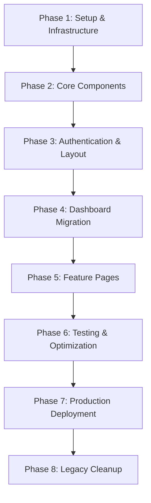

# Frontend Migration Guide

## Overview

This guide provides step-by-step instructions for migrating from the old frontend system to the new Next.js 15 + React 19 implementation. The migration is designed to be incremental, allowing for gradual transition while maintaining system functionality.

## Table of Contents

1. [Migration Strategy](#migration-strategy)
2. [Prerequisites](#prerequisites)
3. [System Differences](#system-differences)
4. [Step-by-Step Migration](#step-by-step-migration)
5. [Component Mapping](#component-mapping)
6. [API Integration](#api-integration)
7. [Testing Procedures](#testing-procedures)
8. [Troubleshooting](#troubleshooting)
9. [Rollback Procedures](#rollback-procedures)

---

## Migration Strategy

### Approach: Incremental Migration

The migration follows a **page-by-page incremental approach** to minimize risk and ensure continuous system availability:

1. **Parallel Development**: New system runs alongside the old system
2. **Feature Flags**: Control which pages use the new implementation
3. **Gradual Rollout**: Migrate pages one by one with thorough testing
4. **Fallback Support**: Ability to quickly revert to old system if needed

### Migration Phases



---

## Prerequisites

### Development Environment

Before starting the migration, ensure you have:

#### Required Software
- **Node.js**: Version 18.17 or higher
- **npm**: Version 9.0 or higher (or pnpm 8.0+)
- **Git**: Latest version
- **VS Code**: Recommended IDE with extensions:
  - TypeScript and JavaScript Language Features
  - Tailwind CSS IntelliSense
  - ES7+ React/Redux/React-Native snippets
  - Auto Rename Tag
  - Bracket Pair Colorizer

#### Backend Dependencies
- **Python**: 3.12+
- **FastAPI**: 0.104.x
- **PostgreSQL**: 13+ (or SQLite for development)

### Environment Setup

1. **Clone the repository**
   ```bash
   git clone <repository-url>
   cd inspection-management
   ```

2. **Install frontend dependencies**
   ```bash
   cd frontend-v2
   npm install
   ```

3. **Setup environment variables**
   ```bash
   cp .env.example .env.local
   # Edit .env.local with your configuration
   ```

4. **Start development servers**
   ```bash
   # Backend (in root directory)
   cd backend
   python -m venv venv
   venv\Scripts\activate  # Windows
   pip install -r requirements.txt
   uvicorn app.main:app --reload
   
   # Frontend (in frontend-v2 directory)
   cd frontend-v2
   npm run dev
   ```

---

## System Differences

### Architecture Changes

| Aspect | Old System | New System |
|--------|------------|------------|
| **Framework** | Custom HTML/JS | Next.js 15 + React 19 |
| **Styling** | Custom CSS | Tailwind CSS + shadcn/ui |
| **State Management** | jQuery/Vanilla JS | React Query + Context |
| **Routing** | Server-side | App Router (Next.js) |
| **Build System** | Custom/Webpack | Next.js built-in |
| **Type Safety** | None | TypeScript strict mode |
| **Testing** | Manual | Jest + Playwright |
| **Accessibility** | Limited | WCAG 2.1 AA compliant |

### Technology Stack Comparison

#### Old Stack
```
Frontend:
├── HTML templates
├── jQuery 3.x
├── Bootstrap 4.x
├── Custom CSS
└── Vanilla JavaScript

Build:
├── Webpack (basic)
├── Babel
└── Manual optimization
```

#### New Stack
```
Frontend:
├── Next.js 15
├── React 19
├── TypeScript 5.7+
├── Tailwind CSS 4.1+
├── shadcn/ui components
└── React Query

Build:
├── Next.js compiler (Rust-based)
├── Automatic optimization
├── Code splitting
└── Bundle analysis
```

---

## Step-by-Step Migration

### Phase 1: Infrastructure Setup ✅

**Status**: Completed

- [x] Next.js project initialization
- [x] TypeScript configuration
- [x] Tailwind CSS setup
- [x] Component library (shadcn/ui)
- [x] Development tools (ESLint, Prettier)
- [x] Testing framework (Jest, Playwright)

### Phase 2: Core Components ✅

**Status**: Completed

- [x] UI component library
- [x] Theme system (light/dark mode)
- [x] Layout components
- [x] Navigation components
- [x] Form components

### Phase 3: Authentication & Security ✅

**Status**: Completed

- [x] Authentication context
- [x] Protected routes
- [x] JWT token management
- [x] Role-based access control
- [x] Security middleware

### Phase 4: Dashboard Migration ✅

**Status**: Completed

- [x] Dashboard layout
- [x] Statistics cards
- [x] Data visualization
- [x] Real-time updates
- [x] Responsive design

### Phase 5: Feature Pages (In Progress)

**Current Status**: 60% Complete

#### Completed Pages
- [x] Login/Authentication
- [x] Dashboard
- [x] User Profile
- [x] Settings

#### In Progress
- [ ] Equipment Management
- [ ] Inspection Forms
- [ ] Reports Generation
- [ ] Analytics Dashboard

#### Pending
- [ ] Advanced Reporting
- [ ] System Administration
- [ ] Audit Logs
- [ ] Data Export/Import

### Phase 6: Testing & Quality Assurance

**Status**: In Progress

- [x] Unit tests for components
- [x] Integration tests
- [x] E2E tests (basic scenarios)
- [ ] Performance testing
- [ ] Accessibility testing
- [ ] Cross-browser testing
- [ ] Mobile responsiveness testing

### Phase 7: Performance Optimization ✅

**Status**: Completed

- [x] Code splitting and lazy loading
- [x] Bundle size optimization
- [x] Performance monitoring
- [x] Caching strategies
- [x] Image optimization
- [x] Service Worker implementation

---

## Component Mapping

### UI Components Migration

| Old Component | New Component | Migration Notes |
|---------------|---------------|-----------------|
| `<button class="btn">` | `<Button variant="default">` | Props-based styling |
| `<div class="card">` | `<Card>` | Structured with Header/Content/Footer |
| `<input class="form-control">` | `<Input>` | Built-in validation support |
| `<select class="form-select">` | `<Select>` | Enhanced accessibility |
| `<table class="table">` | `<DataTable>` | Advanced features (sorting, filtering) |
| Custom modals | `<Dialog>` | Accessible modal implementation |
| Bootstrap alerts | `<Alert>` | Consistent with design system |
| Custom tooltips | `<Tooltip>` | Better positioning and accessibility |

### Layout Migration

#### Old Layout Structure
```html
<div class="wrapper">
  <nav class="sidebar">...</nav>
  <div class="main-content">
    <header class="topbar">...</header>
    <main class="content">...</main>
  </div>
</div>
```

#### New Layout Structure
```tsx
<MainLayout>
  <Sidebar />
  <div className="flex-1">
    <Header />
    <main className="p-6">
      {children}
    </main>
  </div>
</MainLayout>
```

### Form Migration

#### Old Form Pattern
```html
<form id="equipmentForm">
  <div class="form-group">
    <label for="name">Equipment Name</label>
    <input type="text" id="name" class="form-control" required>
    <div class="invalid-feedback"></div>
  </div>
  <button type="submit" class="btn btn-primary">Save</button>
</form>

<script>
$('#equipmentForm').on('submit', function(e) {
  // jQuery validation and submission
});
</script>
```

#### New Form Pattern
```tsx
import { useForm } from 'react-hook-form'
import { zodResolver } from '@hookform/resolvers/zod'
import { z } from 'zod'

const schema = z.object({
  name: z.string().min(1, 'Equipment name is required'),
})

function EquipmentForm() {
  const form = useForm({
    resolver: zodResolver(schema),
  })

  const onSubmit = (data) => {
    // Type-safe form submission
  }

  return (
    <Form {...form}>
      <form onSubmit={form.handleSubmit(onSubmit)}>
        <FormField
          control={form.control}
          name="name"
          render={({ field }) => (
            <FormItem>
              <FormLabel>Equipment Name</FormLabel>
              <FormControl>
                <Input {...field} />
              </FormControl>
              <FormMessage />
            </FormItem>
          )}
        />
        <Button type="submit">Save</Button>
      </form>
    </Form>
  )
}
```

---

## API Integration

### HTTP Client Migration

#### Old Pattern (jQuery AJAX)
```javascript
$.ajax({
  url: '/api/equipment',
  method: 'GET',
  success: function(data) {
    // Handle success
  },
  error: function(xhr, status, error) {
    // Handle error
  }
});
```

#### New Pattern (React Query + Fetch)
```typescript
import { useQuery } from '@tanstack/react-query'

function useEquipment() {
  return useQuery({
    queryKey: ['equipment'],
    queryFn: async () => {
      const response = await fetch('/api/equipment')
      if (!response.ok) {
        throw new Error('Failed to fetch equipment')
      }
      return response.json()
    },
    staleTime: 5 * 60 * 1000, // 5 minutes
    retry: 3,
  })
}

// Usage in component
function EquipmentList() {
  const { data, isLoading, error } = useEquipment()
  
  if (isLoading) return <LoadingSpinner />
  if (error) return <ErrorMessage error={error} />
  
  return <DataTable data={data} columns={columns} />
}
```

### Authentication Integration

#### Token Management
```typescript
// Old: Manual token handling
localStorage.setItem('token', token)

// New: Secure token management
import { useAuth } from '@/contexts/auth-context'

function useApiClient() {
  const { token } = useAuth()
  
  return {
    get: (url: string) => 
      fetch(url, {
        headers: {
          'Authorization': `Bearer ${token}`,
          'Content-Type': 'application/json',
        },
      }),
  }
}
```

---

## Testing Procedures

### Pre-Migration Testing Checklist

Before migrating any page, ensure:

- [ ] **Functionality Mapping**: All features identified and documented
- [ ] **Data Dependencies**: API endpoints and data structures understood
- [ ] **User Flows**: Critical user journeys documented
- [ ] **Edge Cases**: Error scenarios and edge cases identified
- [ ] **Performance Baseline**: Current page performance measured

### Migration Testing Process

#### 1. Component-Level Testing
```bash
# Run component tests
npm run test

# Run with coverage
npm run test:coverage

# Watch mode for development
npm run test:watch
```

#### 2. Integration Testing
```bash
# Run integration tests
npm run test:integration

# Test specific feature
npm run test -- --testNamePattern="Equipment"
```

#### 3. End-to-End Testing
```bash
# Run E2E tests
npm run e2e

# Run with UI for debugging
npm run e2e:ui

# Test specific browser
npx playwright test --project=chromium
```

#### 4. Visual Regression Testing
```bash
# Take screenshots for comparison
npm run test:visual

# Update baseline screenshots
npm run test:visual:update
```

### Post-Migration Validation

After migrating a page:

1. **Functional Testing**
   - [ ] All features work as expected
   - [ ] Forms submit correctly
   - [ ] Data loads and displays properly
   - [ ] Navigation works correctly

2. **Cross-Browser Testing**
   - [ ] Chrome (latest)
   - [ ] Firefox (latest)
   - [ ] Safari (latest)
   - [ ] Edge (latest)

3. **Responsive Testing**
   - [ ] Mobile (320px - 768px)
   - [ ] Tablet (768px - 1024px)
   - [ ] Desktop (1024px+)

4. **Accessibility Testing**
   - [ ] Keyboard navigation
   - [ ] Screen reader compatibility
   - [ ] Color contrast compliance
   - [ ] Focus management

5. **Performance Testing**
   - [ ] Page load time < 3 seconds
   - [ ] First Contentful Paint < 1.8 seconds
   - [ ] Largest Contentful Paint < 2.5 seconds
   - [ ] Cumulative Layout Shift < 0.1

---

## Troubleshooting

### Common Migration Issues

#### 1. Styling Differences

**Problem**: Components look different from the old system

**Solution**:
```tsx
// Use Tailwind classes that match old Bootstrap styles
// Old: class="btn btn-primary"
// New: className="bg-blue-600 hover:bg-blue-700 text-white px-4 py-2 rounded"

// Or use the Button component with appropriate variant
<Button variant="default">Primary Action</Button>
```

#### 2. JavaScript Functionality Missing

**Problem**: Interactive features don't work

**Solution**:
```tsx
// Convert jQuery event handlers to React
// Old: $('#button').on('click', handler)
// New: <Button onClick={handler}>

// Convert DOM manipulation to state updates
// Old: $('#element').hide()
// New: const [visible, setVisible] = useState(true)
```

#### 3. Form Validation Issues

**Problem**: Form validation behaves differently

**Solution**:
```tsx
// Use react-hook-form with Zod validation
import { z } from 'zod'

const schema = z.object({
  email: z.string().email('Invalid email format'),
  password: z.string().min(8, 'Password must be at least 8 characters'),
})

// This provides better validation than old jQuery validation
```

#### 4. API Integration Problems

**Problem**: API calls fail or behave differently

**Solution**:
```typescript
// Ensure proper error handling
const { data, error, isLoading } = useQuery({
  queryKey: ['data'],
  queryFn: fetchData,
  retry: (failureCount, error) => {
    // Don't retry on 4xx errors
    if (error.status >= 400 && error.status < 500) {
      return false
    }
    return failureCount < 3
  },
})

// Handle loading and error states properly
if (isLoading) return <LoadingSpinner />
if (error) return <ErrorMessage error={error} />
```

#### 5. Performance Issues

**Problem**: New page loads slower than old version

**Solution**:
```tsx
// Use lazy loading for heavy components
const HeavyComponent = lazy(() => import('./HeavyComponent'))

// Implement proper loading states
<Suspense fallback={<LoadingSpinner />}>
  <HeavyComponent />
</Suspense>

// Optimize images
<OptimizedImage 
  src="/large-image.jpg"
  alt="Description"
  width={800}
  height={600}
  priority={false}
/>
```

### Debug Tools

#### 1. React Developer Tools
- Install browser extension
- Inspect component props and state
- Profile component performance

#### 2. Network Tab
- Monitor API calls
- Check request/response headers
- Verify authentication tokens

#### 3. Console Logging
```typescript
// Add debug logging
console.log('Component rendered with props:', props)
console.log('API response:', data)

// Use React Query devtools
import { ReactQueryDevtools } from '@tanstack/react-query-devtools'
```

#### 4. Performance Monitoring
```typescript
// Monitor Core Web Vitals
import { PerformanceMonitor } from '@/components/performance-monitor'

// Include in development builds
{process.env.NODE_ENV === 'development' && <PerformanceMonitor />}
```

---

## Rollback Procedures

### Emergency Rollback

If critical issues are discovered after migration:

#### 1. Immediate Rollback (< 5 minutes)
```bash
# Revert to previous deployment
git revert <commit-hash>
git push origin main

# Or use deployment platform rollback
# Vercel: vercel --prod rollback
# Netlify: netlify rollback
```

#### 2. Feature Flag Rollback
```typescript
// Disable new page via feature flag
const useNewDashboard = process.env.NEXT_PUBLIC_NEW_DASHBOARD === 'true'

if (useNewDashboard) {
  return <NewDashboard />
} else {
  // Redirect to old system
  window.location.href = '/old-dashboard'
}
```

#### 3. Database Rollback
```sql
-- If database changes were made
-- Restore from backup or run rollback migrations
-- This should be rare as frontend changes shouldn't affect DB
```

### Gradual Rollback

For non-critical issues:

1. **Identify Affected Users**
   - Monitor error rates
   - Check user feedback
   - Analyze performance metrics

2. **Partial Rollback**
   - Roll back specific features
   - Keep working components
   - Fix issues incrementally

3. **Communication**
   - Notify stakeholders
   - Document issues found
   - Plan fix timeline

### Prevention Strategies

1. **Thorough Testing**
   - Comprehensive test coverage
   - Staging environment testing
   - User acceptance testing

2. **Gradual Deployment**
   - Feature flags for controlled rollout
   - A/B testing for critical pages
   - Canary deployments

3. **Monitoring**
   - Real-time error tracking
   - Performance monitoring
   - User behavior analytics

---

## Migration Checklist

### Pre-Migration
- [ ] Development environment setup
- [ ] Old system functionality documented
- [ ] New components developed and tested
- [ ] API integration verified
- [ ] Performance baseline established

### During Migration
- [ ] Feature flag configured
- [ ] New page deployed to staging
- [ ] Comprehensive testing completed
- [ ] Performance verified
- [ ] Accessibility validated

### Post-Migration
- [ ] Production deployment successful
- [ ] Monitoring alerts configured
- [ ] User feedback collected
- [ ] Performance metrics tracked
- [ ] Documentation updated

### Final Cleanup
- [ ] Old code removed
- [ ] Feature flags cleaned up
- [ ] Dependencies updated
- [ ] Documentation finalized
- [ ] Team training completed

---

## Support and Resources

### Documentation
- [Component Library Documentation](./COMPONENT_LIBRARY.md)
- [Development Workflow](./DEVELOPMENT_WORKFLOW.md)
- [Deployment Guide](./DEPLOYMENT_GUIDE.md)

### Tools and Resources
- **Storybook**: Component development and testing
- **React Query Devtools**: API state debugging
- **React Developer Tools**: Component inspection
- **Lighthouse**: Performance auditing
- **axe DevTools**: Accessibility testing

### Getting Help

1. **Internal Resources**
   - Development team documentation
   - Code review process
   - Team knowledge sharing sessions

2. **External Resources**
   - Next.js documentation
   - React documentation
   - Tailwind CSS documentation
   - shadcn/ui documentation

3. **Community Support**
   - Stack Overflow
   - GitHub discussions
   - Discord communities
   - Reddit communities

---

This migration guide should be updated as new issues are discovered and resolved during the migration process.