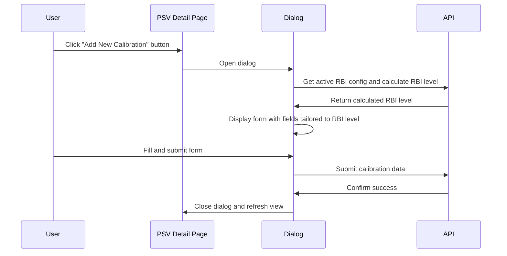

# PSV Calibration Dialog Enhancement Plan

## Current System
- Currently when clicking "Add New Calibration", a dialog opens
- The user must manually select the RBI level in the dialog
- The form fields then adapt based on that selection

## Proposed Enhancement
- Keep the dialog implementation
- Automatically fetch the active RBI level when the dialog opens
- Display the appropriate form immediately based on the active RBI level
- No manual RBI level selection required by the user

## Implementation Plan



### 1. Leverage Existing RBI Calculation API

We already have functionality in `frontend/src/api/rbi.ts` that we can use:

```typescript
// In frontend/src/api/rbi.ts - this function already exists
export async function calculateRBI(tagNumber: string, level: number): Promise<RBICalculationResult> {
  // This function makes an API call to get RBI calculation data
  // It returns a result that includes the rbi_level field
  ...
}

// In frontend/src/api/rbi.ts - this function already exists
export async function getActiveRBIConfiguration(): Promise<RBIConfiguration | null> {
  // This function fetches the active RBI configuration
  ...
}
```

We need to add a new function to determine the appropriate RBI level for a PSV:

```typescript
// Add this new function to frontend/src/api/rbi.ts
export async function getAppropriateRBILevel(psvTagNumber: string): Promise<RBILevel> {
  try {
    // First get the active RBI configuration
    const activeConfig = await getActiveRBIConfiguration();
    
    if (!activeConfig) {
      console.warn("No active RBI configuration found, defaulting to level 1");
      return 1; // Default to level 1 if no config
    }
    
    // Use the active configuration's level to calculate RBI
    const calculationResult = await calculateRBI(psvTagNumber, activeConfig.level);
    
    // The calculation result includes the recommended RBI level for this PSV
    return calculationResult.rbi_level || 1;
  } catch (error) {
    console.error("Error determining appropriate RBI level:", error);
    return 1; // Default to level 1 on error
  }
}
```

### 2. Modify the PSV Calibration Dialog Component

Update the PSVCalibrationDialog component to fetch the appropriate RBI level when it opens:

```typescript
// frontend/src/components/psv/psv-calibration-dialog.tsx
'use client';

import { useState, useEffect } from "react";
import { Button } from "@/components/ui/button";
import { Dialog, DialogContent, DialogDescription, DialogHeader, DialogTitle, DialogTrigger } from "@/components/ui/dialog";
import { PSVCalibrationForm } from "./psv-calibration-form";
import { Calibration, RBILevel, PSV } from "./types";
import { getAppropriateRBILevel } from "@/api/rbi";
import { Loader2 } from "lucide-react";

interface PSVCalibrationDialogProps {
  psv: PSV;
  onCalibrationComplete: (calibration: Calibration) => void;
}

export function PSVCalibrationDialog({
  psv,
  onCalibrationComplete,
}: PSVCalibrationDialogProps) {
  const [open, setOpen] = useState(false);
  const [rbiLevel, setRbiLevel] = useState<RBILevel | null>(null);
  const [isLoading, setIsLoading] = useState(false);
  const [isSubmitting, setIsSubmitting] = useState(false);
  const [error, setError] = useState<string | null>(null);

  // Fetch appropriate RBI level when dialog opens
  useEffect(() => {
    async function loadRBILevel() {
      if (!open || rbiLevel !== null) return;
      
      try {
        setIsLoading(true);
        // Use the function that leverages existing RBI calculation
        const level = await getAppropriateRBILevel(psv.tag_number);
        setRbiLevel(level);
      } catch (err) {
        console.error("Failed to fetch RBI level:", err);
        setError("Failed to determine appropriate RBI level. Using default level.");
        setRbiLevel(1); // Default to level 1 on error
      } finally {
        setIsLoading(false);
      }
    }

    loadRBILevel();
  }, [open, psv.tag_number, rbiLevel]);

  // Reset state when dialog closes
  const handleOpenChange = (newOpen: boolean) => {
    setOpen(newOpen);
    if (!newOpen) {
      setRbiLevel(null); // Reset when closing
      setError(null);
    }
  };

  const handleSubmit = async (formData: any) => {
    try {
      setIsSubmitting(true);

      // Convert Date to ISO string for API
      const calibrationData = {
        ...formData,
        calibration_date: formData.calibration_date.toISOString(),
        tag_number: psv.tag_number,
        created_at: new Date().toISOString(),
      };

      // Make API call to save calibration
      const response = await fetch("/api/psv/calibrations", {
        method: "POST",
        headers: {
          "Content-Type": "application/json",
        },
        body: JSON.stringify(calibrationData),
      });

      if (!response.ok) {
        throw new Error("Failed to save calibration");
      }

      const savedCalibration = await response.json();
      onCalibrationComplete(savedCalibration);
      setOpen(false);
    } catch (error) {
      console.error("Error saving calibration:", error);
      setError(error instanceof Error ? error.message : "An unknown error occurred");
    } finally {
      setIsSubmitting(false);
    }
  };

  return (
    <Dialog open={open} onOpenChange={handleOpenChange}>
      <DialogTrigger asChild>
        <Button variant="default">Add New Calibration</Button>
      </DialogTrigger>
      <DialogContent className="max-w-3xl">
        <DialogHeader>
          <DialogTitle>New PSV Calibration</DialogTitle>
          <DialogDescription>
            Record a new calibration for PSV {psv.tag_number}
          </DialogDescription>
        </DialogHeader>

        <div className="space-y-6">
          {isLoading ? (
            <div className="flex justify-center py-6">
              <Loader2 className="h-8 w-8 animate-spin" />
            </div>
          ) : error ? (
            <div className="text-red-500 mb-4">
              {error}
            </div>
          ) : null}

          {rbiLevel !== null && (
            <div className="space-y-6">
              <div className="bg-muted p-3 rounded-md">
                <p className="text-sm">Using RBI Level: {rbiLevel}</p>
              </div>

              <PSVCalibrationForm
                rbiLevel={rbiLevel}
                onSubmit={handleSubmit}
                defaultValues={{
                  calibration_date: new Date(),
                  test_medium: "Air",
                  work_maintenance: "Adjust",
                }}
              />
            </div>
          )}
          
          <div className="flex justify-end space-x-2 mt-4">
            <Button
              variant="outline"
              onClick={() => setOpen(false)}
              disabled={isSubmitting}
            >
              Cancel
            </Button>
          </div>
        </div>
      </DialogContent>
    </Dialog>
  );
}
```

### 3. Update the PSV Detail Page

No changes needed in the PSV detail page - we're just replacing the existing PSVCalibrationDialog component with the enhanced version.

## Benefits of This Approach

1. **Integration with Existing RBI System**
   - Leverages the existing RBI calculation functionality
   - Maintains consistency with the current RBI implementation
   - No need for additional backend endpoints

2. **Improved User Experience**
   - Users no longer need to manually select the RBI level
   - Form immediately shows the relevant fields based on calculated RBI level
   - Dialog automatically adapts to the appropriate level for the current PSV

3. **Data Integrity**
   - Ensures the correct RBI level is always used based on existing calculation logic
   - Prevents users from accidentally selecting the wrong level
   - Consistent with the rest of the RBI implementation

## Technical Considerations

1. **Error Handling**
   - The system gracefully falls back to RBI Level 1 if the API call fails
   - Clear error messages are shown to users when issues occur

2. **Performance**
   - The RBI level is only calculated when the dialog is opened
   - A loading indicator is displayed during calculation

3. **Maintainability**
   - By leveraging the existing RBI API functions, we maintain a consistent approach
   - Future changes to RBI calculation will automatically be reflected in the calibration form