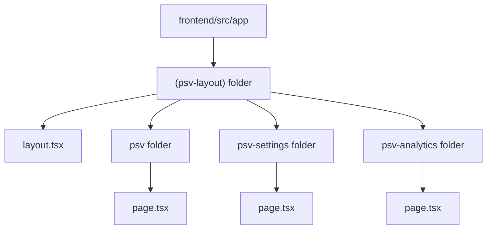
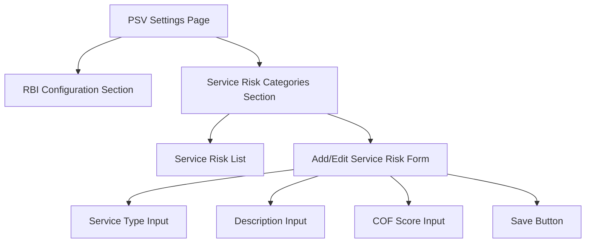
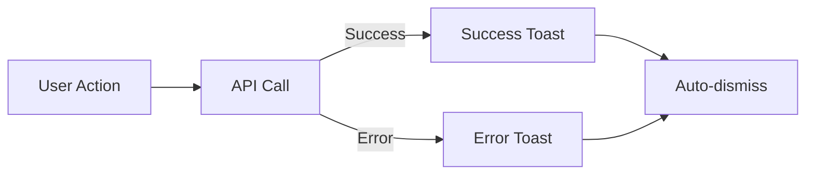
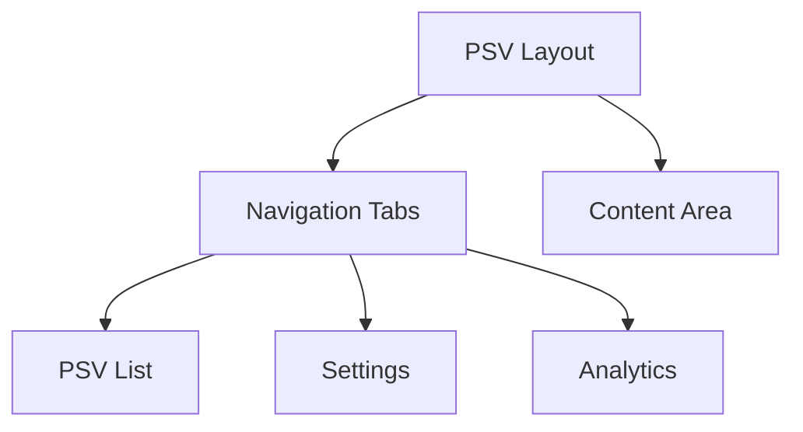

# PSV Management System Implementation Status

Based on a thorough review of the codebase, here's the current implementation status and remaining work needed for the PSV improvements.

## Current Implementation Status

### Backend Implementation ✅

Most backend components have been successfully implemented:

1. ✅ **PUT endpoint for RBI configurations** exists in `backend/app/routers/psv/rbi_routes.py`
2. ✅ **`calculate_test_statistics` function** implemented in both `rbi_routes.py` and `analytics_routes.py`
3. ✅ **RBI Level 1 calculation** updated to use PSV's frequency field
4. ✅ **Service risk routes** implemented with `service_type` as the identifier instead of `id`

### Frontend Implementation ⚠️

Several frontend components need attention:

1. ✅ **RBI API service** (`frontend/src/api/rbi.ts`) has been created
2. ❌ **PSV layout structure** (`frontend/src/app/(psv-layout)`) is missing or incorrectly implemented
   - There appears to be a partial implementation at `frontend/src/app/psv-layout/` but it's not structured as a proper Next.js layout
3. ❌ **Navigation consistency** is likely still an issue
4. ❌ **Service Risk Categories UI** is missing
5. ❌ **Toast notifications** for success/failure feedback are not implemented

## Remaining Work

### 1. Frontend Layout Structure

Create the proper Next.js layout structure using route groups:



### 2. Service Risk Categories UI

Implement the Service Risk Categories UI in the settings page:



### 3. Feedback/Toast Notifications

Implement toast notifications for success/failure messages:



### 4. Navigation and UI Consistency

Ensure consistent navigation between PSV pages:



## Implementation Steps

### 1. Frontend Layout Structure

1. Create `(psv-layout)` folder with Next.js layout structure:
   ```
   frontend/src/app/(psv-layout)/layout.tsx
   ```

2. Implement the layout component with navigation:
   ```tsx
   'use client';
   
   import Link from "next/link";
   import { usePathname } from "next/navigation";
   import { cn } from "@/lib/utils";
   
   const navigationItems = [
     {
       title: "PSV List",
       href: "/psv",
     },
     {
       title: "Settings",
       href: "/psv-settings",
     },
     {
       title: "Analytics",
       href: "/psv-analytics",
     },
   ];
   
   interface PSVLayoutWrapperProps {
     children: React.ReactNode;
   }
   
   export default function PSVLayoutWrapper({ children }: PSVLayoutWrapperProps) {
     const pathname = usePathname();
   
     return (
       <div className="flex-1 space-y-4 p-4 md:p-8 pt-6">
         <div className="flex items-center justify-between">
           <div>
             <h2 className="text-3xl font-bold tracking-tight">PSV Management</h2>
             <p className="text-muted-foreground">
               Manage and monitor pressure safety valves
             </p>
           </div>
         </div>
   
         <div className="space-y-4">
           <nav className="flex space-x-2 border-b">
             {navigationItems.map((item) => (
               <Link
                 key={item.href}
                 href={item.href}
                 className={cn(
                   "flex items-center px-4 py-2 text-sm font-medium transition-colors hover:text-primary",
                   pathname === item.href
                     ? "border-b-2 border-primary text-foreground"
                     : "text-muted-foreground"
                 )}
               >
                 {item.title}
               </Link>
             ))}
           </nav>
   
           <div>
             {children}
           </div>
         </div>
       </div>
     );
   }
   ```

3. Move existing pages into this structure:
   - Move `frontend/src/app/psv/page.tsx` to `frontend/src/app/(psv-layout)/psv/page.tsx`
   - Move `frontend/src/app/psv-settings/page.tsx` to `frontend/src/app/(psv-layout)/psv-settings/page.tsx`
   - Move `frontend/src/app/psv-analytics/page.tsx` to `frontend/src/app/(psv-layout)/psv-analytics/page.tsx`

### 2. Service Risk Categories Component

1. Create a Service Risk Categories component in `frontend/src/components/psv/service-risk-categories.tsx`:
   ```tsx
   'use client';
   
   import { useState, useEffect } from 'react';
   import { Button } from '@/components/ui/button';
   import { Input } from '@/components/ui/input';
   import { Label } from '@/components/ui/label';
   import { Textarea } from '@/components/ui/textarea';
   import {
     Card,
     CardContent,
     CardDescription,
     CardFooter,
     CardHeader,
     CardTitle,
   } from '@/components/ui/card';
   import {
     Table,
     TableBody,
     TableCell,
     TableHead,
     TableHeader,
     TableRow,
   } from '@/components/ui/table';
   import { PlusCircle, Edit, Trash } from 'lucide-react';
   import {
     Dialog,
     DialogContent,
     DialogHeader,
     DialogTitle,
     DialogTrigger,
     DialogFooter,
   } from '@/components/ui/dialog';
   import { ServiceRiskCategory } from '@/components/psv/types';
   import { 
     fetchServiceRiskCategories, 
     createServiceRiskCategory,
     updateServiceRiskCategory,
     deleteServiceRiskCategory 
   } from '@/api/rbi';
   import { toast } from 'sonner';
   
   export function ServiceRiskCategoriesTable() {
     const [categories, setCategories] = useState<ServiceRiskCategory[]>([]);
     const [loading, setLoading] = useState(true);
     const [open, setOpen] = useState(false);
     const [editItem, setEditItem] = useState<ServiceRiskCategory | null>(null);
     
     const loadCategories = async () => {
       setLoading(true);
       try {
         const data = await fetchServiceRiskCategories();
         setCategories(data);
       } catch (error) {
         toast.error("Failed to load service risk categories");
         console.error(error);
       } finally {
         setLoading(false);
       }
     };
     
     useEffect(() => {
       loadCategories();
     }, []);
     
     const handleEdit = (category: ServiceRiskCategory) => {
       setEditItem(category);
       setOpen(true);
     };
     
     const handleDelete = async (serviceType: string) => {
       if (confirm("Are you sure you want to delete this category?")) {
         try {
           await deleteServiceRiskCategory(serviceType);
           toast.success("Service risk category deleted");
           loadCategories();
         } catch (error) {
           toast.error("Failed to delete service risk category");
           console.error(error);
         }
       }
     };
     
     return (
       <Card className="w-full">
         <CardHeader>
           <CardTitle>Service Risk Categories</CardTitle>
           <CardDescription>
             Manage service risk categories and consequences of failure scores
           </CardDescription>
         </CardHeader>
         <CardContent>
           {loading ? (
             <p>Loading categories...</p>
           ) : (
             <Table>
               <TableHeader>
                 <TableRow>
                   <TableHead>Service Type</TableHead>
                   <TableHead>Description</TableHead>
                   <TableHead>COF Score</TableHead>
                   <TableHead className="w-[100px]">Actions</TableHead>
                 </TableRow>
               </TableHeader>
               <TableBody>
                 {categories.length === 0 ? (
                   <TableRow>
                     <TableCell colSpan={4} className="text-center">
                       No service risk categories found
                     </TableCell>
                   </TableRow>
                 ) : (
                   categories.map((category) => (
                     <TableRow key={category.service_type}>
                       <TableCell>{category.service_type}</TableCell>
                       <TableCell>{category.description}</TableCell>
                       <TableCell>{category.cof_score}</TableCell>
                       <TableCell>
                         <div className="flex space-x-2">
                           <Button
                             variant="outline"
                             size="icon"
                             onClick={() => handleEdit(category)}
                           >
                             <Edit className="h-4 w-4" />
                           </Button>
                           <Button
                             variant="outline"
                             size="icon"
                             onClick={() => handleDelete(category.service_type)}
                           >
                             <Trash className="h-4 w-4" />
                           </Button>
                         </div>
                       </TableCell>
                     </TableRow>
                   ))
                 )}
               </TableBody>
             </Table>
           )}
         </CardContent>
         <CardFooter>
           <Dialog open={open} onOpenChange={setOpen}>
             <DialogTrigger asChild>
               <Button className="ml-auto">
                 <PlusCircle className="mr-2 h-4 w-4" /> Add Category
               </Button>
             </DialogTrigger>
             <DialogContent>
               <ServiceRiskForm
                 editItem={editItem}
                 onClose={() => {
                   setOpen(false);
                   setEditItem(null);
                 }}
                 onSuccess={() => {
                   loadCategories();
                   setOpen(false);
                   setEditItem(null);
                 }}
               />
             </DialogContent>
           </Dialog>
         </CardFooter>
       </Card>
     );
   }
   
   interface ServiceRiskFormProps {
     editItem: ServiceRiskCategory | null;
     onClose: () => void;
     onSuccess: () => void;
   }
   
   function ServiceRiskForm({ editItem, onClose, onSuccess }: ServiceRiskFormProps) {
     const [formData, setFormData] = useState<{
       service_type: string;
       description: string;
       cof_score: number;
     }>({
       service_type: "",
       description: "",
       cof_score: 1,
     });
     
     useEffect(() => {
       if (editItem) {
         setFormData({
           service_type: editItem.service_type,
           description: editItem.description || "",
           cof_score: editItem.cof_score,
         });
       }
     }, [editItem]);
     
     const handleChange = (e: React.ChangeEvent<HTMLInputElement | HTMLTextAreaElement>) => {
       const { name, value } = e.target;
       setFormData((prev) => ({
         ...prev,
         [name]: name === "cof_score" ? parseFloat(value) : value,
       }));
     };
     
     const handleSubmit = async () => {
       try {
         if (editItem) {
           await updateServiceRiskCategory(editItem.service_type, formData);
           toast.success("Service risk category updated");
         } else {
           await createServiceRiskCategory(formData as ServiceRiskCategory);
           toast.success("Service risk category created");
         }
         onSuccess();
       } catch (error) {
         toast.error(editItem ? "Failed to update category" : "Failed to create category");
         console.error(error);
       }
     };
     
     return (
       <>
         <DialogHeader>
           <DialogTitle>
             {editItem ? "Edit Service Risk Category" : "New Service Risk Category"}
           </DialogTitle>
         </DialogHeader>
   
         <div className="grid gap-4 py-4">
           <div className="grid grid-cols-4 items-center gap-4">
             <Label htmlFor="service_type" className="text-right">
               Service Type
             </Label>
             <Input
               id="service_type"
               name="service_type"
               value={formData.service_type}
               onChange={handleChange}
               className="col-span-3"
               disabled={!!editItem}
             />
           </div>
           <div className="grid grid-cols-4 items-center gap-4">
             <Label htmlFor="description" className="text-right">
               Description
             </Label>
             <Textarea
               id="description"
               name="description"
               value={formData.description}
               onChange={handleChange}
               className="col-span-3"
             />
           </div>
           <div className="grid grid-cols-4 items-center gap-4">
             <Label htmlFor="cof_score" className="text-right">
               COF Score
             </Label>
             <Input
               id="cof_score"
               name="cof_score"
               type="number"
               min="1"
               max="5"
               step="0.1"
               value={formData.cof_score}
               onChange={handleChange}
               className="col-span-3"
             />
           </div>
         </div>
   
         <DialogFooter>
           <Button variant="outline" onClick={onClose}>
             Cancel
           </Button>
           <Button onClick={handleSubmit}>Save</Button>
         </DialogFooter>
       </>
     );
   }
   ```

2. Add the component to the settings page (`frontend/src/app/(psv-layout)/psv-settings/page.tsx`):
   ```tsx
   // Import the ServiceRiskCategoriesTable component
   import { ServiceRiskCategoriesTable } from "@/components/psv/service-risk-categories";
   
   // Add to your existing settings page
   <div className="grid gap-6">
     {/* Existing RBI configuration content */}
     {/* ... */}
     
     {/* Service Risk Categories */}
     <ServiceRiskCategoriesTable />
   </div>
   ```

### 3. Add Toast Notifications

1. Install Sonner toast library:
   ```bash
   npm install sonner
   ```

2. Add Sonner Toast provider in `frontend/src/app/layout.tsx`:
   ```tsx
   import { Toaster } from 'sonner';
   
   // In your layout component return
   return (
     <html lang="en">
       <body>
         {/* Your existing layout */}
         {children}
         <Toaster position="top-right" />
       </body>
     </html>
   );
   ```

3. Use toast notifications in API service functions:
   ```tsx
   import { toast } from 'sonner';
   
   // Example usage in components:
   try {
     await updateRBIConfiguration(id, data);
     toast.success("Configuration updated successfully");
   } catch (error) {
     toast.error("Failed to update configuration");
     console.error(error);
   }
   ```

## Next Steps

With this implementation plan as a guide, we should:

1. Implement the frontend layout structure first for consistent navigation
2. Add the Service Risk Categories UI components to the settings page
3. Add toast notifications for better user feedback
4. Test all functionality to ensure everything works as expected

After these changes, the PSV Management System should have all the required functionality working properly.