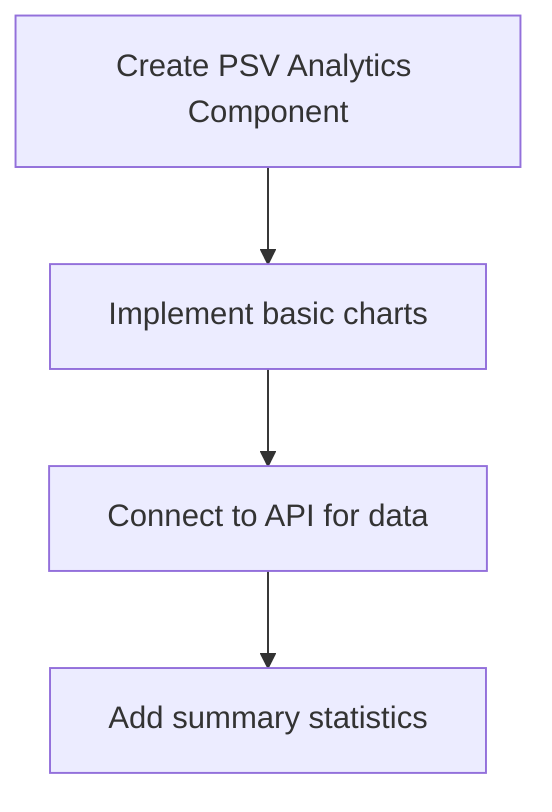
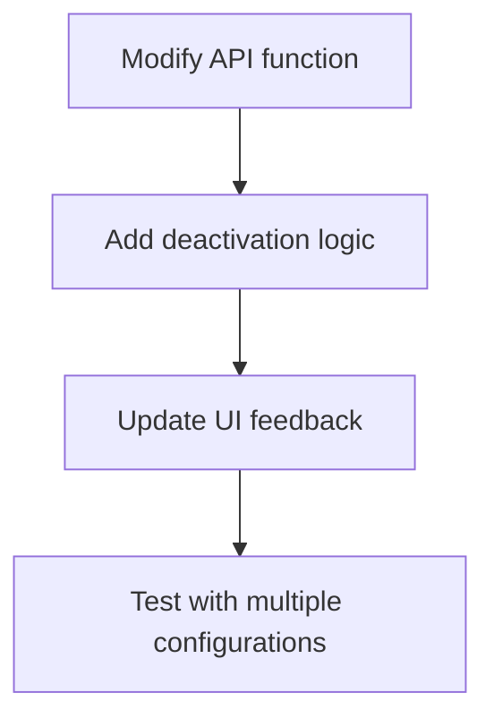

# PSV System Improvement Plan

Based on your requirements, here's a comprehensive plan to address both issues with the PSV system:

## Issue 1: PSV Analytics Page Error
The error is occurring because the `/psv-layout/psv-analytics/page.tsx` file exists but doesn't export a valid React component. We'll need to implement a proper component for this page.

## Issue 2: RBI Level Single-Configuration Restriction
We need to implement a mechanism that ensures only one of the 4 RBI levels can be active at a time, with automatic deactivation of other configurations when a new one is activated.

## Technical Analysis

### 1. Current System Structure
- The PSV system has a layout structure with navigation to PSV List, Settings, and Analytics
- The Settings page allows users to configure RBI levels (1-4)
- Currently, multiple configurations can be active simultaneously, which shouldn't be allowed

### 2. Components to Modify
- `frontend/src/app/psv-layout/psv-analytics/page.tsx` - Create proper component
- `frontend/src/api/rbi.ts` - Modify logic for activating configurations
- `frontend/src/app/psv-layout/psv-settings/page.tsx` - Update UI behavior

## Implementation Plan

### 1. Fix PSV Analytics Page


1. Create a proper React component that displays PSV analytics
2. Implement basic summary statistics and visualization
3. Connect to existing API endpoints for data

### 2. Implement RBI Level Restriction


1. Modify the `updateRBIConfiguration` function in `rbi.ts` to:
   - Check if the updated configuration is being set to active
   - If so, deactivate all other configurations
   - Implement proper error handling

2. Update the PSV Settings page to:
   - Show clearer UI indication that only one config can be active
   - Display which configuration is currently active
   - Add a notification when automatic deactivation occurs

3. Update the form handling:
   - Modify the `handleConfigSave` function to handle the activation logic
   - Update state management to reflect changes to active status

## Technical Details

### Modified API Function (rbi.ts)
We'll modify the `updateRBIConfiguration` function to include logic that deactivates other configurations when one is activated:

```typescript
export async function updateRBIConfiguration(id: number, data: Partial<Omit<RBIConfiguration, 'id' | 'created_at' | 'updated_at'>>) {
  try {
    // If activating this configuration, first deactivate all others
    if (data.active === true) {
      // Get all configurations
      const allConfigs = await fetchRBIConfigurations();
      
      // Deactivate each active config except the one being updated
      for (const config of allConfigs) {
        if (config.id !== id && config.active) {
          await fetch(`${API_URL}/api/psv/rbi/config/${config.id}`, {
            method: 'PUT',
            headers: {
              'Content-Type': 'application/json',
            },
            body: JSON.stringify({ active: false }),
          });
        }
      }
    }

    // Update the target configuration
    const response = await fetch(`${API_URL}/api/psv/rbi/config/${id}`, {
      method: 'PUT',
      headers: {
        'Content-Type': 'application/json',
      },
      body: JSON.stringify(data),
    });

    if (!response.ok) {
      const errorData = await response.json();
      throw new Error(errorData.detail || 'Failed to update RBI configuration');
    }

    return response.json();
  } catch (error) {
    console.error('Error updating RBI configuration:', error);
    throw error;
  }
}
```

### PSV Analytics Page
We'll create a new React component for the analytics page:

```typescript
'use client';

import { useState, useEffect } from 'react';
import { Card, CardContent, CardDescription, CardHeader, CardTitle } from "@/components/ui/card";
import { PSVSummary } from '@/components/psv/types';
import { Tabs, TabsContent, TabsList, TabsTrigger } from "@/components/ui/tabs";
import { 
  Chart as ChartJS,
  CategoryScale,
  LinearScale,
  BarElement,
  Title,
  Tooltip,
  Legend,
  ArcElement,
  PointElement,
  LineElement
} from 'chart.js';
import { Bar, Pie } from 'react-chartjs-2';

// Register ChartJS components
ChartJS.register(
  CategoryScale,
  LinearScale,
  BarElement,
  Title,
  Tooltip,
  Legend,
  ArcElement,
  PointElement,
  LineElement
);

// Sample data fetching function - replace with actual API call
async function fetchPSVSummary(): Promise<PSVSummary> {
  try {
    const response = await fetch('/api/psv/summary');
    if (!response.ok) {
      throw new Error('Failed to fetch PSV summary data');
    }
    return response.json();
  } catch (error) {
    console.error('Error fetching PSV summary:', error);
    // Return mock data for now
    return {
      total: { main: 120, spare: 45 },
      underCalibration: { main: 5, spare: 2 },
      outOfCalibration: { main: 12, spare: 3 },
      dueNextMonth: { main: 8, spare: 4 },
      neverCalibrated: { main: 3, spare: 1 },
      rbiLevel: { level1: 30, level2: 45, level3: 20, level4: 25 }
    };
  }
}

export default function PSVAnalyticsPage() {
  const [summaryData, setSummaryData] = useState<PSVSummary | null>(null);
  const [loading, setLoading] = useState<boolean>(true);

  useEffect(() => {
    const loadData = async () => {
      try {
        const data = await fetchPSVSummary();
        setSummaryData(data);
      } catch (error) {
        console.error("Error loading summary data:", error);
      } finally {
        setLoading(false);
      }
    };

    loadData();
  }, []);

  if (loading) {
    return <div className="flex justify-center items-center h-64">Loading analytics data...</div>;
  }

  if (!summaryData) {
    return <div className="text-center text-red-500">Failed to load analytics data</div>;
  }

  const statusData = {
    labels: ['In Service', 'Under Calibration', 'Out of Calibration', 'Due Next Month', 'Never Calibrated'],
    datasets: [
      {
        label: 'Main Valves',
        data: [
          summaryData.total.main - 
            (summaryData.underCalibration.main + 
             summaryData.outOfCalibration.main + 
             summaryData.neverCalibrated.main),
          summaryData.underCalibration.main,
          summaryData.outOfCalibration.main,
          summaryData.dueNextMonth.main,
          summaryData.neverCalibrated.main
        ],
        backgroundColor: 'rgba(75, 192, 192, 0.6)',
      },
      {
        label: 'Spare Valves',
        data: [
          summaryData.total.spare - 
            (summaryData.underCalibration.spare + 
             summaryData.outOfCalibration.spare + 
             summaryData.neverCalibrated.spare),
          summaryData.underCalibration.spare,
          summaryData.outOfCalibration.spare,
          summaryData.dueNextMonth.spare,
          summaryData.neverCalibrated.spare
        ],
        backgroundColor: 'rgba(153, 102, 255, 0.6)',
      }
    ],
  };

  const rbiLevelData = {
    labels: ['Level 1', 'Level 2', 'Level 3', 'Level 4'],
    datasets: [
      {
        data: [
          summaryData.rbiLevel.level1,
          summaryData.rbiLevel.level2,
          summaryData.rbiLevel.level3,
          summaryData.rbiLevel.level4
        ],
        backgroundColor: [
          'rgba(255, 99, 132, 0.6)',
          'rgba(54, 162, 235, 0.6)',
          'rgba(255, 206, 86, 0.6)',
          'rgba(75, 192, 192, 0.6)'
        ],
        borderColor: [
          'rgba(255, 99, 132, 1)',
          'rgba(54, 162, 235, 1)',
          'rgba(255, 206, 86, 1)',
          'rgba(75, 192, 192, 1)'
        ],
        borderWidth: 1,
      }
    ],
  };

  return (
    <div className="space-y-6">
      <div className="grid grid-cols-1 md:grid-cols-4 gap-4">
        <StatCard 
          title="Total PSVs" 
          value={summaryData.total.main + summaryData.total.spare}
          description="Total pressure safety valves" 
        />
        <StatCard 
          title="Out of Calibration" 
          value={summaryData.outOfCalibration.main + summaryData.outOfCalibration.spare}
          description="Valves requiring immediate attention" 
          alert={true}
        />
        <StatCard 
          title="Due Next Month" 
          value={summaryData.dueNextMonth.main + summaryData.dueNextMonth.spare}
          description="Upcoming calibrations" 
        />
        <StatCard 
          title="Never Calibrated" 
          value={summaryData.neverCalibrated.main + summaryData.neverCalibrated.spare}
          description="Valves without calibration history" 
          alert={true}
        />
      </div>

      <div className="grid grid-cols-1 md:grid-cols-2 gap-6">
        <Card>
          <CardHeader>
            <CardTitle>PSV Status Distribution</CardTitle>
            <CardDescription>Current status of all pressure safety valves</CardDescription>
          </CardHeader>
          <CardContent>
            <Bar 
              data={statusData} 
              options={{
                responsive: true,
                scales: {
                  y: {
                    beginAtZero: true
                  }
                }
              }}
            />
          </CardContent>
        </Card>

        <Card>
          <CardHeader>
            <CardTitle>RBI Level Distribution</CardTitle>
            <CardDescription>Distribution of PSVs by RBI level</CardDescription>
          </CardHeader>
          <CardContent className="flex justify-center">
            <div style={{ maxHeight: '300px', maxWidth: '300px' }}>
              <Pie 
                data={rbiLevelData}
                options={{
                  responsive: true,
                  plugins: {
                    legend: {
                      position: 'bottom',
                    },
                  }
                }}
              />
            </div>
          </CardContent>
        </Card>
      </div>
    </div>
  );
}

interface StatCardProps {
  title: string;
  value: number;
  description: string;
  alert?: boolean;
}

function StatCard({ title, value, description, alert }: StatCardProps) {
  return (
    <Card className={alert ? "border-red-500" : ""}>
      <CardHeader className="flex flex-row items-center justify-between space-y-0 pb-2">
        <CardTitle className="text-sm font-medium">{title}</CardTitle>
      </CardHeader>
      <CardContent>
        <div className={`text-2xl font-bold ${alert ? "text-red-500" : ""}`}>{value}</div>
        <p className="text-xs text-muted-foreground">{description}</p>
      </CardContent>
    </Card>
  );
}
```

### UI Changes in PSV Settings
We'll update the PSV Settings page to better handle the single-active configuration requirement:

```typescript
// Modify the handleConfigSave function in psv-settings/page.tsx

const handleConfigSave = async (formData: Omit<RBIConfiguration, 'id' | 'created_at' | 'updated_at'>) => {
  try {
    setIsLoading(true);
    
    // Ensure level is of type RBILevel
    const level = formData.level as RBILevel;
    if (![1, 2, 3, 4].includes(level)) {
      throw new Error("Invalid RBI level");
    }

    let result;
    const wasActivated = formData.active && (!activeConfig?.active);
    
    if (activeConfig?.id) {
      // Update existing configuration
      result = await updateRBIConfiguration(activeConfig.id, formData);
      
      // If this config was just activated, inform the user that others were deactivated
      if (wasActivated) {
        toast({
          title: "Configuration activated",
          description: `RBI Configuration "${result.name}" has been activated. All other configurations have been deactivated.`
        });
      } else {
        toast({
          title: "Configuration updated",
          description: `RBI Configuration "${result.name}" has been updated successfully.`
        });
      }
    } else {
      // Create new configuration
      result = await createRBIConfiguration({
        ...formData,
        level,
      });
      
      // If the new config is active, inform the user that others were deactivated
      if (formData.active) {
        toast({
          title: "Configuration created and activated",
          description: `New RBI Configuration "${result.name}" has been created and activated. All other configurations have been deactivated.`
        });
      } else {
        toast({
          title: "Configuration created",
          description: `New RBI Configuration "${result.name}" has been created successfully.`
        });
      }
    }

    // Reload all configurations to reflect changes in active status
    await loadConfigurations();
    setActiveConfig(result);
  } catch (error) {
    console.error("Error saving RBI configuration:", error);
    toast({
      variant: "destructive",
      title: "Error saving configuration",
      description: error instanceof Error ? error.message : "Unknown error"
    });
  } finally {
    setIsLoading(false);
  }
};
```

## Testing Strategy
- Test activating each RBI level configuration and verify others are deactivated
- Verify the PSV Analytics page loads without errors
- Test the analytics visualizations with different data scenarios

## Backend Considerations
- We may need to update the backend API to support this "only one active" requirement
- The update endpoint should handle deactivation of other configurations server-side for consistency

## Implementation Timeline
1. **Day 1**: Implement the PSV Analytics page and fix the error
2. **Day 2**: Modify the RBI configuration API and test the single-active restriction
3. **Day 3**: Update the UI for better user feedback and final testing