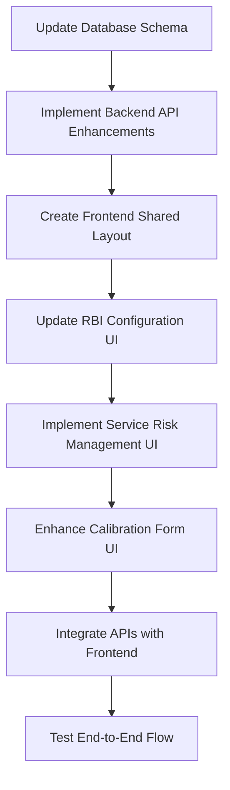

# PSV RBI System Implementation Plan

## Overview

This document outlines a comprehensive plan to implement a Risk-Based Inspection (RBI) system for Pressure Safety Valves (PSVs) with four distinct levels of complexity and accuracy, along with fixing the existing issues in the PSV settings functionality.

## Current Issues

1. Settings don't update when configurations are changed
2. Creating new configurations results in errors
3. Configurations can't be saved properly
4. Missing PUT endpoint for updating RBI configurations
5. Level 1 configuration uses hardcoded fixed_interval instead of the PSV's frequency from database
6. Inconsistent navigation between PSV main page, settings, and analytics pages

## System Requirements

### RBI Levels

1. **Level 1: Fixed Interval**
   - Simple fixed interval based on PSV's frequency field
   - Next calibration date = Last calibration date + Frequency (months)

2. **Level 2: Test Result Based**
   - Based on "receive test" results (pop test and leak test)
   - Compares test results with previous calibration or allowed thresholds
   - Calculates change rate over time
   - Assigns scores based on thresholds

3. **Level 3: Condition Assessment**
   - Includes Level 2 calculations
   - Adds condition assessment for:
     - Body condition (score 1-5)
     - Internal parts condition (score 1-5)
     - Seat/plug condition (score 1-5)

4. **Level 4: Service Risk Categorization**
   - Includes Level 3 calculations
   - Adds service fluid risk categorization
   - Implements consequence of failure (CoF) scoring per API 581

### Data Model Requirements

#### PSV Model
- Tag Number (PK)
- Unique No
- Status (Main/Spare)
- Frequency (months)
- Last Calibration Date
- Expire Date
- Unit
- Train
- Type of PSV (pilot, bellows, open bonnet, etc.)
- Serial No
- SET Pressure (Barg)
- CDTP (Barg)
- Back Pressure (Barg)
- NPS
- Inlet Size
- Inlet Rating
- Outlet Size
- Outlet Rating
- P&ID
- Line Number
- Service
- Data Sheet No
- Manufacturer

#### Calibration Model
- Tag Number (FK to PSV)
- Calibration Date
- Work Maintenance (Adjust, Cleaning, Lapping)
- Change Parts
- Test Medium (Nitrogen, Air, Steam, Water)
- Pre-repair Pop Test (for Level 2+)
- Pre-repair Leak Test (for Level 2+)
- Post-repair Pop Test 
- Post-repair Leak Test
- No of Bubbles
- Inspector
- Test Operator
- General Condition
- Body Condition Score (for Level 3+)
- Internal Parts Score (for Level 3+)
- Seat Plug Condition Score (for Level 3+)
- Approved By
- Work No

#### RBI Configuration Model
- Level (1-4)
- Name
- Description
- Active status
- Settings (JSON):
  - Level 1: 
    - base_interval (default: 36 months)
  - Level 2:
    - pop_test_thresholds: { min: -5, max: 5 }
    - leak_test_thresholds: { min: -10, max: 10 }
    - parameter_weights: { pop_test: 0.6, leak_test: 0.4 }
    - score_thresholds: { 
        pop_test: [
          { max: 10, score: 5 },
          { max: 30, score: 4 },
          { max: 50, score: 3 },
          { max: 70, score: 2 },
          { default: 1 }
        ]
      }
  - Level 3:
    - condition_weights: { 
        body: 0.3, 
        internal_parts: 0.3, 
        seat_plug: 0.4 
      }
  - Level 4:
    - service_risk_categories: { ... }
    - risk_matrix: { ... }

#### Service Risk Category Model
- Service Type
- Description
- CoF Score (1-5)
- Notes

### Calculation Logic

#### Level 1
```python
def calculate_rbi_level_1(psv, config):
    interval = psv.frequency  # Use PSV's frequency instead of config
    next_date = psv.last_calibration_date + timedelta(days=interval * 30)
    return interval, next_date
```

#### Level 2
1. Calculate relative change in pop test and leak test
2. Convert changes to scores using thresholds
3. Apply weights to calculate composite risk score
4. Map risk score to calibration interval using matrix

```python
def calculate_rbi_level_2(psv, calibrations, config):
    # Get latest calibration
    latest_cal = calibrations[0]
    
    # Get previous calibration if exists
    prev_cal = calibrations[1] if len(calibrations) > 1 else None
    
    # Calculate pop test change
    if prev_cal and prev_cal.post_repair_pop_test:
        pop_change_percent = ((latest_cal.pre_repair_pop_test - prev_cal.post_repair_pop_test) / prev_cal.post_repair_pop_test) * 100
    else:
        # Use set pressure as reference if no previous calibration
        pop_change_percent = ((latest_cal.pre_repair_pop_test - psv.set_pressure) / psv.set_pressure) * 100
    
    # Calculate leak test change similarly
    # ...
    
    # Score the changes using thresholds from config
    pop_score = score_parameter(pop_change_percent, config.settings["score_thresholds"]["pop_test"])
    leak_score = score_parameter(leak_change_percent, config.settings["score_thresholds"]["leak_test"])
    
    # Calculate weighted composite score
    weights = config.settings["parameter_weights"]
    composite_score = (pop_score * weights["pop_test"]) + (leak_score * weights["leak_test"])
    
    # Determine risk level and interval
    interval = map_score_to_interval(composite_score)
    next_date = datetime.utcnow() + timedelta(days=interval * 30)
    
    return composite_score, interval, next_date
```

#### Level 3 & 4
Similar logic with additional parameters and weightings.

## Implementation Plan

### 1. Database Schema Updates

1. Update the `Calibration` model to include:
   - pre_repair_pop_test
   - pre_repair_leak_test
   - body_condition_score
   - internal_parts_score
   - seat_plug_condition_score

2. Ensure RBI Configuration model has appropriate JSON schema validation

3. Create Service Risk Category model

### 2. Backend API Enhancements

1. **Add Missing PUT Endpoint for RBI Configuration Updates**
   ```python
   @router.put("/config/{config_id}", response_model=RBIConfiguration)
   def update_rbi_config(
       config_id: int,
       config_update: RBIConfiguration,
       db: Session = Depends(get_session)
   ):
       """Update existing RBI configuration"""
       db_config = db.get(RBIConfiguration, config_id)
       if not db_config:
           raise HTTPException(status_code=404, detail="Configuration not found")
       
       # Update configuration fields
       config_data = config_update.dict(exclude_unset=True)
       config_data["updated_at"] = datetime.utcnow()
       
       for key, value in config_data.items():
           setattr(db_config, key, value)
       
       # If this config is active, deactivate other configs at the same level
       if config_data.get("active") is True:
           other_configs = db.exec(
               select(RBIConfiguration)
               .filter(
                   RBIConfiguration.id != config_id,
                   RBIConfiguration.level == db_config.level,
                   RBIConfiguration.active == True
               )
           ).all()
           
           for other_config in other_configs:
               other_config.active = False
       
       try:
           db.commit()
           db.refresh(db_config)
       except Exception as e:
           db.rollback()
           raise HTTPException(status_code=400, detail=str(e))
       return db_config
   ```

2. **Update RBI Level 1 Calculation Logic**
   ```python
   def calculate_rbi_level_1(psv: PSV, config: RBIConfiguration) -> Tuple[int, datetime]:
       """Calculate fixed interval for RBI Level 1 using the PSV's frequency field"""
       # Use the PSV's frequency field instead of config settings
       interval = psv.frequency
       
       # If no calibration date exists, use current date as base
       base_date = psv.last_calibration_date if psv.last_calibration_date else datetime.utcnow()
       next_date = base_date + timedelta(days=interval * 30)  # Approximate months
       
       return interval, next_date
   ```

3. Implement Level 2-4 calculation functions based on the detailed requirements

4. Create endpoints for service risk category management

### 3. Frontend Enhancements

1. **Create a Shared Layout for PSV-related Pages**
   Create a new file `frontend/src/app/(psv-layout)/layout.tsx` for consistent navigation.

2. **Update RBI Configuration UI**
   - Enhance the existing RBI configuration form to support all 4 levels
   - Add dynamic form fields based on the selected RBI level
   - Implement threshold/weight configuration interfaces
   - Add validation for all configuration fields

3. **Service Risk Category Management UI**
   - Create interface for managing service risk categories
   - Add CRUD functionality for risk categories
   - Implement service-to-risk mapping

4. **Enhanced Calibration Form**
   - Create dynamic calibration form that adapts to the selected RBI level
   - Show/hide fields based on the PSV's RBI level
   - Add validation for required fields based on RBI level

5. **API Integration**
   - Create typed API functions for RBI operations
   - Handle error states and loading states
   - Add proper toast notifications for successful operations

### 4. RBI Configuration UI Enhancement

The RBI Configuration UI should allow:

1. **Level 1 Configuration**
   - Set default base interval (though individual PSV frequency will be used)

2. **Level 2 Configuration**
   - Configure pop test thresholds (min/max allowable deviation)
   - Configure leak test thresholds
   - Set parameter weights
   - Define score thresholds for different deviation percentages

3. **Level 3 Configuration**
   - All Level 2 configurations
   - Set weights for body, internal parts, and seat/plug conditions

4. **Level 4 Configuration**
   - All Level 3 configurations
   - Configure risk matrix
   - Set service risk category mappings

### 5. Navigation Improvements

1. Create a consistent navigation layout for all PSV-related pages
2. Ensure proper active state highlighting in navigation
3. Apply the layout to all PSV pages (main list, settings, analytics)

## Implementation Flow



## Timeline

1. Database Schema Updates: 1 day
2. Backend API Enhancements: 3 days
3. Frontend Shared Layout: 1 day
4. RBI Configuration UI Updates: 2 days
5. Service Risk Management UI: 2 days
6. Calibration Form Enhancements: 2 days
7. API Integration: 1 day
8. Testing and Refinement: 2 days

**Total Estimated Timeline: 14 days**

## Testing Plan

1. **Unit Testing**
   - Test individual calculation functions with various input scenarios
   - Verify risk score calculations match expected outputs
   - Test API endpoints with different input payloads

2. **Integration Testing**
   - Test database schema migrations
   - Verify API interactions with database
   - Test UI components with mock API responses

3. **End-to-End Testing**
   - Create test PSVs with different characteristics
   - Test calibration workflow for each RBI level
   - Verify next calibration date calculations

4. **Regression Testing**
   - Ensure existing functionality still works
   - Verify PSV listing and filtering
   - Check summary statistics accuracy