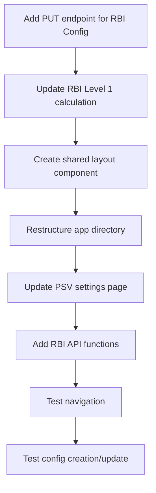

# PSV Settings Section and Navigation Improvement Plan

## Current Issues

After analyzing your code, I've identified the following issues:

### 1. PSV Settings Section Problems
- Settings don't update when configurations are changed
- Creating new configurations results in errors
- Configurations can't be saved properly
- Missing PUT endpoint for updating RBI configurations in the backend
- Level 1 configuration uses hardcoded fixed_interval instead of the PSV's frequency from database

### 2. Navigation Problems
- Inconsistent navigation between PSV main page, settings, and analytics
- Navigation menu only exists on the main PSV page
- Users must use the back button to return to the main page

### 3. RBI Level Configuration Issues
- Fixed interval for Level 1 should use the PSV's frequency field from database
- Multiple levels for determining the next inspection period are not properly implemented

## Solution Plan

### 1. Backend Enhancements

#### 1.1 Add Missing PUT Endpoint for RBI Configuration Updates
Add the following endpoint to `backend/app/routers/psv/rbi_routes.py`:

```python
@router.put("/config/{config_id}", response_model=RBIConfiguration)
def update_rbi_config(
    config_id: int,
    config_update: RBIConfiguration,
    db: Session = Depends(get_session)
):
    """Update existing RBI configuration"""
    db_config = db.get(RBIConfiguration, config_id)
    if not db_config:
        raise HTTPException(status_code=404, detail="Configuration not found")
    
    # Update configuration fields
    config_data = config_update.dict(exclude_unset=True)
    config_data["updated_at"] = datetime.utcnow()
    
    for key, value in config_data.items():
        setattr(db_config, key, value)
    
    # If this config is active, deactivate other configs at the same level
    if config_data.get("active") is True:
        # Get all other configurations at the same level
        other_configs = db.exec(
            select(RBIConfiguration)
            .filter(
                RBIConfiguration.id != config_id,
                RBIConfiguration.level == db_config.level,
                RBIConfiguration.active == True
            )
        ).all()
        
        # Deactivate them
        for other_config in other_configs:
            other_config.active = False
    
    try:
        db.commit()
        db.refresh(db_config)
    except Exception as e:
        db.rollback()
        raise HTTPException(status_code=400, detail=str(e))
    return db_config
```

#### 1.2 Update RBI Level 1 Calculation Logic
Modify the `calculate_rbi_level_1` function in `backend/app/routers/psv/rbi_utils.py`:

```python
def calculate_rbi_level_1(psv: PSV, config: RBIConfiguration) -> Tuple[int, datetime]:
    """Calculate fixed interval for RBI Level 1 using the PSV's frequency field"""
    # Use the PSV's frequency field instead of config settings
    interval = psv.frequency
    
    # If no calibration date exists, use current date as base
    base_date = psv.last_calibration_date if psv.last_calibration_date else datetime.utcnow()
    next_date = base_date + timedelta(days=interval * 30)  # Approximate months
    
    return interval, next_date
```

### 2. Frontend Enhancements

#### 2.1 Create a Shared Layout for PSV-related Pages
Create a new file `frontend/src/app/(psv-layout)/layout.tsx`:

```tsx
'use client';

import Link from "next/link";
import { usePathname } from "next/navigation";
import { cn } from "@/lib/utils";

const navigationItems = [
  {
    title: "PSV List",
    href: "/psv",
  },
  {
    title: "Settings",
    href: "/psv-settings",
  },
  {
    title: "Analytics",
    href: "/psv-analytics",
  },
];

interface PSVLayoutWrapperProps {
  children: React.ReactNode;
}

export default function PSVLayoutWrapper({ children }: PSVLayoutWrapperProps) {
  const pathname = usePathname();

  return (
    <div className="flex-1 space-y-4 p-4 md:p-8 pt-6">
      <div className="flex items-center justify-between">
        <div>
          <h2 className="text-3xl font-bold tracking-tight">PSV Management</h2>
          <p className="text-muted-foreground">
            Manage and monitor pressure safety valves
          </p>
        </div>
      </div>

      <div className="space-y-4">
        <nav className="flex space-x-2 border-b">
          {navigationItems.map((item) => (
            <Link
              key={item.href}
              href={item.href}
              className={cn(
                "flex items-center px-4 py-2 text-sm font-medium transition-colors hover:text-primary",
                pathname === item.href
                  ? "border-b-2 border-primary text-foreground"
                  : "text-muted-foreground"
              )}
            >
              {item.title}
            </Link>
          ))}
        </nav>

        <div>
          {children}
        </div>
      </div>
    </div>
  );
}
```

#### 2.2 Restructure App Directory
Move the following files:
- `frontend/src/app/psv/page.tsx` to `frontend/src/app/(psv-layout)/psv/page.tsx`
- `frontend/src/app/psv-settings/page.tsx` to `frontend/src/app/(psv-layout)/psv-settings/page.tsx`
- `frontend/src/app/psv-analytics/page.tsx` to `frontend/src/app/(psv-layout)/psv-analytics/page.tsx`

#### 2.3 Fix PSV Settings Page
Update the PSV settings page to properly handle updating configurations and add toast notifications:

```tsx
// frontend/src/app/(psv-layout)/psv-settings/page.tsx
import { toast } from "@/components/ui/use-toast";

// Enhance handleConfigSave function
const handleConfigSave = async (formData: RBIConfigFormData) => {
  try {
    setIsLoading(true);
    const method = activeConfig?.id ? "PUT" : "POST";
    const url = activeConfig?.id
      ? `/api/psv/rbi/config/${activeConfig.id}`
      : "/api/psv/rbi/config";

    // Ensure level is of type RBILevel
    const level = formData.level as RBILevel;
    if (![1, 2, 3, 4].includes(level)) {
      throw new Error("Invalid RBI level");
    }

    const response = await fetch(url, {
      method,
      headers: {
        "Content-Type": "application/json",
      },
      body: JSON.stringify({
        ...formData,
        level,
        // Include id if editing existing config
        ...(activeConfig?.id && { id: activeConfig.id }),
      }),
    });

    if (!response.ok) {
      const errorData = await response.json().catch(() => ({}));
      throw new Error(errorData.detail || "Failed to save configuration");
    }
    
    // Force refresh the configurations list
    await loadConfigurations();
    
    // Show success message
    toast({
      title: "Configuration saved",
      description: "The RBI configuration has been saved successfully.",
      variant: "default",
    });
  } catch (error) {
    console.error("Error saving RBI configuration:", error);
    // Show error message
    toast({
      title: "Error saving configuration",
      description: error.message || "An error occurred while saving the configuration",
      variant: "destructive",
    });
  } finally {
    setIsLoading(false);
  }
};
```

#### 2.4 Create API Functions for RBI Settings
Create a new file `frontend/src/api/rbi.ts`:

```typescript
import { RBIConfiguration } from "@/components/psv/types";

const API_URL = process.env.NEXT_PUBLIC_API_URL || 'http://localhost:8000';

export async function fetchRBIConfigurations(): Promise<RBIConfiguration[]> {
  const response = await fetch(`${API_URL}/api/psv/rbi/config`);
  if (!response.ok) {
    const error = await response.json().catch(() => ({}));
    throw new Error(error.detail || "Failed to fetch RBI configurations");
  }
  return response.json();
}

export async function createRBIConfiguration(config: RBIConfiguration): Promise<RBIConfiguration> {
  const response = await fetch(`${API_URL}/api/psv/rbi/config`, {
    method: "POST",
    headers: {
      "Content-Type": "application/json",
    },
    body: JSON.stringify(config),
  });
  
  if (!response.ok) {
    const error = await response.json().catch(() => ({}));
    throw new Error(error.detail || "Failed to create RBI configuration");
  }
  
  return response.json();
}

export async function updateRBIConfiguration(id: number, config: Partial<RBIConfiguration>): Promise<RBIConfiguration> {
  const response = await fetch(`${API_URL}/api/psv/rbi/config/${id}`, {
    method: "PUT",
    headers: {
      "Content-Type": "application/json",
    },
    body: JSON.stringify(config),
  });
  
  if (!response.ok) {
    const error = await response.json().catch(() => ({}));
    throw new Error(error.detail || "Failed to update RBI configuration");
  }
  
  return response.json();
}
```

### 3. Update the PSV Settings Page to Use the New API Functions

Refactor the PSV settings page to use the new API functions:

```tsx
// frontend/src/app/(psv-layout)/psv-settings/page.tsx
import { fetchRBIConfigurations, createRBIConfiguration, updateRBIConfiguration } from "@/api/rbi";

// Update loadConfigurations
const loadConfigurations = useCallback(async () => {
  try {
    setIsLoading(true);
    const data = await fetchRBIConfigurations();
    setConfigs(data);

    // Set active config to the first one if none selected
    if (!activeConfig && data.length > 0) {
      setActiveConfig(data[0]);
    }
  } catch (error) {
    console.error("Error loading RBI configurations:", error);
    toast({
      title: "Error loading configurations",
      description: "Failed to load RBI configurations. Please try again.",
      variant: "destructive",
    });
  } finally {
    setIsLoading(false);
  }
}, [activeConfig]);

// Update handleConfigSave
const handleConfigSave = async (formData: RBIConfigFormData) => {
  try {
    setIsLoading(true);

    // Ensure level is of type RBILevel
    const level = formData.level as RBILevel;
    if (![1, 2, 3, 4].includes(level)) {
      throw new Error("Invalid RBI level");
    }

    let result;
    if (activeConfig?.id) {
      // Update existing configuration
      result = await updateRBIConfiguration(activeConfig.id, {
        ...formData,
        level,
        id: activeConfig.id,
      });
    } else {
      // Create new configuration
      result = await createRBIConfiguration({
        ...formData,
        level,
      });
    }

    // Refresh configurations list
    await loadConfigurations();
    
    // Select the saved configuration
    setActiveConfig(result);
    
    toast({
      title: "Success",
      description: `Configuration ${activeConfig?.id ? "updated" : "created"} successfully.`,
      variant: "default",
    });
  } catch (error) {
    console.error("Error saving RBI configuration:", error);
    toast({
      title: "Error",
      description: error.message || "Failed to save configuration",
      variant: "destructive",
    });
  } finally {
    setIsLoading(false);
  }
};
```

## Implementation Flow 



## Expected Results

1. Consistent navigation across all PSV-related pages
2. Working configuration creation and updates in the settings page
3. Level 1 configurations correctly using the PSV's frequency from the database
4. Improved user experience with proper page transitions and feedback

## Next Steps

After implementing and testing these changes, consider these future enhancements:

1. Add form validation to prevent invalid configurations
2. Implement confirmation dialogs for important actions (e.g., deleting configurations)
3. Add service risk categories management UI as mentioned in your PSV settings page
4. Add automatic data refresh for real-time updates